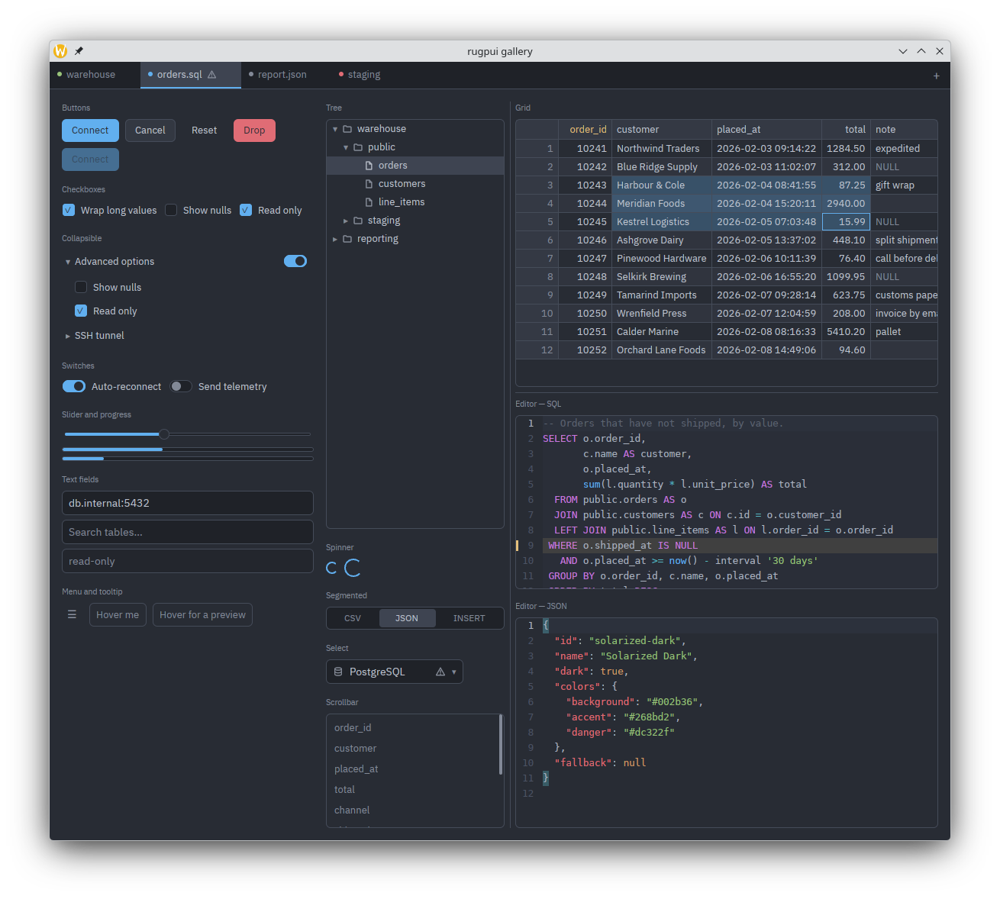
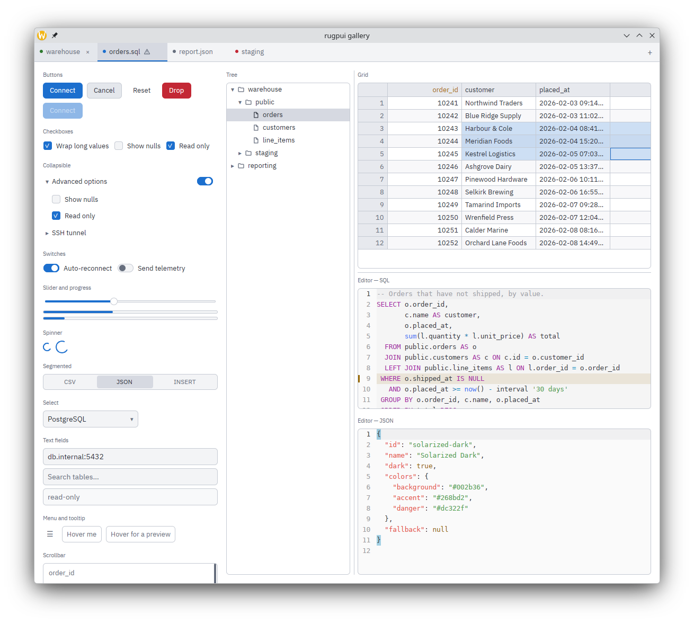

# rugpui

[](https://github.com/xcomart/rugpui/actions/workflows/ci.yml)
[](LICENSE)
[](#)
[](Cargo.toml)
[](https://github.com/zed-industries/zed/tree/fd82517a115d97a07835b52f0512b22b38e38ccf)

A gpui widget kit, and the two larger widgets built on it: a virtualised data
grid and a code editor. Extracted from three desktop applications that had been
carrying byte-identical copies of the same code, so that a fix made once is a
fix everywhere.

Nothing here knows what an application does. There are no database concepts, no
log concepts and no documents — only colours, text entry, tabs, menus, trees,
scroll indicators, a table over rows it never fetches, and an editor over a rope
it never loads. Every user-facing string comes from the host, which is what lets
a localized application stay localized without this repository having heard of a
locale.

## Gallery

Every widget in this repository, in one window, in the two default palettes:





Run it yourself with `cargo run -p rugpui-gallery -- --theme light`; `--theme`
takes any of the six built-in palettes (`dark`, `light`, `solarized-dark`,
`solarized-light`, `gruvbox-dark`, `dracula`) and picks the matching editor
palette with it. The screenshots above are that window captured at 1180×1020 in
`dark` and in `light` — regenerate them by running the gallery in each and
saving the window to `docs/screenshots/gallery-<theme>.png`.

## Documentation

The guide sits in [`docs/README.md`](docs/README.md); the reference is the
rustdoc (`cargo doc --workspace --no-deps`), generated from the same doc
comments the guide points at.

- [Getting started](docs/getting-started.md) — from an empty crate to a window
  with a rugpui widget in it.
- [Theming](docs/theming.md) — the two palettes and how a host picks and
  stores them.
- [Widgets](docs/widgets/) — one page per widget, including
  [text input](docs/widgets/text-input.md), [tree](docs/widgets/tree.md) and
  [scrollbar](docs/widgets/scrollbar.md).
- [Grid](docs/grid.md) — the virtualised result grid, over a `GridSource` the
  host implements.
- [Editor](docs/editor.md) — the code editor, its lexers and its syntax cache.
- [Shell](docs/shell.md) — the layer above the widget kit: title bar,
  updater, about/update dialogs, split panes.

## The crates

| crate | what it is |
|---|---|
| [`rugpui`](crates/rugpui) | The widget kit: theme and editor-theme palettes and their file store, text input, buttons, checkboxes, switches, segmented controls, sliders, progress bars, busy spinners, tabs, dropdown menus, selects, palette pickers, tooltips, modals, overlay scrollbars, split panes, lazily filled trees, and the caption buttons of a self-drawn title bar. |
| [`rugpui-grid`](crates/rugpui-grid) | A virtualised result grid. A million rows scroll without a stutter, null is not the empty string, and the rows arrive through a `GridSource` the host implements — so the grid can be pointed at a query result, a `DESCRIBE`, a plan or a diff. |
| [`rugpui-editor`](crates/rugpui-editor) | A code editor: a rope, a pluggable per-line highlighter with an incremental cache, and an element that shapes only the visible lines. Ships base lexers for eighteen languages — SQL, Java, XML/HTML, PHP, the seven configuration formats a file panel reaches every day, and a C-like table for the rest — with a registry that picks one from a file name, a `#!` line or a language the host defined in a YAML file (`custom-syntax`). Composes any second grammar the host supplies over one of them. |
| [`rugpui-shell`](crates/rugpui-shell) | The layer *above* the widgets: a window that draws its own title bar, a self-updater that replaces the installed copy with the one GitHub published, the about and update dialogs, a split-pane tree, an editor for a palette, and the pieces a settings form is built out of. Knows nothing about any application — everything specific to one is injected. |
| [`rugpui-gallery`](crates/rugpui-gallery) | The example, not a library: every widget above in one window, and the worked version of what a host has to do for itself — install an `AssetSource`, call the three `init`s, keep the state the stateless widgets do not. It is what the screenshots are taken of, and the one crate here that links a platform backend. Not published, and nothing depends on it; it is a workspace member so that CI compiles it on every platform and an example that has gone stale is a build failure. |

`rugpui-grid`, `rugpui-editor` and `rugpui-shell` all depend on `rugpui`; none of them
depends on another. `rugpui-gallery` is not a library and nothing depends on it.

## Using it

Take all three from git at one revision, and — this is the part that is easy to
get wrong — point your own `[patch."https://github.com/zed-industries/zed"]`
table at *this* repository at that same revision:

```toml
[workspace.dependencies]
rugpui = { git = "https://github.com/xcomart/rugpui", rev = "<sha>" }
rugpui-grid = { git = "https://github.com/xcomart/rugpui", rev = "<sha>" }
rugpui-editor = { git = "https://github.com/xcomart/rugpui", rev = "<sha>" }
rugpui-shell = { git = "https://github.com/xcomart/rugpui", rev = "<sha>" }

# The gpui these widgets are written against, named by revision because a git
# dependency is identified by URL *and* revision.
gpui = { git = "https://github.com/zed-industries/zed", rev = "fd82517a115d97a07835b52f0512b22b38e38ccf" }
gpui_platform = { git = "https://github.com/zed-industries/zed", rev = "fd82517a115d97a07835b52f0512b22b38e38ccf", features = [
    "font-kit",
    "wayland",
    "x11",
] }

[patch."https://github.com/zed-industries/zed"]
gpui = { git = "https://github.com/xcomart/rugpui", rev = "<sha>" }
gpui_linux = { git = "https://github.com/xcomart/rugpui", rev = "<sha>" }
gpui_macos = { git = "https://github.com/xcomart/rugpui", rev = "<sha>" }
gpui_windows = { git = "https://github.com/xcomart/rugpui", rev = "<sha>" }
```

The patch table is not optional. Without it your workspace resolves gpui from
Zed's monorepo while `rugpui` resolves it from the patched copy, and two gpui
crates end up in one binary: the `Global`s the widgets install would be invisible
to the application, and nothing would draw. Keep the `rev` of the patch table and
of the `rugpui` dependencies the same, for the same reason.

Then, once during start-up:

```rust
rugpui::init(cx);          // key bindings, the two registries, the default palettes
rugpui_grid::init(cx);     // if you use the grid
rugpui_editor::init(cx);   // if you use the editor
```

and, if you let users drop theme files into a directory of your choosing:

```rust
let dirs = rugpui::ThemeDirs {
    ui_themes: config_dir.join("themes"),
    // `None` for an application with no code editor and so no second palette.
    editor_themes: Some(config_dir.join("editor-themes")),
};
rugpui::theme_store::reload(&dirs, cx);
```

Where those directories are is the application's decision; this repository never
guesses at a configuration directory.

## The shell

`rugpui-shell` is the one crate here that is about an *application* rather than
about a widget — and it is here because three applications had each written the
same one. Its whole contract with a host is three things, and the crate refuses
to guess at any of them.

**The identity** — the constants an updater and an about box need. Installed
once, before the first window:

```rust
use rugpui_shell::AppIdentity;

const IDENTITY: AppIdentity = AppIdentity {
    name: "widget",
    // Always the *application's* own version: `rugpui-shell` has one of its own
    // and it is not this one.
    version: env!("CARGO_PKG_VERSION"),
    repository_url: "https://github.com/you/widget",
    repository_label: "github.com/you/widget",
    latest_release_api: "https://api.github.com/repos/you/widget/releases/latest",
    releases_page: "https://github.com/you/widget/releases",
    fallback_archive: "widget-update",
    // What a release archive carries that has to end up on disk, in install
    // order, chosen under your own `cfg`. One entry for a single-file
    // application; the executable — or the `.app` — is always first.
    payload: PAYLOAD,
    bundle_executable: "Contents/MacOS/widget",
    // The `AppId` an Inno Setup installer was given, with Inno's `_is1`
    // appended. A published identifier of *your* product: two applications
    // sharing one would have winget treat either as the other.
    windows_arp_key: ARP_KEY,
    // Whether an install has to leave its renames to the next launch, which
    // only you can answer — on Windows a JVM loaded into the process holds
    // open handles on the very files the swap renames.
    must_defer: || cfg!(windows) && widget_jdbc::Jvm::get().is_some(),
};

rugpui_shell::init(IDENTITY, cx);
```

`init` needs a `gpui::App`, and two of the shell's calls run before there is
one: `update::apply_pending`, which performs the renames a staged update left
for the next launch, and `update::clean_leftovers`, which sweeps up the
previous one's `.old` copies. Both read the identity out of a process global
rather than out of gpui, so a host that calls either of them first thing in
`main` installs it first thing too:

```rust
rugpui_shell::init_process_identity(IDENTITY);
if rugpui_shell::update::apply_pending() {
    return; // the new build is running; this process has nothing left to do.
}
```

`init` performs that call itself, so a host that reaches an `App` before it
needs the update paths never writes it. With no identity installed at all the
two functions log an error and do nothing — a mis-ordered `main` costs an
update, not a launch.

**Restarting into an update.** `install` renames the running image aside and
writes the new build under the old name. On Linux, `current_exe()` follows the
*inode* into the renamed copy, so gpui's own restart fallback would come back
up on the build the user just replaced; on macOS that fallback needs the
`.app` bundle, not the executable inside it, or `open` relaunches nothing.
`rugpui_shell::restart_path()` is the path as it stood before anything moved,
adjusted to the bundle root on macOS:

```rust
if let Some(path) = rugpui_shell::restart_path() {
    cx.set_restart_path(path);
}
cx.restart();
```

**The words.** The shell looks its strings up by the keys your locale files
already carry — `common.close`, `update.available`, `settings.manage.import` —
so adopting it changes no translation. Interpolation is the shell's: a template
comes back with its `%{marker}`s intact and the shell fills them in.

```rust
struct Words;

impl rugpui_shell::Strings for Words {
    fn text(&self, key: &str) -> gpui::SharedString {
        rust_i18n::t!(key).into_owned().into()
    }
}

rugpui_shell::set_strings(Box::new(Words), cx);
```

Four of those keys are ones an existing application may not have yet, because
they name the rows of a text field's right-click menu: `input.menu_cut`,
`input.menu_copy`, `input.menu_paste` and `input.menu_select_all`. Every field
the shell builds is given them through `rugpui_shell::input_menu_labels`, and a
host's own fields take the same function so that one set of keys covers the
whole application:

```rust
TextInput::new(cx).context_menu(rugpui_shell::input_menu_labels)
```

A key you have not translated shows as the key itself, which is visible and
therefore reportable — no field goes without a menu because a line of text is
missing.

**The ignored release.** "Never tell me about this version again" belongs in
your settings file, which the shell does not own:

```rust
struct Policy;

impl rugpui_shell::UpdatePolicy for Policy {
    fn ignored(&self, cx: &gpui::App) -> Option<String> {
        app_settings::current(cx).ignored_update
    }

    fn set_ignored(&self, tag: Option<String>, cx: &mut gpui::App) {
        let mut settings = app_settings::current(cx);
        settings.ignored_update = tag;
        app_settings::replace(settings, cx);
        app_settings::save(cx);
    }
}

rugpui_shell::set_update_policy(Box::new(Policy), cx);
```

A palette catalogue is built the same way — from the directories you chose
above, and the id to fall back on when the selected one is deleted:

```rust
use std::sync::Arc;
use rugpui_shell::{EditorThemeCatalog, ThemeCatalog, UiThemeCatalog};

let ui: Arc<dyn ThemeCatalog> =
    Arc::new(UiThemeCatalog::new(dirs.clone(), AppSettings::default().theme));
let editor: Arc<dyn ThemeCatalog> =
    Arc::new(EditorThemeCatalog::new(dirs, AppSettings::default().editor_theme));
```

A third kind of palette is a `ThemeCatalog` of your own over
`CatalogFile::Other`. Two of the trait's defaults are there for a format that
differs from these two: `has_dark_flag` answering `false` takes the dark/light
checkbox out of the editor — and leaves the flag your `values_of` reported
untouched on the way back to `file_from` — and `group_headings` names the slots
a heading should stand in front of, for a list long enough to want them.

What stays in the application, deliberately: the workspace (every dialog reports
through an `EventEmitter` and you decide what it means — including the restart
after an update, which is the two lines above); what a tab is; the body of the
settings form; the settings type and its globals; your own icons; and the
`i18n!` invocation with the locale files it compiles.

## The vendored gpui

`vendor/` holds four crates of Zed's monorepo at revision
`fd82517a115d97a07835b52f0512b22b38e38ccf`, each the upstream directory with its
manifest flattened and every change to the code marked `RULOGMAN PATCH` — so
diffing a vendored crate against upstream at that revision shows the whole of
what we carry. They are patched back over the git source by the root manifest's
patch table, and they exist because gpui has no answer of its own for five
things: moving an open window between the platform's caption and the
application's own (`set_titlebar_transparent`), the X11 backend running its
close callbacks with the client `RefCell` borrowed, X11's `is_transparent`
ignoring client-side decorations, X11 having no counterpart to Wayland's
`org_kde_kwin_blur`, and macOS 26 blurring nothing behind a window whose
`NSVisualEffectView` Liquid Glass rebuilt. The root
[`Cargo.toml`](Cargo.toml) tells the whole story, hunk by hunk.

`vendor/unicode-width` is there for a different reason: nothing in this
workspace uses it, and it is neither patched nor built here. It narrows the
ranges where Unicode 16 and the terminals disagree about a symbol's width, and
it lives here so an application that needs it can take it through
`[patch.crates-io]` at the same revision as everything else rather than carrying
a vendored tree of its own.

All four entries of the patch table are live here. Three of them —
`gpui_linux`, `gpui_macos` and `gpui_windows` — are reached only through
`gpui_platform`, which no widget names and only an application does: in this
workspace that application is [`rugpui-gallery`](crates/rugpui-gallery), and
before it existed the three printed `patch ... was not used in the crate graph`
on every build. A consumer that copies the table and names `gpui_platform` in
its own manifest is in the same position.

Moving the revision forward means re-flattening the manifests and replaying the
marked hunks. Delete a hunk, and then the vendored crate once it holds none,
whenever upstream grows its own answer.

## Development

```sh
cargo fmt --all --check
cargo clippy --workspace --all-targets --locked -- -D warnings
cargo test --workspace --locked
```

The first build compiles gpui from source and takes a while. The tests need no
window and no display server: they run on gpui's headless test platform.

```sh
cargo run -p rugpui-gallery -- --theme dark
```

The gallery is the one thing here that does open a window, so it is also the one
thing that needs the libraries a backend links: on a Debian-like Linux,
`libxkbcommon-dev`, `libxkbcommon-x11-dev`, `libwayland-dev` and
`libfontconfig1-dev`.

## Licence

MIT. See [LICENSE](LICENSE).
