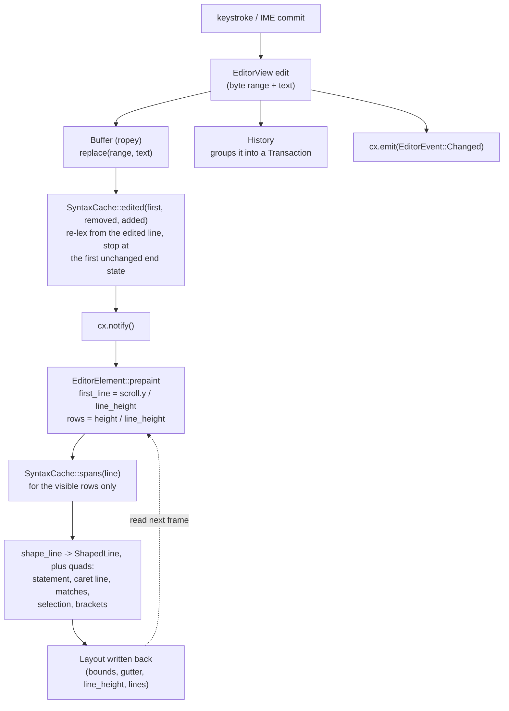
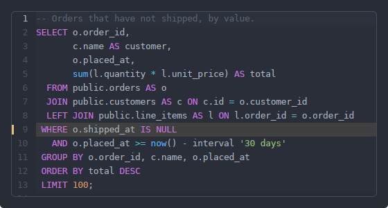
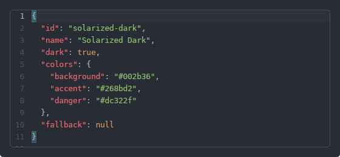
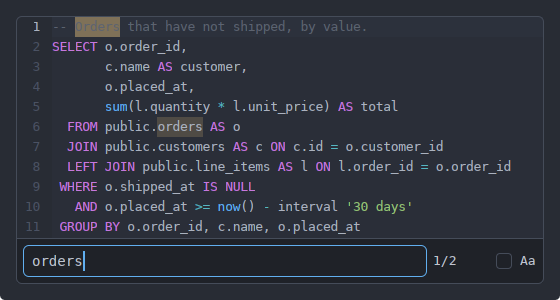
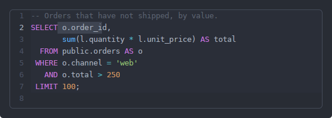
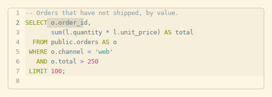

# The editor

`rugpui-editor` is a multi-line code editor: a rope, a pluggable line
highlighter, an incremental syntax cache, and a gpui element that shapes only
the rows that fit on screen. Reach for it when a document is the point — a
query, a config file, a script — and for `rugpui`'s [`TextInput`](./widgets/text-input.md)
when a *value* is. They share the discipline (byte offsets everywhere, UTF-16
only at the platform boundary, grapheme clusters for every caret step) and none
of the code.

## The boundary

The crate knows `rugpui` and nothing else. **It has no file system, no language
server and no parser.** A highlighter is a line lexer the host hands it, and the
whole-document verdict a real parser would give — parse errors, unknown fields —
comes back in as gutter marks. Nothing here opens a file, picks a language from
a path, runs a statement or draws a completion popup; each of those is a hook
the host fills.

Three things make it hold at 100 MB, and they are worth knowing before the API:

* **The buffer is a rope.** An insert is O(log n), and so are `byte <-> line`
  and `byte <-> UTF-16 code unit`. See [buffer.rs](../crates/rugpui-editor/src/buffer.rs).
* **The syntax cache is one `LineState` per line.** An edit re-lexes from the
  edited line down to the first line whose *end state* is unchanged — for an
  ordinary keystroke, that is the line itself. See
  [highlight.rs](../crates/rugpui-editor/src/highlight.rs).
* **Only the visible lines are shaped.** The element works the row range out
  from the scroll offset and the line height and shapes those and no others. See
  [element.rs](../crates/rugpui-editor/src/element.rs).

The two questions that look like they need the whole buffer as a `&str` — which
statement the caret is in, which bracket matches this one — are answered over a
*window* of the rope cut at statement boundaries, so they cost the length of a
statement rather than of the document
([syntax.rs](../crates/rugpui-editor/src/syntax.rs)).

## The pipeline



The dashed edge is the one-frame trail every scrolling surface here lives with:
hit testing, `caret_bounds` and the scrollbars read what the element measured
*last* time it drew.

## Quick start

`init` once, after `rugpui::init`, and before any window opens. It binds
everything to the `Editor` and `EditorFind` key contexts, so none of it escapes
into the rest of the window.

```rust
use rugpui_editor::{EditorEvent, EditorView, highlighter_for_extension};

// once, at start-up
rugpui::init(cx);
rugpui_editor::init(cx);

// in the host view's constructor
let editor = cx.new(|cx| {
    let mut editor =
        EditorView::new(cx).highlighter(highlighter_for_extension("sql").expect("sql"));
    editor.set_text("select * from orders;\n", cx);
    editor
});

cx.subscribe(&editor, |_this, editor, event: &EditorEvent, cx| match event {
    EditorEvent::Changed => {
        let _text = editor.read(cx).text();
    }
    EditorEvent::RunStatement { span } => {
        let text = editor.read(cx).text();
        let _sql = span.sql(&text);
    }
    _ => {}
})
.detach();

// in its render
div()
    .flex()
    .flex_col()
    .size_full()
    .border_1()
    .border_color(theme(cx).border)
    // The font goes on the container, not on the editor.
    .font_family(self.mono.clone())
    .text_size(px(12.5))
    .child(self.editor.clone())
```



*What that comes to: the `sql` highlighter's colours, line numbers, the band on
the caret's line, and — from `set_marks(..)` — a warning against line 9. The
[gutter marks](#gutter-marks) section below is where that last one comes from.*

### Why the font goes on the container

`EditorElement::prepaint` takes its font, size and line height from
`window.text_style()` and `window.line_height()`. `EditorView` is an *entity*,
so a host holds an `Entity<EditorView>` and passes it to `.child(...)` — there
is nothing there to call `.font_family()` on. Styling the ancestor `div` is what
changes the window text style for the subtree, which is exactly what the gallery
does ([main.rs](../crates/rugpui-gallery/src/main.rs)): `.font_family(self.mono.clone()).text_size(px(12.5))`
on the frame around the editor.

Name a real family. The literal `"monospace"` is a fontconfig alias and resolves
on Linux only; the gallery's `monospace(cx)` helper walks
`cx.text_system().all_font_names()` for the first candidate that exists.

A host that owns the font outright — one whose editor must match a terminal
beside it — pushes it in with `set_font(font, size, line_height, cx)` instead,
and `clear_font(cx)` hands the question back to the window. The row pitch is a
parameter rather than a ratio applied to the size, because the ratio is the
host's to choose.

## `EditorView`

| method | argument | returns | effect |
| --- | --- | --- | --- |
| **content** | | | |
| `EditorView::new` | `&mut Context<Self>` | `Self` | An empty plain-text editor. |
| `highlighter` | `Arc<dyn Highlighter>` | `Self` | Builder form; sets the lexer. |
| `read_only` | `bool` | `Self` | Builder form; refuses every change. |
| `text` | — | `String` | The whole buffer. O(n); for saving, not for drawing. |
| `set_text` | `&str`, `cx` | | Replaces the buffer, clears the history and the dirty flag, scrolls home. "A file was opened", not "something was pasted". |
| `text_in` | `Range<usize>` | `String` | The text of a byte range, clamped to the buffer. |
| `insert_at_caret` | `&str`, `cx` | | Inserts at the caret, replacing the selection. One undo step. |
| `replace_range` | `Range<usize>`, `&str`, `cx` | | Replaces a range, caret past it. How a completion is accepted. |
| `line_count` | — | `usize` | Lines, counting the empty one after a trailing newline. |
| `is_dirty` / `mark_clean` | — / `cx` | `bool` / | Changed since it was set or last marked clean. |
| `set_read_only` / `is_read_only` | `bool`, `cx` / — | / `bool` | Refuse changes, or stop refusing. |
| **selection and caret** | | | |
| `selection` | — | `Range<usize>` | The selected byte range; empty when there is only a caret. |
| `has_selection` | — | `bool` | Whether anything is selected. Greys out "copy" in a host menu. |
| `caret` | — | `usize` | The caret's byte offset. |
| `caret_position` | — | `(usize, usize)` | Line and **grapheme** column, both from one — what a status bar shows. |
| `move_to` | `usize`, `cx` | | Moves the caret, collapsing the selection. Clamped and put on a character boundary. |
| `select_range` | `Range<usize>`, `cx` | | Selects a range, caret at its end. |
| `caret_bounds` | — | `Option<Bounds<Pixels>>` | Where the caret is in **window** coordinates. `None` before the first frame and when the caret's line is off screen. |
| **statements and history** | | | |
| `statement_at_caret` | — | `Option<StatementSpan>` | `None` for a plain-text buffer and for any highlighter whose `statements()` is false. |
| `can_undo` / `can_redo` | — | `bool` | For greying out a host menu. |
| **marks** | | | |
| `set_marks` | `Vec<(usize, MarkKind)>`, `cx` | | Replaces the gutter marks. Zero-based lines. |
| `marks` | — | `&[(usize, MarkKind)]` | The marks in force, sorted by line. |
| **find** | | | |
| `set_find_query` | `&str`, `cx` | | Puts a query in the bar and re-runs the search. |
| `set_find_replacement` | `&str`, `cx` | | Puts text in the replace field. |
| `set_find_case_sensitive` | `bool`, `cx` | | Sets case sensitivity and re-runs the search. |
| `matches` | — | `&[Range<usize>]` | Every match of the current query, in order. |
| `find_labels` | `find`, `replace`, `cx` | | The two placeholders. This crate holds no strings; the words are the host's. |
| `input_menu` | `impl Fn(&App) -> InputMenuLabels`, `cx` | | A clipboard right-click menu on the find fields. Asked for its wording per open, so a language change lands. |
| **highlighter, palette, font** | | | |
| `set_highlighter` | `Option<Arc<dyn Highlighter>>`, `cx` | | Swaps the lexer and re-lexes. `None` is plain text. |
| `current_highlighter` | — | `Option<&Arc<dyn Highlighter>>` | The lexer in force. |
| `set_palette` / `palette` | `Option<EditorTheme>`, `cx` / `&App` | / `EditorTheme` | Per-instance palette; `None` follows `rugpui::editor_theme`. Cheap per frame. |
| `set_font` / `clear_font` | `Font`, `Pixels`, `Pixels`, `cx` / `cx` | | Per-instance font, size and row pitch. Cheap per frame. |
| **what a completion popup needs** | | | |
| `word_before_caret` | — | `Range<usize>` | The prefix a list filters on. `$`, `{` and `.` count as word characters, so half a written `${item.` is kept. Empty at the caret means "the unfiltered list". |
| `word_at_caret` | — | `Range<usize>` | The whole word the caret is inside — what to replace when a completion is accepted mid-word. |
| `line_before_caret` | — | `String` | The caret's line up to the caret: the context a source decides *what* to offer from. |
| `set_intercept` / `intercepts` | `bool` / — | / `bool` | Hand `Up`, `Down`, `Enter`, `Tab`, `Escape` to the host instead of acting on them. |

The popup itself is out of scope: what to offer comes from a model this crate
has never heard of. What is here is what the popup needs *from the document*, so
that no caller has to work out a byte offset into a rope for itself.

## Events

Subscribe with `cx.subscribe(&editor, |_, editor, event: &EditorEvent, cx| ...)`.

| variant | payload | meaning |
| --- | --- | --- |
| `Changed` | — | The buffer changed. |
| `SelectionChanged` | — | The caret or the selection moved — the cue to re-read `caret_position()`. |
| `RunStatement` | `span: StatementSpan` | Run the statement the caret is in. |
| `RunSelection` | `span: Range<usize>` | Run the selected text. Falls back to `RunStatement` when nothing is selected. |
| `RunAll` | — | Run the whole buffer. |
| `Intercepted` | `NavKey` | One of `Up`, `Down`, `Enter`, `Tab`, `Escape`, while `set_intercept(true)`. |
| `ContextMenu` | `position: Point<Pixels>` | A right click. The editor took the focus and said where; the host draws the menu. |

The editor never runs anything — it has no connection and no notion of one. The
three `Run` variants are requests, and their spans are byte ranges into what
`text()` returns. `StatementSpan` carries two: `range()` covers the statement as
written, semicolon included, and is what to highlight or select; `sql_range()`
stops before that semicolon, and is what to hand a driver, several of which
reject a trailing `;`. `span.text(&source)` and `span.sql(&source)` slice them.

`ContextMenu` holds no strings because this layer holds none. Every command such
a menu offers is already an action, so the host dispatches `Copy`, `Cut`,
`Paste`, `Undo`, `Redo`, `SelectAll`, `ToggleComment`, `Find`, `RunStatement`,
`RunAll` or `RunSelection` into the `Editor` key context rather than calling
anything new, and greys them out with `has_selection()`, `can_undo()`,
`can_redo()` and `is_read_only()`.

## Key bindings

`rugpui_editor::init(cx)` binds the actions of the `rugpui_editor` namespace,
declared in [editor.rs](../crates/rugpui-editor/src/editor.rs). Two placeholders
run through the table: **mod** is `cmd` on macOS and `ctrl` elsewhere, **word**
is `alt` on macOS and `ctrl` elsewhere.

| action | binding | context |
| --- | --- | --- |
| `Backspace` / `Delete` | `backspace` / `delete` | Editor |
| `DeleteWordLeft` / `DeleteWordRight` | `word-backspace` / `word-delete` | Editor |
| `Left` `Right` `Up` `Down` | the arrows | Editor |
| `SelectLeft` … `SelectDown` | `shift-` + the arrows | Editor |
| `WordLeft` / `WordRight` | `word-left` / `word-right` | Editor |
| `SelectWordLeft` / `SelectWordRight` | `word-shift-left` / `word-shift-right` | Editor |
| `LineStart` / `LineEnd` | `home` / `end` | Editor |
| `SelectLineStart` / `SelectLineEnd` | `shift-home` / `shift-end` | Editor |
| `DocumentStart` / `DocumentEnd` | `mod-home` / `mod-end` | Editor |
| `SelectDocumentStart` / `SelectDocumentEnd` | `mod-shift-home` / `mod-shift-end` | Editor |
| `PageUp` / `PageDown` | `pageup` / `pagedown` | Editor |
| `SelectPageUp` / `SelectPageDown` | `shift-pageup` / `shift-pagedown` | Editor |
| `Newline` | `enter` — carries the line's indent | Editor |
| `Indent` / `Outdent` | `tab` / `shift-tab` — four spaces | Editor |
| `ToggleComment` | `mod-/` | Editor |
| `SelectAll` | `mod-a` | Editor |
| `Copy` / `Cut` / `Paste` | `mod-c` / `mod-x` / `mod-v` | Editor |
| `Undo` / `Redo` | `mod-z` / `mod-shift-z` and `mod-y` | Editor |
| `RunStatement` / `RunAll` / `RunSelection` | `mod-enter` / `mod-shift-enter` / `mod-alt-enter` | Editor |
| `Find` / `Replace` | `mod-f` / `mod-h` | Editor **and** EditorFind |
| `FindNext` / `FindPrev` | `f3` / `shift-f3` | Editor **and** EditorFind |
| `CloseFind` | `escape` | Editor **and** EditorFind |
| `ReplaceAll` | `mod-alt-enter` | EditorFind |
| `ReplaceNext` | none by default | Editor (handler only) |
| `ShowCharacterPalette` | `ctrl-cmd-space`, macOS only | Editor |

`ReplaceNext` and `ReplaceAll` are handled on the text surface as well as on the
bar, so a host driving the search itself need not open the bar to use them. The
editing actions are only installed when the editor is not read-only; the
navigation, copy, find and run actions always are.

To rebind, add your own `KeyBinding`s in the host's init **after**
`rugpui_editor::init(cx)` — gpui matches the last binding registered for a
context first:

```rust
use gpui::KeyBinding;
use rugpui_editor::editor::{KEY_CONTEXT, ReplaceNext, RunStatement};

rugpui_editor::init(cx);
cx.bind_keys([
    KeyBinding::new("f5", RunStatement, Some(KEY_CONTEXT)),
    KeyBinding::new("ctrl-shift-h", ReplaceNext, Some(KEY_CONTEXT)),
]);
```

`KEY_CONTEXT` is `"Editor"` and `FIND_KEY_CONTEXT` is `"EditorFind"`.

## Highlighting

A highlighter is one method:

```rust
pub trait Highlighter: Send + Sync + 'static {
    fn line(&self, text: &str, state: LineState) -> (Vec<Span>, LineState);
    fn line_comment(&self) -> Option<&'static str> { None }
    fn statements(&self) -> bool { false }
}
```

`text` is one line with its terminator stripped. `state` is what this method
returned for the line before, or `LineState::START` for the first line. The
returned spans are **byte ranges relative to the start of the line**, sorted,
non-overlapping and inside `text`; they need not tile it, and bytes no span
covers are drawn in the palette's foreground colour — which is what keeps a
highlighter for a mostly-prose language from having to invent a token for prose.

The method has to be a pure function of its two arguments. The cache calls it
out of order, skips lines whose state did not change, and calls it again for the
same line on the next frame; a highlighter that remembers anything between calls
will disagree with it.

`line_comment()` is what the comment toggle writes — `None` makes the toggle do
nothing. `statements()` says the language is written as `;`-terminated
statements, which turns on both the caret-statement wash and the `RunStatement`
event. Only `SqlHighlighter` returns `true`.

### `LineState`, and the 16-bit rule

`LineState` is one opaque `u32`, not an associated type: the trait has to be
object safe, because the highlighter is chosen when a document is opened rather
than when the widget is compiled. Only the highlighter that produced a state
knows how to read it. `LineState::START` is zero and means "nothing is open";
every highlighter must treat it that way.

`LineState::COMPOSABLE_BITS` is 16. A highlighter meant to be composed — as a
base under an overlay, or as an overlay over a base — must keep its state inside
that many bits, because `LineState::pack` puts two states in one `u32`. The
widest lexer shipped here uses three. A highlighter whose state needs a side
table cannot be composed at all: `LineState` carries nothing but the integer,
and there is nowhere for the table to travel with it.

### `Token` and the editor-theme slots

Every variant but `QuotedIdentifier` names one of `EditorTheme`'s fourteen token
slots, so mapping a span onto a colour is a total function with no fallback and
no invented slot ([highlight.rs](../crates/rugpui-editor/src/highlight.rs), where
`color_for` is the match).

| `Token` | `EditorTheme` slot | what it is |
| --- | --- | --- |
| `Keyword` | `keyword` | Reserved words. |
| `String` | `string` | Quoted literals. |
| `Number` | `number` | Numeric literals; also what a custom definition's `literal` group gets. |
| `Comment` | `comment` | Line and block comments. |
| `Function` | `function` | Called functions. |
| `Type` | `r#type` | Type names; SQL's `${...}` placeholders. |
| `Operator` | `operator` | `=`, `<>`, `,`, `:`. |
| `Identifier` | `identifier` | Table, column, alias and key names. |
| `QuotedIdentifier` | `identifier` | A quoted name. Painted as an identifier, but opaque to the statement splitter and bracket matcher the way a string is. |
| `Key` | `key` | The left-hand side of a mapping, a section header, a Markdown heading. |
| `Variable` | `variable` | A named reference: `$HOME`, a YAML anchor, a link's text. |
| `Punctuation` | `punctuation` | Brackets, semicolons, dots. |
| `BracketMatch` | `bracket_match` | Never emitted by a lexer — the pair is found over the caret and painted as a quad. |
| `Error` | `error` | Text that cannot be read at all. |
| `Warning` | `warning` | Text that reads, but not as it was meant to. |

The four canvas and three frame slots — `background`, `foreground`, `cursor`,
`selection`, `line_highlight`, `gutter`, `gutter_active` — are drawn by the
element rather than by a token. The caret's line takes `line_highlight`, and the
statement the caret is in takes the same colour at half opacity; find matches
are `warning` at 45% opacity for the current one and 20% for the rest; a gutter
mark uses `error` or `warning`.

### What the cache re-lexes

`SyntaxCache` keeps four bytes per line: the state that line *ends* in. Spans
are not cached — a `Vec<Span>` per line of a large document would cost more than
the document and buy nothing, since `line()` is a few hundred nanoseconds and
the renderer only wants the forty lines it is about to draw.

After an edit, `edited(buffer, first, removed, added)` re-lexes from `first`
down and stops at the first line *below the edited region* whose new end state
equals the one it had. For an edit that opens no comment and no string that is
one line, whatever the document's length; typing `/*` on line three of a hundred
thousand walks down to the line that closes the comment or to the end of the
file, and typing the `*/` walks back no further than it came.

## Snippets and code tooltips

`EditorView` is an entity: a caret, a history, a scroll offset and an input
handler, because someone is going to type into it. A completion popup's
documentation box, a tooltip over a saved query, a preview beside a file list —
none of those are typed into, and paying for an editor to draw four read-only
lines is the wrong trade.

`CodeSnippet` is the other end. A stateless element, rebuilt on every render of
its parent, that lexes its text line by line and hands gpui one `StyledText` per
line. Same `Highlighter`, same colours, same gap filling as the editor; no
gutter, no caret, no selection, no virtualisation.

```rust
use rugpui_editor::{CodeSnippet, highlighter_for_extension};

CodeSnippet::new(query, highlighter_for_extension("sql").expect("sql"))
    .font_family(self.mono.clone())
    .max_lines(4)
```

| method | argument | default | effect |
| --- | --- | --- | --- |
| `CodeSnippet::new` | `impl Into<SharedString>`, `Arc<dyn Highlighter>` | | The code and the lexer. |
| `font_family` | `impl Into<SharedString>` | the window's | The family the runs are shaped in. |
| `text_size` | `Pixels` | 11.5 px | The type size. |
| `max_lines` | `usize` | unbounded | Draw at most this many lines, then one holding `…` in the `comment` colour. |
| `bare` | — | off | Drop the code-block background, padding and corner. |

The default box is `background` from the *editor* palette, 8 px of horizontal
and 6 px of vertical padding, and a small corner — enough to read as a
quotation. `bare()` is for a host that has already drawn the container.

Blank lines are drawn as a single space rather than as an empty `StyledText`,
which would have no text to take a height from and would collapse the line.

**Name a family that exists.** By default a snippet draws in whatever family the
window's text style is in, which for most hosts is proportional — and code in a
proportional face does not line up. Either name one with `.font_family(..)` or
put one on a container above it, the way the gallery does for the editors; both
reach the runs. The literal `"monospace"` is a fontconfig alias and resolves on
Linux only, so the gallery's `monospace(cx)` walks
`cx.text_system().all_font_names()` for the first of its candidates that is
installed — the same rule as [Why the font goes on the
container](#why-the-font-goes-on-the-container).

### `tooltip_code`

```rust
pub fn tooltip_code(
    text: impl Into<SharedString>,
    highlighter: Arc<dyn Highlighter>,
    font_family: Option<SharedString>,
) -> impl Fn(&mut Window, &mut App) -> AnyView + 'static
```

`rugpui::tooltip_with` over a `CodeSnippet`: the box every other tooltip in the
application is drawn in, with a listing inside it.

```rust
div()
    .id("saved-query")
    .tooltip(tooltip_code(
        query.clone(),
        highlighter_for_extension("sql").expect("sql"),
        Some(self.mono.clone()),
    ))
    .child(name)
```

`font_family` is `None` for "whatever the window is in", which is the right
answer only when the tooltip is opened from a subtree that already has a
fixed-pitch family on it.

A tooltip that is code *and other things* is a `rugpui::Tooltip` with the
snippet handed in through `.element(..)`. This is what the gallery's second
hover target does ([main.rs](../crates/rugpui-gallery/src/main.rs)):

```rust
let sql = highlighter_for_extension("sql").expect("sql");
let mono = self.mono.clone();

Tooltip::new()
    .image(PREVIEW, px(96.))
    .note("public.orders — 12 rows")
    .element(move |_window, _cx| {
        CodeSnippet::new(data::SQL, sql.clone())
            .font_family(mono.clone())
            .max_lines(4)
            .into_any_element()
    })
    .build()
```

The closure runs once per hover, so the lexer, the family and the text are
cloned into it rather than borrowed. See
[tooltip](./widgets/tooltip.md#composite-tooltips) for the rest of the builder.

### Drawing your own listing

A host whose popup is not a snippet — a diff view, a log pane, a completion list
that colours the matched prefix — wants the colours without the element. Two
functions are public for exactly that:

```rust
pub fn runs_for_spans(
    text: &str,
    spans: &[Span],
    palette: &EditorTheme,
    font: &Font,
) -> Vec<TextRun>

pub const fn color_for(token: Token, palette: &EditorTheme) -> Hsla
```

`runs_for_spans` is the gap filling: gpui shapes a line from runs whose lengths
add up to its length, and a highlighter's spans need not tile the line, so the
bytes no span covers come back as `foreground`. It also clamps — a span past the
end of a line, or one that starts inside the one before it, is a bug in ordinary
code, and the alternative to clamping is a panic inside gpui's shaper. Its output
always tiles `text`, which is what `StyledText::with_runs` asserts on.

```rust
let (spans, next) = highlighter.line(line, state);
let runs = runs_for_spans(line, &spans, &palette, &font);
StyledText::new(line.to_string()).with_runs(runs)
```

Thread `state` from `LineState::START` through the lines in order, exactly as the
syntax cache does; a lexer that is handed the wrong start state will disagree
about where a block comment or a string ends.

`color_for` is the `Token` → `EditorTheme` map tabulated
[above](#token-and-the-editor-theme-slots).

## Built-in languages

Eighteen entries, in the order a picker should list them. Plain text leads —
it is the answer to "colour none of this" rather than a format among the others.

| id | name | extensions | whole names | `#!` | lexer | line comment |
| --- | --- | --- | --- | --- | --- | --- |
| `plain` | Plain Text | — | — | — | none | — |
| `shell` | Shell | `sh` `bash` `zsh` `ksh` `ash` `mksh` | `.bashrc` `.bash_profile` `.profile` `.zshrc` `.zshenv` … | `*sh` | own | `#` |
| `yaml` | YAML | `yml` `yaml` | — | — | own | `#` |
| `json` | JSON | `json` | — | — | own | none |
| `toml` | TOML | `toml` | — | — | own | `#` |
| `conf` | Conf | `ini` `conf` `cfg` `properties` `env` | `.env` `sshd_config` `ssh_config` `.gitconfig` `.npmrc` `.editorconfig` | — | own | `#` |
| `dockerfile` | Dockerfile | `dockerfile` | `dockerfile` `containerfile` | — | own | `#` |
| `markdown` | Markdown | `md` `markdown` | — | — | own | none |
| `sql` | SQL | `sql` | — | — | `SqlHighlighter` | `--` |
| `java` | Java | `java` | — | — | own | `//` |
| `xml` | XML | `xml` `html` `htm` | — | — | own | none |
| `php` | PHP | `php` | — | `php` | own | `//` |
| `csharp` | C# | `cs` | — | — | `CLikeHighlighter` | `//` |
| `kotlin` | Kotlin | `kt` `kts` | — | — | `CLikeHighlighter` | `//` |
| `typescript` | TypeScript | `ts` `tsx` `js` `jsx` `mjs` `cjs` | — | `node` | `CLikeHighlighter` | `//` |
| `go` | Go | `go` | — | — | `CLikeHighlighter` | `//` |
| `rust` | Rust | `rs` | — | — | `CLikeHighlighter` | `//` |
| `python` | Python | `py` `pyw` | — | `python` `python3` | `CLikeHighlighter` | `#` |

Every one of them is a hand-written state machine over bytes, and none builds a
tree. A `.yml` that is invalid YAML still has to be readable *while it is being
fixed*, which is the argument against a parser as much as the size of one is.
The rule each is held to is that it never panics and never refuses — a line of
random bytes comes out with no spans, not as an error — and that whatever it
carries to the next line fits inside `COMPOSABLE_BITS`.

### Picking one

`highlighter_for_extension(ext)` takes the extension alone, without a leading
dot, case-insensitively, in the form `Path::extension` returns it. An unknown
extension answers `None`, which is a plain-text editor. A host whose files carry
a second extension of their own — `Model.java.tpl` — strips it before asking.



*The same `EditorView` with `highlighter_for_extension("json")`: nothing about
the widget changes, only which state machine runs over the bytes.*

`LanguageRegistry` answers the wider questions: what may a document be *set* to,
and what is this file given that half the shell scripts on a server are called
`deploy`. `detect(name, first_line)` runs three rules in order, each more certain
than the next:

1. **the whole name** — `Dockerfile`, `sshd_config`, `.bashrc`. A name here also
   claims itself plus a dotted tail, so `dockerfile` claims `Dockerfile.build`
   and `.env` claims `.env.production`;
2. **the extension** — with the leading dot of a hidden file stripped first, so
   `.prettierrc.json` is as much JSON as `prettierrc.json` is;
3. **the `#!` line**, and only for a name with no extension at all. A `.yml`
   that starts with `#!` is still YAML.

All three run over the built-ins first and only then over what a host
registered, so a definition somebody dropped into a directory can *add* a
language but never take one over. `detect` never fails: a file nothing claims is
plain text.

```rust
use std::sync::Arc;
use rugpui_editor::{FileMatch, LanguageEntry, LanguageRegistry};

let mut registry = LanguageRegistry::builtin();

// A language of the host's own, written as a lexer rather than as a file.
registry.register(LanguageEntry {
    id: "hcl".into(),
    name: "HCL".into(),
    files: FileMatch {
        extensions: vec!["tf".into(), "hcl".into()],
        names: vec![],
        shebangs: vec![],
    },
    highlighter: Some(Arc::new(MyHclHighlighter)),
});

// Fill a picker: `all()` is already in the order a list should read.
for entry in registry.all() {
    println!("{} = {}", entry.id, entry.name);
}

// Open a file, or restore the picker's choice by the id stored in settings.
let entry = registry.detect("/etc/nginx/nginx.conf", "");
let entry = registry.get("yaml").unwrap_or(entry);
editor.update(cx, |editor, cx| {
    editor.set_highlighter(entry.highlighter.clone(), cx);
});
```

Every list in a `FileMatch` is compared in lower case, so a host filling one in
must write it that way — nothing folds the table, only the name matched against
it. The registry is an ordinary value, not a global: where it lives is the
host's question. `register` puts a language behind every built-in, sorted
alphabetically by name among the registered ones. `builtin()` builds fresh
highlighters on each call, because two of them carry per-document state; two
registries hand out two sets, and `Arc::ptr_eq` is how an editor asks "am I
already lexing this".

## Custom languages from a file

Behind the `custom-syntax` feature, off by default because it is the only thing
in the crate that costs a dependency (a YAML reader):

```toml
rugpui-editor = { git = "…", rev = "…", features = ["custom-syntax"] }
```

A `Definition` is one general lexer driven by data, for the long tail: the
nineteenth hand-written scanner would be the same shape as the eighteenth.

### The schema

Every key is optional. A file holding nothing but `name` and `files` is legal
and gives a language that is matched and drawn in one colour.

| key | shape | default | meaning |
| --- | --- | --- | --- |
| `id` | string | slugged from `name` | Stable id, for settings and `LanguageRegistry::get`. |
| `name` | string | `unnamed` | What the language calls itself, for a picker. |
| `files.extensions` | list of strings | `[]` | No leading dot, matched without regard to case. |
| `files.names` | list of strings | `[]` | Whole file names, for what has no extension. |
| `files.shebangs` | list of strings | `[]` | Matches when the `#!` interpreter *ends with* this. |
| `comment` | string | none | Line comment, and what the comment toggle writes. |
| `block_comment` | `[open, close]` | none | A comment that may cross lines. |
| `strings` | list of rules | `[]` | Tried longest opener first. Each rule is either `quote:` (one character, never crosses a line, with `escape:` — default `true` — saying whether `\` escapes the next character) or `pair: [open, close]` (crosses lines, and a backslash escapes nothing inside it). |
| `keywords` | map of group → words | `{}` | Groups: `keyword`, `literal` (the number colour), `key`, `variable`. Any other group name is warned about and ignored. |
| `keywords_ignore_case` | bool | `false` | Covers the whole definition, not one group — SQL needs it everywhere or nowhere. |
| `variables` | list of strings | `[]` | Sigils: `$NAME` and `${…}` become variables. |
| `sections` | bool | `false` | Colour a leading `[section]` as a key. |
| `keys` | `none` \| `colon` \| `equals` | `none` | Colour `key:` / `key=` at the head of a line. |
| `numbers` | bool | `true` | Colour numeric literals. |

A word YAML would otherwise resolve to something else — `true`, `null` — arrives
as the word it looks like, since the reader takes the text of a plain scalar
wherever a string is wanted. Quoting them anyway says what you mean to the next
person. At most `STRING_LIMIT` (32) string rules survive; the state carries
`COMMENT` or the index of the open `pair` rule, in seven bits, which is why a
definition can be the base under an overlay like any built-in language.

### A complete example

```yaml
id: ruby
name: Ruby
files:
  extensions: [rb, rake, gemspec]
  names: [Gemfile, Rakefile]
  shebangs: [ruby]
comment: "#"
block_comment: ["=begin", "=end"]
strings:
  - quote: "'"
  - quote: '"'
    escape: true                # the default: a `\` escapes the next character
  - pair: ["%q{", "}"]          # an open/close pair, which may cross lines
keywords:
  keyword: [alias, and, begin, break, case, class, def, do, else, elsif, end,
            ensure, for, if, in, module, next, not, or, redo, rescue, retry,
            return, self, super, then, undef, unless, until, when, while, yield]
  literal: ["true", "false", "nil"]
keywords_ignore_case: false
variables: ["@", "$"]
sections: false
keys: none
numbers: true
```

### Loading it

```rust
use rugpui_editor::LanguageRegistry;
use rugpui_editor::lang::custom::Definition;

let mut registry = LanguageRegistry::builtin();
match Definition::parse(&std::fs::read_to_string(&path)?) {
    Ok(mut definition) => {
        // The file's stem is a better id than one slugged from inside the
        // file: it is what the user can see and rename.
        if let Some(stem) = path.file_stem().and_then(|stem| stem.to_str()) {
            definition.id = stem.to_ascii_lowercase();
        }
        registry.register(definition.into_entry());
    }
    // One broken definition must not cost the user the others.
    Err(err) => log::warn!("skipping {}: {err:#}", path.display()),
}
```

Where the files live and when they are re-read is the host's business, which is
why no directory walker ships here. `parse` fails only when the file is not a
definition at all; a rule inside it that cannot be honoured — an empty
delimiter, a quote that is not one character, an unknown `keywords` group — is
dropped and logged rather than failing the file.
`Definition::parse_with_warnings` hands the complaints back instead, which is
what a host shipping definitions of its own wants a test to assert on.

What a line-at-a-time scanner cannot express is the boundary: no regular
expressions and no context (a word is a keyword wherever it stands), no nesting,
one line comment and one block comment per language, no heredocs and no
interpolation coloured inside a string. Languages that need those are the ones
with a lexer of their own.

## Two grammars at once

A template is a file of some other language — Java, XML, SQL — with `${…}`
sprinkled through it, and the useful colouring is both at once.
`CompositeHighlighter` runs a base `Highlighter` and an `Overlay` over the same
line: the base sees the whole line so its own state stays coherent, its spans
are then cut wherever an overlay region stands, and the overlay's spans go on
top. No overlay ships here, because an overlay is a grammar and whose grammar it
is, is the host's question.

`Overlay` is one method. It answers with spans *and* with the byte ranges it
took charge of, because a span the overlay did not emit may still be text the
overlay owns — the space inside a placeholder — and the base's opinion about it
has to be thrown away all the same.

```rust
use std::sync::Arc;

use rugpui_editor::{
    CompositeHighlighter, LineState, Overlaid, Overlay, Span, Token,
    highlighter_for_extension,
};

/// `%{name}` painted over whatever the file is written in.
struct Placeholders;

impl Overlay for Placeholders {
    fn regions(&self, text: &str, _state: LineState) -> Overlaid {
        let mut out = Overlaid::default();
        let bytes = text.as_bytes();
        let mut at = 0;
        while at < bytes.len() {
            if !bytes[at..].starts_with(b"%{") {
                at += 1;
                continue;
            }
            // Unterminated: leave the rest of the line to the base language.
            let Some(offset) = bytes[at + 2..].iter().position(|byte| *byte == b'}') else {
                break;
            };
            let end = at + 2 + offset + 1;
            out.spans.push(Span::new(at..at + 2, Token::Punctuation));
            if offset > 0 {
                out.spans.push(Span::new(at + 2..end - 1, Token::Variable));
            }
            out.spans.push(Span::new(end - 1..end, Token::Punctuation));
            out.regions.push(at..end);
            at = end;
        }
        // `out.state` stays at LineState::START: this overlay carries nothing
        // across a line break. One that did would set it here, within
        // LineState::COMPOSABLE_BITS.
        out
    }
}

let base = highlighter_for_extension("sql").expect("sql ships here");
let composite = Arc::new(CompositeHighlighter::new(base, Arc::new(Placeholders)));
editor.update(cx, |editor, cx| editor.set_highlighter(Some(composite), cx));
```

The regions must be sorted, non-overlapping and inside `text`, and every span
must lie within one of them — the composition walks each list once and relies on
both. `line_comment()` on the composite is the *base's*: commenting a line out of
a SQL file with placeholders in it still writes `--`. `base()` and `overlay()`
hand the two parts back.

The base sees the overlay's text as well as the text around it, so a `%{` inside
what the base would call a string can still confuse the base's state. Cutting the
regions out of the base's *input* would fix that and break something worse — the
base would lex `'a' || 'b'` as two unrelated fragments whenever a region stood
between them — so the base reads the line whole and the cut happens to its
output.

## Gutter marks

`MarkKind` is `Warning` or `Error`, and the verdict comes from outside: this
crate has no parser, so "line 9 references an unknown column" is something the
host worked out and hands over.

```rust
use rugpui_editor::MarkKind;

editor.update(cx, |editor, cx| {
    editor.set_marks(vec![(8, MarkKind::Warning)], cx); // line 9, counting from zero
});
```

`set_marks` replaces the whole list. At most one mark per line survives, and a
line that is both an error and a warning wears the error, because the parse
failure is what has to be fixed first. Lines past the end of the buffer are kept
rather than dropped — a diagnostic arrives from a background task, and the
buffer it was computed against may already have been shortened — and simply
never drawn. `marks()` hands the list back, sorted by line.

## Find, history, statements

**Find** is plain substring search, not a regular expression: what people look
for in a script is a table name, and a regex engine would be 1.5 MB of DFA
machinery for a feature nothing else here wants. Matches are non-overlapping and
found left to right, which is what makes "replace all" one pass with a running
offset correction and what makes "find next" terminate. `find_all(haystack,
needle, case_sensitive)` is the free function; `FindState` is what the bar keeps.
An empty needle matches nothing, so an empty find bar does not light up the
buffer. Case-insensitive matching compares `char::to_lowercase` a character at a
time rather than lowercasing the haystack, because lowercasing changes byte
lengths and every offset handed back has to index the buffer as it stands.



*The find bar down, with a query in it: every match is marked in the buffer, the
count reads `1/2`, and the bar's own widgets are drawn with the chrome `Theme`.*

**History** groups by intent, which is why one `ctrl-z` takes back a word rather
than a letter. A single-character insertion at the caret extends the previous
transaction if that one was also typing and ended exactly where this one starts;
a run of backspaces extends the same way, backwards; a newline ends the group
after itself, so undo stops at line boundaries. Everything else — a paste, a
caret move, an indent, a comment toggle, a replace-all, the commit of an IME
composition — is its own `Transaction`. A composition is not recorded while it
runs: typing `ㅎ`, `하`, `한` is one edit, not three, because the intermediate
states are not text anyone typed. A `Transaction` carries the selection before
and after, so undo puts the caret back where the typing *started*.

**Statements** are `statement_at_caret()`, gated on `Highlighter::statements()`.
A statement runs from the first non-blank byte after the previous semicolon to
the semicolon that ends it, and a semicolon counts only when the highlighter did
*not* call it part of a string, a comment or a quoted identifier — which is
where all the value is, and it comes for free from the colours already being
drawn. In the blank space between two statements the one *before* the caret
wins, which is what a person means after finishing a query and pressing return.
The window that makes this affordable is capped at two megabytes either way; the
bracket scan walks outwards at most five thousand lines.

## Theming

The editor draws from `EditorTheme`, a syntax palette of twenty-one slots kept
separate from the chrome `Theme` — a light chrome around a dark editor is a real
preference, not a mistake. See [theming.md](./theming.md) for the slots, the file
format and the built-in palettes; the token mapping is the table above.

One listing in a dark palette and in a light one, with a range selected so the
selection colour sits beside the current-line band and the caret:

| `one-dark` | `solarized-light` |
| --- | --- |
|  |  |

All six are side by side in
[theming.md](./theming.md#the-six-built-ins-1).

By default an editor reads the application-wide `rugpui::editor_theme(cx)`, and
that is where nearly every editor should stay. `set_palette(Some(palette), cx)`
overrides it for one instance, for a host whose *documents* carry colours of
their own — a terminal session with a scheme attached, a diff view that wants
both sides in the same colours whatever the app is set to. `set_font` is the
same shape for the font. Both are cheap to call on every frame: an unchanged
value repaints nothing, which is how a host keeps up with a scheme that changes
under it.

The find bar is built out of `rugpui`'s own widgets and draws with the chrome
`Theme`'s `surface`, `border` and `text`.

## Out of scope, deliberately

Multiple cursors would change the shape of every command in the editor module,
so they go in as a list of selections in one piece or not at all. Code folding
needs a row-to-line map between the buffer and the renderer, which nothing else
wants yet. A minimap needs a second, coarser shaping pass, and is the least
valuable of the three. And the completion popup is the host's: what to offer
comes from a model this crate has never heard of.

## Testing on the headless platform

Everything worth holding down — input handling above all — only exists once
there is a window and a focused element, so the tests open one. The pattern in
[tests.rs](../crates/rugpui-editor/src/tests.rs), which a host can copy for its
own editor pane:

```rust
#[gpui::test]
fn typing_inserts_at_the_caret(cx: &mut TestAppContext) {
    cx.update(rugpui::init);
    cx.update(rugpui_editor::init);

    // `Harness` is an ordinary Render that puts the editor in a div().size_full().
    let window = cx.add_window(|_, cx| Harness {
        editor: cx.new(|cx| EditorView::new(cx).highlighter(Arc::new(SqlHighlighter))),
    });
    let editor = window
        .update(cx, |harness, _, _| harness.editor.clone())
        .expect("the window is open");

    let mut cx = VisualTestContext::from_window(*window.deref(), cx);
    cx.update(|window, cx| editor.read(cx).focus_handle(cx).focus(window, cx));
    cx.run_until_parked();

    cx.simulate_input("select 1");
    cx.simulate_keystrokes("cmd-z ctrl-z");  // both chords; each platform takes its own
    cx.refresh().expect("the window is open");
    cx.run_until_parked();
}
```

Three things make such a test work: the harness is an ordinary `Render` that
puts the editor in a `div().size_full()`; the editor must be *focused* or no key
reaches it; and a frame is a `refresh()` plus a `run_until_parked()`, because
the test platform draws on the effect cycle. Send both the `cmd-` and the
`ctrl-` chord for every shortcut — each platform acts on the one it binds and
lets the other fall through, so one test covers both.

The crate's own performance tests count `SyntaxCache::lex_calls()` across two
frames, to assert that drawing a hundred-thousand-line buffer costs one lex per
visible line and that one keystroke in the middle of it re-lexes at most three.
A host can do the same over a `SyntaxCache` it built itself; the editor's own
cache is crate-internal, so a host test asserts on behaviour and timing
instead.

---

Source: [lib.rs](../crates/rugpui-editor/src/lib.rs), and beside it
[editor.rs](../crates/rugpui-editor/src/editor.rs),
[element.rs](../crates/rugpui-editor/src/element.rs),
[buffer.rs](../crates/rugpui-editor/src/buffer.rs),
[highlight.rs](../crates/rugpui-editor/src/highlight.rs),
[composite.rs](../crates/rugpui-editor/src/composite.rs),
[syntax.rs](../crates/rugpui-editor/src/syntax.rs),
[find.rs](../crates/rugpui-editor/src/find.rs),
[history.rs](../crates/rugpui-editor/src/history.rs),
[snippet.rs](../crates/rugpui-editor/src/snippet.rs),
[sql_syntax.rs](../crates/rugpui-editor/src/sql_syntax.rs) and
[lang/](../crates/rugpui-editor/src/lang/mod.rs)
([registry](../crates/rugpui-editor/src/lang/registry.rs),
[custom](../crates/rugpui-editor/src/lang/custom.rs)).
Worked usage: [rugpui-gallery/src/main.rs](../crates/rugpui-gallery/src/main.rs).
