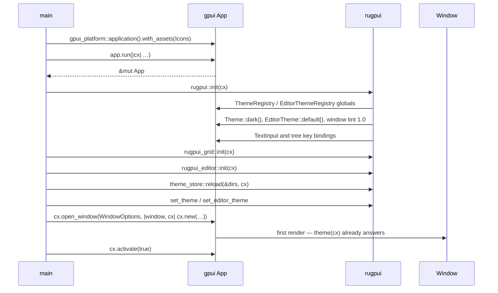

# Getting started

From an empty crate to a window with a rugpui widget in it. The worked version
of everything below is [`rugpui-gallery`](../crates/rugpui-gallery/src/main.rs),
which is a workspace member precisely so that CI keeps it compiling — if a
snippet here has gone stale, the gallery has not.

## The dependency block

rugpui is taken from git at a revision, and so is the gpui it is written
against. The full `[patch."https://github.com/zed-industries/zed"]` table is in
the [README](../README.md#using-it); copy it from there rather than from here,
because it is the part that has to be exact.

The invariant it exists for: **the `rev` of the patch entries and the `rev` of
the `rugpui` dependencies must be the same string.** A git dependency is
identified by URL *and* revision, so if your workspace resolves `gpui` from
Zed's monorepo while `rugpui` resolves it from the patched copy, two different
`gpui` crates end up linked into one binary. They do not share types, and they
do not share the type-keyed map gpui stores `Global`s in — so the `Theme`,
`ThemeRegistry` and `EditorThemeRegistry` globals that [`rugpui::init`] installs
would be invisible to every `theme(cx)` call your application makes, and the
widgets would draw with default colours or not draw at all. It compiles. That is
what makes it worth stating twice.

Which crates you actually need:

| crate | when |
|---|---|
| [`rugpui`](../crates/rugpui) | always — the widgets and both palettes |
| [`rugpui-grid`](../crates/rugpui-grid) | a table over rows you supply through a `GridSource`; see [grid.md](./grid.md) |
| [`rugpui-editor`](../crates/rugpui-editor) | a code editor; see [editor.md](./editor.md) |
| [`rugpui-shell`](../crates/rugpui-shell) | a window with its own title bar, an updater, dialogs; see [shell.md](./shell.md) |
| `gpui` | always — you name element types and `Context` yourself |
| `gpui_platform` | **binary crate only** — it is what picks and starts a backend |

`gpui_platform` is the one dependency no library in this workspace names: it is
a hundred lines of `cfg`-directed re-exports over `gpui_linux`, `gpui_macos`
and `gpui_windows`, and it is what puts three of the four patch entries to use.
Take it with the features a backend needs — `font-kit`, and on Linux `wayland`
and `x11`, which are what
[`rugpui-gallery`](../crates/rugpui-gallery/Cargo.toml) resolves through the
workspace table.

## `main`

```rust
fn main() {
    let app = gpui_platform::application().with_assets(Icons);
    app.run(move |cx: &mut App| {
        rugpui::init(cx);
        rugpui_grid::init(cx);
        rugpui_editor::init(cx);

        set_theme(Theme::dark(), cx);
        set_editor_theme(EditorTheme::one_dark(), cx);

        cx.open_window(
            WindowOptions {
                window_bounds: Some(WindowBounds::Windowed(Bounds::centered(
                    None,
                    size(px(1180.), px(1020.)),
                    cx,
                ))),
                titlebar: Some(TitlebarOptions {
                    title: Some("my app".into()),
                    ..Default::default()
                }),
                app_id: Some("my-app".into()),
                ..Default::default()
            },
            |window, cx| cx.new(|cx| Main::new(window, cx)),
        )
        .expect("failed to open the window");

        cx.activate(true);
    });
}
```

### `with_assets`

Every widget that draws an icon is *handed a path* and resolves it through
gpui's [`svg`](https://docs.rs/gpui) element, which asks the `AssetSource` the
application was built with. gpui's default source answers every path with
`None`, so without one of your own the icon paints as nothing at all — no
error, no placeholder, an empty box where a folder should be. That covers the
tree's row icons, a `TabItem::mark`, and the glyphs `WindowControls` draws.

The gallery's source is worth copying verbatim; it embeds the files with
`include_bytes!` so the binary carries them:

```rust
const ICONS: &[(&str, &[u8])] = &[
    ("icons/folder.svg", include_bytes!("../assets/icons/folder.svg")),
    ("icons/file.svg", include_bytes!("../assets/icons/file.svg")),
];

struct Icons;

impl AssetSource for Icons {
    fn load(&self, path: &str) -> Result<Option<Cow<'static, [u8]>>> {
        Ok(ICONS
            .iter()
            .find(|(name, _)| *name == path)
            .map(|(_, bytes)| Cow::Borrowed(*bytes)))
    }

    fn list(&self, path: &str) -> Result<Vec<SharedString>> {
        Ok(ICONS
            .iter()
            .map(|(name, _)| *name)
            .filter(|name| name.starts_with(path))
            .map(SharedString::from)
            .collect())
    }
}
```

An SVG reaching gpui is painted as a monochrome sprite: only the alpha channel
survives and the element's `text_color` supplies the colour, so the fills
written in the file never appear on screen. Draw your icons as solid shapes and
let the theme colour them — [`Theme::icon`](./theming.md) is the slot meant for
exactly this.

### The init order

`rugpui::init` first, because it is what installs both registries and both
default palettes; the other two only register key bindings, and neither has a
palette of its own. Then set the palettes you actually want *over* the defaults
`rugpui::init` just installed — `init` sets `Theme::dark()` and
`EditorTheme::default()` so that a view rendered before your settings have been
read still has colours to draw with, rather than panicking on a missing global.



`cx.activate(true)` is what brings the application to the front; without it the
window opens behind whatever the user was looking at on some platforms.

If you let users drop theme files into a directory, `rugpui::theme_store::reload`
belongs between the three `init`s and the two `set_*` calls — see
[theming.md](./theming.md).

## The first view

A rugpui view is an ordinary gpui `Render` impl. Two habits carry through
everything:

```rust
impl Render for Main {
    fn render(&mut self, _window: &mut Window, cx: &mut Context<Self>) -> impl IntoElement {
        let palette = theme(cx);
        let this = cx.entity();

        div()
            .flex()
            .flex_col()
            .size_full()
            .bg(palette.background)
            .text_color(palette.text)
            .text_size(px(13.))
            .child(
                Button::new("connect", "Connect").on_click(move |_event, _window, cx| {
                    this.update(cx, |view, cx| {
                        view.connected = true;
                        cx.notify();
                    });
                }),
            )
    }
}
```

`theme(cx)` at the top of `render`, once, and every colour from the value it
returns. It clones the global rather than borrowing it, which is what lets you
keep using `cx` mutably while styling elements. Never hardcode a colour: the
point of a palette is that `set_theme` restyles the whole window.

`let this = cx.entity();` is the other half. The small widgets are stateless —
they draw what you tell them and hand a value back through a callback — so the
callback needs a handle to the view that owns the state. Clone `this` into each
closure that needs it (`let this = this.clone();` inside the builder), call
`this.update(cx, …)`, mutate, and `cx.notify()` so the frame is redrawn. The
gallery's `Gallery` struct is the whole pattern in one place: `tab`, `checked`,
`segment`, `switch_on`, `amount`, `choice`, `select_open`, `menu_open` are all
fields the widgets do not keep for themselves.

Where a callback is the widget's only argument you can also use `cx.listener`,
which is gpui's shorthand for the same thing; the gallery uses it for the
scrollbar's `on_drag_move`.

## Entities and stateless elements

Two kinds of widget live here, and knowing which is which tells you where state
goes.

**Entities** — built once with `cx.new(...)`, stored in a field, and
`.clone()`d into the tree on every render. They hold their own state and they
emit events you subscribe to:

| widget | crate | holds |
|---|---|---|
| [`TextInput`](./widgets/text-input.md) | `rugpui` | the text, the caret, the selection, the IME state |
| [`TreeView`](./widgets/tree.md) | `rugpui` | which nodes are expanded, which row is selected |
| [`GridView`](./grid.md) | `rugpui-grid` | the scroll position, the cell selection, the edit in progress |
| [`EditorView`](./editor.md) | `rugpui-editor` | the rope, the history, the syntax cache |

```rust
let input = cx.new(|cx| TextInput::new(cx).placeholder("host:port"));
```

**Everything else** is rebuilt from scratch on every render: `Button`,
`Checkbox`, `Switch`, `Segmented`, `Slider`, `ProgressBar`, `Spinner`,
`TabBar`, `MenuButton`, `Select`, `SchemeSelect`, `EditorThemePicker`,
`Scrollbar`, `WindowControls`, and the tooltip and modal helpers. They are
values, not entities: `Select::new("driver").open(self.select_open)` draws an
open list because *you* said the list is open, and the `on_open_change`
callback is how it asks you to change your mind. If you forget to keep the
flag, the dropdown never opens — this is the single most common mistake, and
each widget page under [`docs/widgets/`](./widgets/) says exactly what state its
widget expects the host to keep.

## The monospace family

`"monospace"` is a *fontconfig* alias. It resolves to a real face on Linux and
nowhere else, so an editor styled `.font_family("monospace")` renders in a
proportional font on macOS and Windows. The gallery asks the text system which
families are actually installed and takes the first candidate that is:

```rust
fn monospace(cx: &App) -> SharedString {
    const CANDIDATES: &[&str] = &[
        "SF Mono",
        "Menlo",
        "Cascadia Mono",
        "Consolas",
        "DejaVu Sans Mono",
    ];
    let installed = cx.text_system().all_font_names();
    CANDIDATES
        .iter()
        .find_map(|candidate| {
            installed
                .iter()
                .find(|name| name.eq_ignore_ascii_case(candidate))
                .cloned()
        })
        .map_or_else(|| SharedString::new_static("monospace"), SharedString::from)
}
```

Resolve it once — the gallery does it in `Gallery::new` and keeps the result in
a field — and set it on the container that holds the editor, not on the editor
itself. If you take `rugpui-shell`, `rugpui_shell::monospace_family(cx)` is the
same search done once per process and cached; see [shell.md](./shell.md).

## The gallery as a reference

```sh
cargo run -p rugpui-gallery -- --theme dark
```

`--theme` takes any of `dark`, `light`, `solarized-dark`, `solarized-light`,
`gruvbox-dark` and `dracula`, and picks the matching editor palette with it. The
window shows every widget in an interesting state — a ticked checkbox, an open
dropdown, a tree with two levels expanded, a grid with a range selected, an
editor with a gutter mark on line 9 — so it doubles as a visual index. Its
[`data.rs`](../crates/rugpui-gallery/src/data.rs) holds real `TreeSource` and
`GridSource` implementations, which are the shortest correct examples of both
traits anywhere in the repository.

## Building and testing

```sh
cargo fmt --all --check
cargo clippy --workspace --all-targets --locked -- -D warnings
cargo test --workspace --locked
```

The first build compiles gpui from source and takes a while.

The gallery is the only thing here that opens a window, so it is the only thing
that needs the libraries a backend links. On a Debian-like Linux:
`libxkbcommon-dev`, `libxkbcommon-x11-dev`, `libwayland-dev` and
`libfontconfig1-dev`.

The tests need neither a window nor a display server: they run on gpui's
headless test platform, which the crates pull in as a dev-dependency only —
[`crates/rugpui/Cargo.toml`](../crates/rugpui/Cargo.toml) has

```toml
[dev-dependencies]
gpui = { workspace = true, features = ["test-support"] }
```

so the library itself links gpui without it. That is what lets the behaviour
which only exists once an element tree has been laid out and hit-tested —
hover-revealed controls, which of two stacked hitboxes answers a press — be
tested in CI on a machine with no display at all. Do the same in your own crate
if you want to test a view that embeds these widgets.

## Where next

- [theming.md](./theming.md) — the two palettes, the file format, the store
- [widgets/](./widgets/) — one page per widget, with the state each expects you to keep
- [grid.md](./grid.md) — `GridSource`, `GridEvent`, selection and copy
- [editor.md](./editor.md) — the rope, highlighters, the language registry
- [shell.md](./shell.md) — title bar, updater, dialogs, panes, settings forms
- [../README.md](../README.md) — the patch table, the vendored gpui, and why
