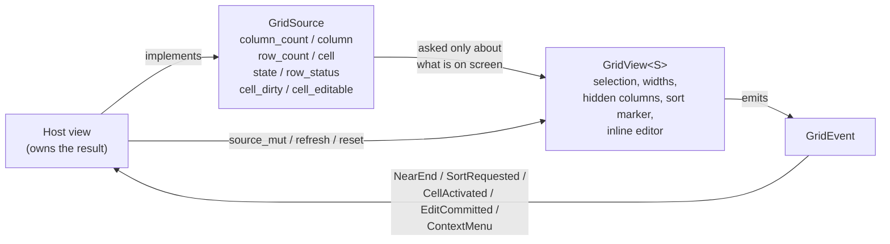

# The grid

`rugpui-grid` is one widget — [`GridView`](../crates/rugpui-grid/src/grid.rs) — over a table of rows it never fetches itself. Reach for it when you have a result set: a query result, a `DESCRIBE`, an execution plan, a diff. Anything with columns and rows and more of them than fit on a screen.

The rows arrive through a trait the host implements, [`GridSource`](../crates/rugpui-grid/src/source.rs). That boundary is the whole design: the crate knows `rugpui` and gpui and nothing else, so it can be pointed at any shape of answer, and its own tests need no server of any kind.

## What it holds to

Four things, from the [crate header](../crates/rugpui-grid/src/lib.rs):

* **A million rows scroll without a stutter.** Neither axis lays out more than the viewport can show, and no per-frame work is proportional to the size of the result.
* **Null is not the empty string.** `GridCell::Null` draws the marker `NULL` in a muted colour; `GridCell::Text("")` draws an empty cell. They are different values and they look different. Two of the four copy formats can carry the difference; two cannot, and [`copy.rs`](../crates/rugpui-grid/src/copy.rs) says which.
* **The grid does not sort.** It holds the first *n* rows of an answer the server holds all of, so sorting what is here would put the wrong rows at the top. A header click raises `GridEvent::SortRequested` and nothing moves until the host comes back with new rows.
* **The grid does not stage an edit either.** It draws which rows and cells have been changed and it hosts the field the user types into — because only it knows where a cell is on screen. What a typed value *becomes* is the host's, and reaches it as `GridEvent::EditCommitted`.

## The shape of it



Copying is deliberately *not* in that loop: gpui owns the clipboard and the grid owns the selection, so the grid does it itself.

Call `rugpui_grid::init(cx)` once at start-up, after `rugpui::init(cx)`, so the key bindings are registered. See [getting started](./getting-started.md) and the [README](../README.md) for the three `init`s.

## Implementing `GridSource`

Implement it on whatever the host already keeps the result in, so there is one copy of the data rather than two that can disagree. Every method is asked only about what is on screen, and none of them may block.

| method | required | returns | notes |
| --- | --- | --- | --- |
| `column_count(&self)` | yes | `usize` | Every column, hidden ones included. |
| `column(&self, index)` | yes | `GridColumn<'_>` | Asked once per visible column per frame — keep the name, don't build it. |
| `row_count(&self)` | yes | `usize` | How many rows are held *now*, not how many the query will return. A result being paged in grows this number and the grid follows it. |
| `cell(&self, row, column)` | yes | `GridCell<'_>` | `column` is a source column, unaffected by hiding or by dragged widths. |
| `state(&self)` | no | `GridSourceState` | Defaults to `Complete`. |
| `row_status(&self, row)` | no | `RowStatus` | Defaults to `Unchanged`. Asked once per *visible* row per frame — must be a lookup. |
| `cell_dirty(&self, row, column)` | no | `bool` | Defaults to `false`. Asked once per visible cell per frame. |
| `cell_editable(&self, row, column)` | no | `bool` | Defaults to `false`, so a source that has not thought about editing cannot be edited by accident. Asked per gesture, not per frame. |

The three defaulted methods are the truth for the read-only sources — a plan, a `DESCRIBE`, a diff — which are half of what the grid is pointed at.

Here is the gallery's source, trimmed. See [`rugpui-gallery/src/data.rs`](../crates/rugpui-gallery/src/data.rs) for the whole of it:

```rust
use rugpui_grid::{GridCell, GridColumn, GridColumnKind, GridSource};

const COLUMNS: &[(&str, GridColumnKind)] = &[
    ("order_id", GridColumnKind::Number),
    ("customer", GridColumnKind::Text),
    ("placed_at", GridColumnKind::Temporal),
    ("total", GridColumnKind::Number),
    ("note", GridColumnKind::Text),
];

// `None` is a null; `Some("")` is the empty string. They are not the same cell.
const ROWS: &[[Option<&str>; 5]] = &[
    [Some("10241"), Some("Northwind Traders"), Some("2026-02-03 09:14:22"), Some("1284.50"), Some("expedited")],
    [Some("10242"), Some("Blue Ridge Supply"), Some("2026-02-03 11:02:07"), Some("312.00"), None],
    [Some("10244"), Some("Meridian Foods"),    Some("2026-02-04 15:20:11"), Some("2940.00"), Some("")],
];

pub struct Orders;

impl GridSource for Orders {
    fn column_count(&self) -> usize {
        COLUMNS.len()
    }

    fn column(&self, index: usize) -> GridColumn<'_> {
        let (name, kind) = COLUMNS[index];
        GridColumn::new(name, kind).primary_key(index == 0)
    }

    fn row_count(&self) -> usize {
        ROWS.len()
    }

    fn cell(&self, row: usize, column: usize) -> GridCell<'_> {
        match ROWS[row][column] {
            Some(text) => GridCell::Text(text),
            None => GridCell::Null,
        }
    }
}
```

### Values are already strings

`GridCell::Text` borrows from the source rather than owning, so drawing a screenful of cells allocates nothing per cell for the value itself. That only works because the values *are* strings by the time they reach here: whatever decodes the wire hands over its text already decoded. A source that would have to format a number on the way out has nowhere to put the result — which is the constraint saying that formatting belongs upstream.

### `GridColumn` and `GridColumnKind`

`GridColumn::new(name, kind)` builds a heading; `.primary_key(true)` marks it as part of the key and `.aligned(GridColumnAlign::Left)` overrides the alignment its kind would have chosen.

`GridColumnKind` is a **hint and not a type**. The grid uses it for exactly two things, both readable on the enum itself:

* `kind.align()` — only `Number` goes `GridColumnAlign::Right`, because a column of right-aligned digits can be read down for magnitude.
* `kind.quoted_in_sql()` — `Number` and `Boolean` are written bare into a copied `INSERT`; `Text`, `Temporal` and `Binary` are quoted, because a bare `2024-01-01` is arithmetic in more dialects than it is a date.

A source that cannot tell says `GridColumnKind::Text`, which is the safe answer to both questions and the `Default`.

### The four cells

| variant | drawn as | muted |
| --- | --- | --- |
| `GridCell::Null` | `NULL_TEXT` (`"NULL"`) | yes |
| `GridCell::Default` | `DEFAULT_TEXT` (`"DEFAULT"`) | yes |
| `GridCell::Text(&str)` | the text, possibly empty | no |
| `GridCell::Lob { size: Option<u64> }` | `lob_label(size)` — `[LOB 4096]` or `[LOB]` | yes |

`GridCell::Default` is never returned by a source over a result set: a row that exists on the server has a value in every column, and that value may be `Null`. It exists for a staging layer holding a row that is not inserted yet, where a column left out means "the server will supply it" — which is not the same as writing `NULL` over an auto-increment key.

The whole of "how a cell draws" is the free function `cell_label(&GridCell<'_>) -> CellLabel`, which returns `{ text: SharedString, muted: bool }`. It lives outside the widget so the null-versus-empty distinction can be asserted without a window.

### Paging: `GridSourceState` and `NearEnd`

`state()` returns `Complete` (nothing more is coming), `HasMore` (the server has rows the source does not) or `Loading` (a batch is on its way).

While the source says `HasMore`, the grid raises `GridEvent::NearEnd` once the viewport comes within a hundred rows of the last one held. It is raised **once per row count**: a burst of scrolling that never reaches new rows asks once. The host fetches, drops the batch into its source through `source_mut`, and the grid — now looking at a longer result — asks again when the new end comes into view. Returning `Loading` while a fetch is in flight is what keeps a fast scroll from firing one fetch per frame.

### Staged edits: `RowStatus` and `cell_dirty`

`row_status(row)` says how a whole row is marked — `Unchanged`, `Modified`, `Inserted` or `Deleted`. The four do not overlap: a row that was inserted and then changed again is still `Inserted`, because that is the statement it will become. A `Deleted` row is still drawn, in its place, with its values struck through; making it vanish would renumber everything under it and leave the user nothing to change their mind about.

`cell_dirty(row, column)` is the per-cell half of `Modified` — the row marker says the row was touched, this says where. A dirty cell is tinted with the accent colour behind its text. Note that `cell()` returns the *staged* value for a dirty cell: the grid draws what it is given and knows nothing of what was there before.

## Building the view

`GridView<S>` is an entity, created with `cx.new` and rendered as a child element, exactly like the tree:

```rust
let grid = cx.new(|cx| {
    let mut grid = GridView::new(Orders, cx).insert_table("public.orders");
    grid.select_cell(2, 1, cx);
    grid.extend_selection(4, 3, cx);
    grid
});
```

Give it a bounded box to live in — the gallery puts it in a bordered `div().h(px(256.))` — and render it with `self.grid.clone()`.

| method | argument | effect |
| --- | --- | --- |
| `GridView::new` | `source: S, cx` | A grid over `source`, nothing selected, nothing sorted. |
| `.tab_index(index)` | `isize` | Places the grid in the window's tab order (builder; consumes `self`). |
| `.insert_table(table)` | `impl Into<SharedString>` | The table name written into a copied `INSERT` (builder). |
| `set_insert_table(table)` | `Option<SharedString>` | The same, after the fact. |
| `source()` / `source_mut(cx)` | — | Read the source, or change it — dropping a fetched batch in, most of the time. `source_mut` commits any edit in progress first and re-reads the shape on the next draw. |
| `refresh(cx)` | — | Re-read the source, for a change the grid cannot have seen. |
| `reset(cx)` | — | Throw away column widths, hidden flags, the selection, the sort marker and the scroll position — what a *new* result deserves, as opposed to another batch of the same one. |
| `selection()` | — | `&Selection`. |
| `is_selected(row, column)` | display column | Whether that cell is picked. |
| `sort()` / `set_sort(sort, cx)` | `Option<(usize, SortDirection)>` | Read the marker, or put it where the host says the result really is ordered — without asking for anything. |
| `toggle_sort(column, cx)` | source column | Walk the sort on one step (ascending, descending, none) and raise `SortRequested`. What a header click does. |
| `visible_rows()` | — | `Range<usize>`: the rows the list built last frame. |
| `visible_column_indices()` | — | `Vec<usize>`: the source columns showing, left to right. The index into this is a *display* column. |
| `column_width(column)` / `set_column_width(column, width, cx)` | source column, `f32` | Width in pixels, clamped so a column can still be found and dragged. |
| `is_column_hidden(column)` / `set_column_hidden(column, hidden, cx)` | source column, `bool` | Hiding clears the selection, because display positions renumber. |
| `hidden_column_count()` | — | Whether "show every column" is worth offering. |
| `show_all_columns(cx)` | — | The way back: a hidden column has no heading to right click. |
| `column_name(column)` | source column | `Option<&str>`, for labelling a menu item. |
| `autofit_column(column, cx)` | source column | Fit to content, sampling the first 500 rows and capped at 480 px. What a double click on the resize grip does. |
| `select_cell(row, column, cx)` / `extend_selection(row, column, cx)` | display column | Replace or stretch, and scroll the cell into view. |
| `select_row(row, cx)` / `select_all(cx)` / `clear_selection(cx)` | — | As a click on a row number, `Ctrl+A`, and nothing. |
| `copy(format, cx)` | `CopyFormat` | Writes the selection to the clipboard. |
| `scroll_to_row(row, cx)` | `usize` | Brings a row into view. |
| `editing()` | — | `Option<(row, source column)>` while the inline editor is open. |
| `editor()` | — | `Option<&Entity<TextInput>>`, for reading the half-typed value. |
| `begin_edit(row, column, window, cx)` | source column | Opens the inline editor. Returns whether it opened. |
| `commit_edit(cx)` / `cancel_edit(cx)` | — | Close, staging or discarding. |

## Events

`GridView<S>` implements `EventEmitter<GridEvent>`, so a host subscribes once. The crate header's example, extended:

```rust
cx.subscribe_in(&grid, window, |view, grid, event, window, cx| match event {
    // The viewport is within a hundred rows of the end and the source said
    // there are more. Fetch, then drop the batch in through `source_mut`.
    GridEvent::NearEnd => view.fetch_next_batch(cx),

    // A header was clicked. `direction` is `None` on the third click, which
    // drops the ordering. Re-run the query with a new `ORDER BY`; the rows do
    // not move until you replace the source.
    GridEvent::SortRequested { column, direction } => {
        view.reorder(*column, *direction, cx)
    }

    // A double click, or `Enter` on the cursor cell. A LOB goes to a viewer;
    // anything writable goes to the editor. The grid raises the same event
    // either way, because which of the two a cell deserves depends on the
    // column's type and on whether the result can be written to.
    GridEvent::CellActivated { row, column } => {
        grid.update(cx, |grid, cx| grid.begin_edit(*row, *column, window, cx));
    }

    // The user finished typing and the value really changed. Nothing has been
    // staged by the grid: the cell goes on drawing whatever `GridSource::cell`
    // returns until your staging layer says otherwise.
    GridEvent::EditCommitted { row, column, value } => {
        let EditValue::Text(text) = value;
        view.stage(*row, *column, text, cx)
    }

    // A right click. The grid has already taken the focus and moved the
    // selection if it had to; the items, their strings and what they do are
    // yours.
    GridEvent::ContextMenu { target, position } => {
        view.open_menu(*target, *position, cx)
    }
})
.detach();
```

`GridEvent` is `Clone` but not `Copy`, because `EditCommitted` carries the text; every other variant is four words of nothing. Every `column` in every variant is a **source** column, unaffected by hiding or by dragged widths.

## Selection

[`selection.rs`](../crates/rugpui-grid/src/selection.rs) is pure arithmetic — no window, no source, no colours. A `Selection` is a `Vec<CellRange>` plus an *anchor* (the corner a `Shift` gesture pivots around) and a *cursor* (the cell the arrow keys move). Five methods cover every gesture: `replace`, `add`, `extend_to`, `replace_rows`/`add_rows`, and `select_all`. `clamp(rows, columns)` drops any part hanging over a source that shrank.

A `CellAddress` is `{ row, column }`, and its `column` is the column's **display position** — the nth column currently on screen, left to right — not the source column. Hiding a column therefore renumbers the ones after it, which is exactly why `set_column_hidden` and `show_all_columns` clear the selection. Addressing by source column instead would let a "rectangle" survive a hide by drawing with a hole in it, which is worse.

`selection.bounds()` is the smallest `CellRange` covering everything picked, and it is what a copy runs over.

### Mouse

| gesture | effect |
| --- | --- |
| click a cell | picks it; starts a drag |
| drag | stretches from the anchor |
| `Shift`-click | stretches the newest rectangle from the anchor |
| `Ctrl`/`Cmd`-click | adds a one-cell rectangle and pivots on it from now on |
| double click | raises `CellActivated` |
| click a row number | picks the whole row, full width of the visible columns |
| `Shift`/`Ctrl`-click a row number | grows the block, or adds a row to it |
| right click | takes the focus, moves the selection only if the press fell *outside* it, then raises `ContextMenu` — no drag, no activation |
| click a heading | `toggle_sort` on that column |
| drag a heading's right edge | resizes; double click on it auto-fits |
| right click a heading or its grip | raises `ContextMenu` with `MenuTarget::Header` and leaves the selection alone |
| `Shift`+wheel | scrolls sideways, for a mouse with no horizontal wheel |

### Keys

Bound by `init` in the `GridView` key context, so the arrows and the clipboard chords go on meaning what they mean everywhere else in the app. `{mod}` is `cmd` on macOS and `ctrl` elsewhere.

| key | action |
| --- | --- |
| arrows | `MoveUp` / `MoveDown` / `MoveLeft` / `MoveRight` |
| `Shift`+arrows | `ExtendUp` / `ExtendDown` / `ExtendLeft` / `ExtendRight` |
| `Home` / `End` | `MoveRowStart` / `MoveRowEnd` |
| `{mod}-Home` / `{mod}-End` | `MoveFirst` / `MoveLast` |
| `PageUp` / `PageDown` | one screenful less a row, so the bottom row becomes the top one |
| `Shift-PageUp` / `Shift-PageDown` | the same, stretching |
| `{mod}-A` | `SelectAll` |
| `{mod}-C` | `CopyCells` — TSV |
| `Enter` | `Activate`: raises `CellActivated` on the cursor cell |

With nothing picked yet, the first keystroke lands on the first cell rather than one step away from it.

## Editing

The grid draws edit state and hosts the field; it stages nothing and sends nothing. The field has to live here for one reason: it is placed over a cell, and nothing else knows where a cell is.

`begin_edit(row, column, window, cx) -> bool` refuses when the cell is not there, its column is hidden, `cell_editable` says no (the default), or the cell holds a `GridCell::Lob` whose body is not in the grid. The field is seeded with the cell's text; a `Null` or `Default` cell seeds an empty one, but the grid remembers that the cell held no value — so leaving that field empty commits nothing rather than quietly turning `NULL` into `''`.

**A close commits.** `Enter`, `Tab`, the focus going elsewhere, a sort, a refresh, a scroll that takes the row off screen, a column dragged — all of them raise `GridEvent::EditCommitted`. Only `Escape` throws the typing away. The asymmetry is deliberate: what is committed is *staged*, not sent, so the cost of committing something the user did not mean is one undo in the pending changes, while the cost of discarding is the typing. Committing an unchanged field raises nothing at all, so opening a cell, looking at it and moving on is silent either way.

While the editor is open a second key context, `GridCellEditor`, exists — `Escape` cancels, `Tab` and `Shift-Tab` commit and open the next or previous editable cell of the same row (stopping at the ends rather than wrapping onto another row). Those three keys mean nothing to a merely focused grid, and binding them on the grid's own context would take `Escape` away from the app for as long as a grid had the focus. The stack while typing reads `GridView > GridCellEditor > TextInput`, so the field's own bindings win: `Enter` is the field's `Submit`, and left and right walk the caret. Up and down are not the field's, so an arrow out of a field commits it and walks on, the way a spreadsheet does.

`EditValue` has one variant today, `EditValue::Text(String)` — verbatim, neither parsed nor trimmed, because the grid has no idea what the column's type will make of it. It is an enum rather than a bare `String` because the next ones are visible already: a `Null` for the gesture that clears a cell rather than emptying it, and a `Lob` for a body that arrives from a file. Matching on it now costs a host nothing and saves it a signature change later.

## Copying

Four formats, because four different things get done with a block of rows.

| `CopyFormat` | `label()` | shape | a null becomes |
| --- | --- | --- | --- |
| `Tsv` (default) | `"TSV"` | tab separated, quoted when a field holds a tab, newline or quote | an empty field |
| `Csv` | `"CSV"` | comma separated, RFC 4180 quoting | an empty field |
| `Json` | `"JSON"` | an array of objects keyed by column name | `null` |
| `Insert` | `"INSERT"` | one `INSERT` per row | `NULL` |

`CopyFormat::ALL` is all four in menu order.

Only JSON and `INSERT` are faithful about null. There is no way to write a null in a tab- or comma-separated field that an empty string could not also be — the format has one hole and two things to put in it — so TSV and CSV lose the distinction on the way out. Reach for the other two when it matters.

JSON writes numeric and boolean columns as JSON numbers and booleans **when their text really is one**, and as strings when it is not: a numeric column holding `1,234` is text, whatever the driver called it. `INSERT` writes numbers and booleans bare and quotes everything else with inner quotes doubled — note that MySQL reads a backslash inside a string literal as an escape unless `NO_BACKSLASH_ESCAPES` is set.

`Ctrl`-click can pick blocks no rectangle covers, and no format has a shape for that. The copy runs over `Selection::bounds` and the cells inside the box but outside the selection come out as nulls: nothing is dropped, and nothing unpicked is included as a value. A LOB copies as its `[LOB …]` placeholder, which is deliberately not a valid value in any format — the body is not in the grid, so it cannot leave one.

`GridView::copy(format, cx)` does all of this and writes to the clipboard; an empty selection writes nothing rather than blanking it. The free function behind it is public for a host that wants the text without the clipboard:

```rust
use rugpui_grid::{CopyFormat, DEFAULT_INSERT_TABLE, copy_payload};

let text = copy_payload(&source, &columns, &selection, CopyFormat::Insert, DEFAULT_INSERT_TABLE);
```

`columns` maps display position to source column — `GridView::visible_column_indices()` — which is what makes a hidden column absent from the copy. `DEFAULT_INSERT_TABLE` is `"?table?"`, deliberately not valid SQL: a statement aimed at the wrong table is worse than one that will not parse until the name is filled in. Set the real one with `.insert_table("public.orders")`.

## Context menus

The grid raises `GridEvent::ContextMenu { target, position }` and stops. It does not name the items and does not run them, because this layer holds no strings. `position` is in **window** coordinates, which is what a menu anchors to.

`MenuTarget::Cell` covers the body — a cell or a row number. `MenuTarget::Header { column }` is a column heading, and `column` is the source column.

Everything such a menu needs is on `GridView` already: `copy`, `select_all`, `clear_selection`, `toggle_sort`, `set_column_hidden`, `show_all_columns`, `autofit_column` to act, and `sort`, `is_column_hidden`, `hidden_column_count`, `column_name` to label and disable. The host stores the position, renders a [`ContextMenu`](./widgets/menu.md) and clears the position on dismiss:

```rust
GridEvent::ContextMenu { target, position } => {
    self.menu = Some((*target, *position));
    cx.notify();
}
```

```rust
// A helper on the host, called from its `render` and dropped in beside the
// grid with `.children(self.render_menu(cx))`.
fn render_menu(&self, cx: &mut Context<Self>) -> Option<ContextMenu> {
    let (target, position) = self.menu?;
    let grid = self.grid.clone();
    let entries = match target {
        MenuTarget::Cell => vec![
            MenuEntry::new("Copy").shortcut("Ctrl+C").on_activate({
                let grid = grid.clone();
                move |_window, cx| {
                    grid.update(cx, |grid, cx| grid.copy(CopyFormat::Tsv, cx));
                }
            }),
            MenuEntry::separator(),
            MenuEntry::new("Select all"),
        ],
        MenuTarget::Header { column } => {
            let view = grid.read(cx);
            let name = view.column_name(column).unwrap_or_default().to_string();
            vec![
                MenuEntry::new(format!("Hide {name}")),
                MenuEntry::new("Show all columns")
                    .disabled(view.hidden_column_count() == 0),
                MenuEntry::new("Fit to contents"),
            ]
        }
    };

    let this = cx.entity();
    Some(
        ContextMenu::new("grid-context")
            .position(position)
            .entries(entries)
            .on_dismiss(move |_window, cx| {
                this.update(cx, |view, cx| {
                    view.menu = None;
                    cx.notify();
                });
            }),
    )
}
```

The host keeps the open/closed state — the `Option<(MenuTarget, Point<Pixels>)>` above — exactly as it does for every other stateless widget in the kit.

## Theme slots

See [theming](./theming.md) for the palette as a whole. The grid draws with five slots of its own and five general ones:

| slot | where |
| --- | --- |
| `grid_header` | the column header band, and the row-number gutter |
| `grid_row_alt` | the background of every odd row |
| `grid_selection` | the background of a picked cell |
| `grid_null` | the text of a muted label: `NULL`, `DEFAULT`, a LOB placeholder |
| `grid_pk` | a primary-key column's heading text — the one thing a key gets |
| `border` | every cell and header edge |
| `text` | an ordinary heading and cell |
| `text_muted` | the row number in the gutter |
| `accent` | the sort marker, the cursor cell's outline, a dirty cell's tint, a `Modified` row's mark |
| `success` / `danger` | an `Inserted` / `Deleted` row's mark down the gutter |

The dirty tint and the row tint are drawn at low alpha (0.16 and 0.10) so the text keeps the contrast the palette promised it, and so a whole tinted row does not out-shout the selection drawn over it.

## Performance

From the [`grid.rs`](../crates/rugpui-grid/src/grid.rs) header. Nothing per frame is proportional to the number of rows or to the number of columns — only to the number of both that fit on screen.

* **Rows** go through gpui's `uniform_list`, which lays out only what the viewport can reach. `visible_rows()` is the range it built, and is what the guarantee is stated in.
* **Columns** are virtualised by hand, because there is no `uniform_list` for them and tables with several hundred columns are real. Every column's left edge is kept in a list rebuilt when a width changes, so finding the run the content area can see is two binary searches. A row is drawn as one absolutely positioned strip slid left by the scroll offset, not as a flex row of every cell with the invisible ones clipped.
* **The horizontal offset is the grid's own field**, not a gpui scroll container's — a scroll container lays its content out in full, which is exactly the cost being avoided. It also makes the header and the body trivially agree: they read the same number.
* **Hit testing is arithmetic**, not a listener per cell. A cell that answered presses would need an id and a hitbox, and a screenful is several hundred of both, every frame, for a gesture four numbers resolve.
* **The viewport is measured during prepaint** by a `canvas` in the body, which asks for a repaint when the width changed. A resize — and the very first frame — costs one extra frame and nothing after that.
* **Auto-fit samples 500 rows** and measures in character cells rather than shaping text, capped at 480 px. Being a few pixels out only means the user drags the column afterwards, which they can.

The budget this buys is what `row_status` and `cell_dirty` must respect: a source that answered either by walking a million rows would undo the virtualisation on its own. Keep staged changes in a map keyed by row so the answer is a lookup.

## Testing without a window

Half the crate needs no window at all. `selection.rs`, `copy.rs` and `source.rs` are pure, and their tests are plain `#[test]` functions over a twenty-line source — a struct of `Vec<Vec<Option<&'static str>>>` where `None` is a null and `Some("")` is the empty string:

```rust
struct Fixture {
    headings: Vec<(&'static str, GridColumnKind)>,
    rows: Vec<Vec<Option<String>>>,
}

impl GridSource for Fixture {
    fn column_count(&self) -> usize { self.headings.len() }
    fn row_count(&self) -> usize { self.rows.len() }

    fn column(&self, index: usize) -> GridColumn<'_> {
        let (name, kind) = self.headings[index];
        GridColumn::new(name, kind)
    }

    fn cell(&self, row: usize, column: usize) -> GridCell<'_> {
        match self.rows[row][column].as_deref() {
            Some(text) => GridCell::Text(text),
            None => GridCell::Null,
        }
    }
}
```

For editing and staging, the tests add the three defaulted methods over plain fields — a `Vec<RowStatus>`, a `Vec<(usize, usize)>` of dirty cells and a `Vec<usize>` of editable columns — which is the shape of the overlay a host wraps a real result in.

The widget's own tests do need a window, and use gpui's `TestAppContext`. The pattern in `grid.rs` is worth copying: a `Harness` view that does nothing but `div().size_full().child(self.grid.clone())`, an `Rc<RefCell<Vec<GridEvent>>>` filled by a `cx.subscribe` so a test can drain what the grid announced, and helpers that `cx.update(…)` then `cx.run_until_parked()`. Mouse gestures are simulated with `cx.simulate_event(MouseDownEvent { … })` at coordinates worked out from the row height and the column widths, so a click on a given cell is a one-line helper.

To count how often a source is touched, a source can note each call on a shared probe — which is how "does it still only touch the visible rows?" becomes an assertion rather than something to eyeball.
