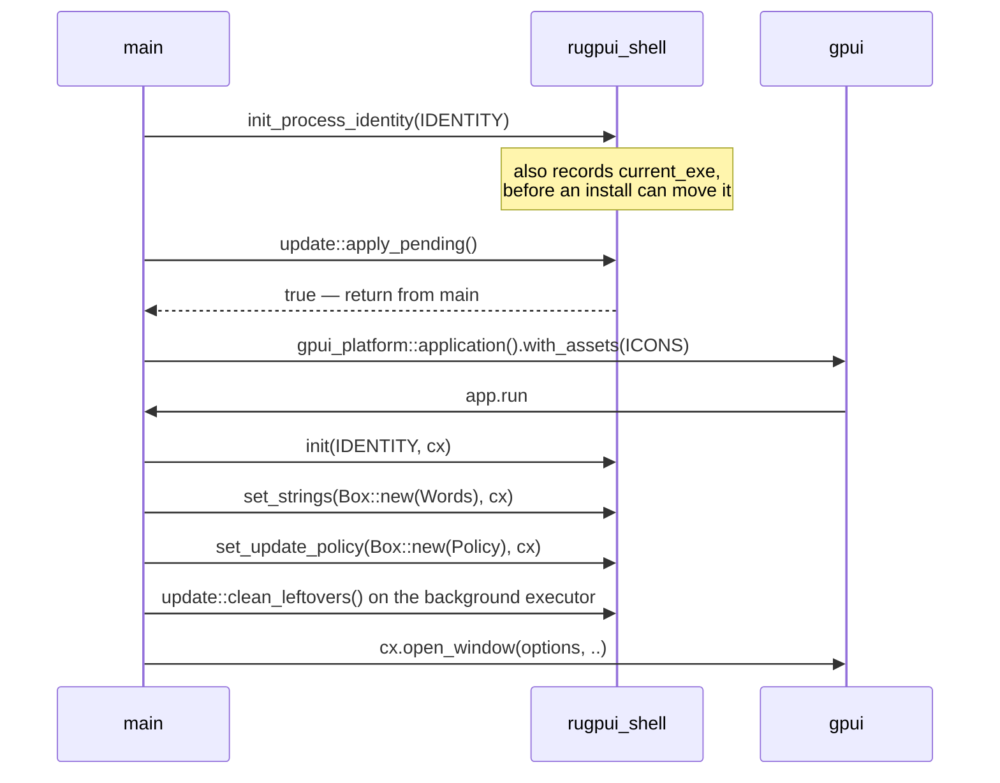
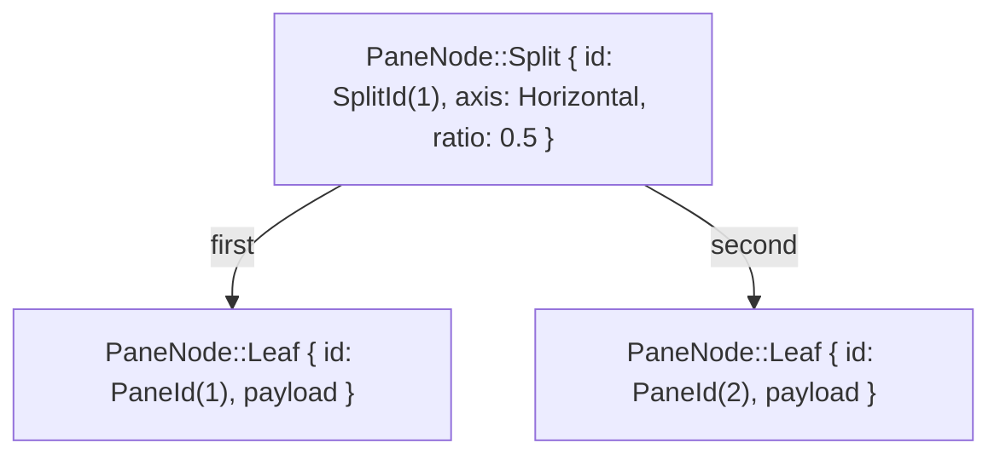
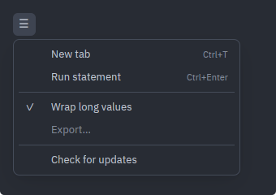
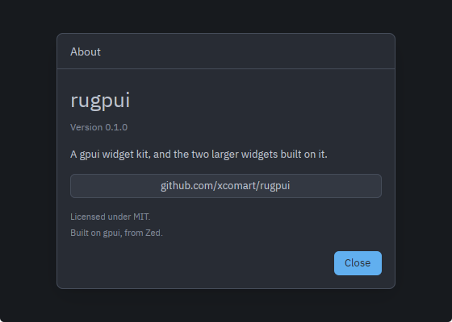
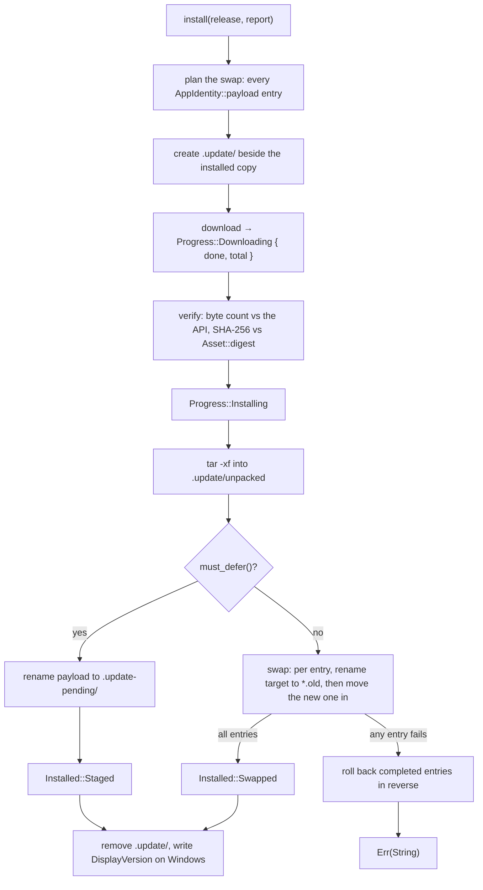
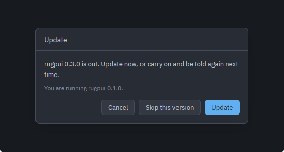
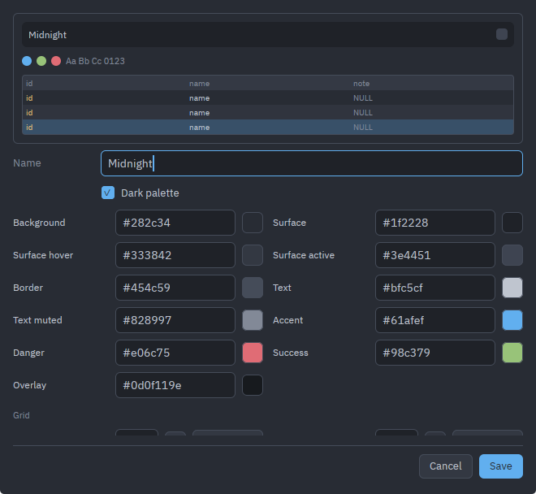
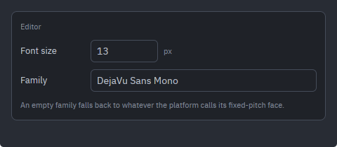

# The shell

`rugpui-shell` is the layer above the widget kit: the parts of an *application*
that turned out not to be about the application at all. A window that draws its
own title bar, an updater that replaces the installed copy with the one GitHub
published, an about box, a palette editor, a tree of split panes. Reach for it
when you are writing a gpui desktop application rather than embedding a widget
in someone else's.

The root [README](../README.md#the-shell) walks through the wiring — the three
injected things and the two catalogues. In short:

* **[`AppIdentity`](../crates/rugpui-shell/src/inject.rs)** — the constants an
  updater and an about box need, all `&'static str` because the shell only ever
  reads them. Installed with `init(IDENTITY, cx)`, or with
  `init_process_identity(IDENTITY)` when you have to reach the update paths
  before there is a `gpui::App`.
* **`Strings`** — one method, `text(&self, key: &str) -> SharedString`, over
  whatever your application already translates with. Installed with
  `set_strings`. Interpolation is *not* the implementation's job: hand the
  template back with its `%{marker}`s intact and the shell fills them in.
* **`UpdatePolicy`** — `ignored`/`set_ignored`, the two-line window onto the
  "never mention this version again" tag in your settings file. Installed with
  `set_update_policy`.
* **`restart_path()`** — the path to hand `cx.set_restart_path` after an
  install, because `current_exe()` at restart time is wrong on two platforms.
* **`input_menu_labels`** — pass it to `TextInput::context_menu` so one set of
  keys covers every field in the application.
* **`UiThemeCatalog` / `EditorThemeCatalog`** — the two built-in `ThemeCatalog`
  implementations over `rugpui`'s own palette formats.

Everything below is what the README does not cover.

## The host contract, in order

`init` needs an `App`; two of the shell's calls run before there is one.
`update::apply_pending` performs the renames a staged update left for the next
launch, and `update::clean_leftovers` sweeps up the previous one's `.old`
copies. Both read the identity out of a process global rather than out of gpui,
which is what `init_process_identity` fills — and `init` calls it itself, so the
two can never drift apart.



`identity(cx)` answers from the gpui global and panics when `init` has not run —
every caller is inside a window you opened after installing it, so reaching that
panic is a wiring mistake rather than a runtime condition. The background paths
read the process-wide slot instead, and the two that run at start-up log an
error and no-op rather than taking the launch down.

`ignored_release(cx)` and `set_ignored_release(tag, cx)` are the shell's side of
`UpdatePolicy`. With no policy installed the first answers `None` and the second
logs a debug line: an application that does not offer "ignore this version"
simply never suppresses anything. `set_ignored_release` takes the policy out of
the global for the duration of the call and puts it back, because your
implementation wants a `&mut App` of its own to write settings with.

## The strings the shell looks up

`text(cx, key, args)` and `label(cx, key)` are the only way anything here
reaches the user's language. A key you have not translated comes back as the key
itself — visible on screen, and therefore reportable; the alternative, a panic
inside a render pass, would take the window down over a missing line of text. A
`%{marker}` with no matching argument is left as it stands for the same reason.

| Key | Where it is shown | Markers |
|---|---|---|
| `common.close` | About dialog, update dialog | |
| `common.cancel` | Update dialog, delete confirmation, theme editor | |
| `common.save` | Theme editor | |
| `about.title` | About dialog heading | |
| `about.version` | Under the wordmark | `version` |
| `about.tagline` | One line of prose | |
| `about.license` | Footnote | `license` |
| `about.credits` | Footnote | |
| `input.menu_cut` `input.menu_copy` `input.menu_paste` `input.menu_select_all` | A text field's right-click menu | |
| `menu.check_updates` | Update dialog heading while checking, up to date or failed | |
| `update.title` | Update dialog heading while announcing or installing | |
| `update.available` | "A new version exists" | `app`, `version` |
| `update.installed` | "You are running …" | `app`, `version` |
| `update.checking` | Manual check in flight | |
| `update.up_to_date` | Manual check found nothing | |
| `update.downloading` | Progress heading | |
| `update.installing` | Progress heading | |
| `update.failed` | Error heading | |
| `update.update` `update.ignore` `update.open_release` | The three buttons | |
| `settings.editor.name` | Theme editor's name field | |
| `settings.editor.dark` | Theme editor's dark/light checkbox | |
| `settings.editor.invalid` | Refusal of a malformed colour | |
| `settings.editor.automatic` | The "back to automatic" button | |
| `settings.editor.automatic_slot` | Its accessible name | `name` |
| `settings.editor.grid_group` | Heading over the optional slots | |
| `settings.editor.theme_title` | `UiThemeCatalog::kind_label_key` | |
| `settings.editor.editor_theme_title` | `EditorThemeCatalog::kind_label_key` | |
| `settings.editor.slot.*` | The sixteen chrome slot labels: `background`, `surface`, `surface_hover`, `surface_active`, `border`, `text`, `text_muted`, `accent`, `danger`, `success`, `overlay`, `grid_header`, `grid_row_alt`, `grid_selection`, `grid_null`, `grid_pk` | |
| `settings.editor.code.*` | The editor slot labels: `foreground`, `cursor`, `selection`, `line_highlight`, `gutter`, `gutter_active`, `keyword`, `string`, `number`, `comment`, `function`, `type`, `operator`, `identifier`, `key`, `variable`, `punctuation`, `bracket_match`, `error`, `warning` (its `background` shares `settings.editor.slot.background`) | |
| `settings.manage.duplicate` `edit` `delete` `import` `export` | The five management buttons | |
| `settings.manage.copy_name` | Name a duplicate is given | `name` |
| `settings.manage.delete_theme_confirm` | Delete question, chrome catalogue | `name` |
| `settings.manage.delete_editor_theme_confirm` | Delete question, editor catalogue | `name` |
| `settings.manage.delete_failed` | | `error` |
| `settings.manage.write_failed` | Save, export and import failures | `error` |
| `settings.manage.import_select` | The file picker's prompt | |
| `settings.manage.import_skipped` | "n files were not palettes" | `count` |
| `settings.manage.import_unreadable` | `ImportError::Unreadable` | `file`, `error` |
| `settings.manage.import_bad_color` | `ImportError::BadColor` | `file`, `slot` |
| `settings.manage.import_not_a_theme` | `ImportError::WrongKind`, chrome catalogue | `file` |
| `settings.manage.import_not_an_editor_theme` | `ImportError::WrongKind`, editor catalogue | `file` |

`locale::check_locale_dir` (below) is what keeps a translation from silently
losing one of these.

## The self-drawn title bar

A window opens one of two ways, and
[`TitlebarStyle`](../crates/rugpui-shell/src/chrome.rs) is the setting that says
which: `Custom` (the default — your toolbar *is* the title bar) or `System`. It
is read once, at window creation, because that is when the platforms decide
whether the window has a caption at all; an interface offering it as a setting
is expected to say that a change shows after a restart. It serialises in
`snake_case`, which is the spelling the settings files already carry.

Taking the caption away also takes the drag, the double-click to maximise, the
window menu, the resize borders and the drop shadow. Each has to be put back by
hand, and differently on every platform — which is what the rest of `chrome.rs`
is.

| Function | Answers | Notes |
|---|---|---|
| `draws_own_titlebar(style, window)` | `bool` | On Windows and macOS the style settles it. On Linux the *window's* actual decorations do: the ask for client-side decorations can be declined, and deciding from the style alone would draw a second caption under the compositor's. |
| `titlebar_gestures(row)` | `Stateful<Div>` | Windows needs nothing — the row reports itself as `WindowControlArea::Drag` and the window procedure does the rest. macOS gets the double-click, routed through `Window::titlebar_double_click` so it follows System Settings. Linux gets all of it: `start_window_move` on press (the compositor takes the pointer, so a release would never arrive), `zoom_window` on double-click, `show_window_menu` on right-click. |
| `client_tiling(window)` | `Option<gpui::Tiling>` | Always `None` off Linux. `Some` exactly when the compositor granted client-side decorations, with the edges that currently touch something marked tiled. |
| `render_resize_edges(tiling)` | `Vec<AnyElement>` | Four strips over the `SHADOW_BAND` and four `RESIZE_CORNER` squares, each starting `window.start_window_resize(edge)`; a tiled edge gets none. |
| `window_appearance(blur, opacity)` | `WindowBackgroundAppearance` | Blur wins; failing that anything below fully opaque asks for `Transparent`; otherwise `Opaque`. |
| `window_control_strips(icons, custom, window, cx)` | `(Option<WindowControls>, Option<WindowControls>)` | The caption buttons, split into the two ends a Linux desktop may ask for. Both `None` unless `custom`, and both `None` on macOS, where AppKit goes on drawing the traffic lights over your toolbar band. |

Assembling one, in the order the pieces go together:

```rust
let custom = rugpui_shell::draws_own_titlebar(settings.titlebar_style, window);
let (leading, trailing) =
    rugpui_shell::window_control_strips(&icons, custom, window, cx);

let mut row = div().id("titlebar").flex().flex_row().items_center();
if custom {
    row = rugpui_shell::titlebar_gestures(row);
}
let row = row
    .children(leading)
    .child(/* your toolbar */)
    .children(trailing);
```

The two strips carry fixed element ids — `window-controls-leading` and
`window-controls-trailing` — so they render straight into the row: leading
before whatever it starts with, trailing after whatever it ends with. Build
`icons` with `rugpui_shell::window_control_icons()`, which is the four paths of
[`WINDOW_CONTROL_ICONS`](../crates/rugpui-shell/src/icons.rs) in the shape
`rugpui::WindowControlIcons` wants; see
[window-controls](./widgets/window-controls.md) for what the strip draws.


*The pieces together: a `MenuButton` at the leading end, the window's title in
the middle, and the trailing `WindowControls` strip.*

The shadow band, when the window carries one, goes at the window root:

```rust
div().relative().size_full().children(
    rugpui_shell::client_tiling(window)
        .map(rugpui_shell::render_resize_edges)
        .unwrap_or_default(),
)
```

### Icons

[`IconSet`](../crates/rugpui-shell/src/icons.rs) is a `gpui::AssetSource` over
several `const` tables, searched in order, so this crate's four caption glyphs,
the widget layer's two disclosure marks and your own icons stay three slices in
the three crates they belong to:

```rust
static SET: IconSet = IconSet::new(&[rugpui::ICONS, rugpui_shell::WINDOW_CONTROL_ICONS, ICONS]);
```

`rugpui::ICONS` is not optional: leave it out and every tree, collapsible
section and dropdown draws its arrow as nothing at all.

Install it with `Application::with_assets`; without it gpui's default source
answers every path with `None` and the icons paint as nothing at all. `icon(path,
size, color)` builds one sized and tinted `Svg` — still an `Svg`, so a hover
state can go on styling it. gpui paints an SVG as a *monochrome* sprite: the
colours in the file never reach the screen, only its coverage does, and the tint
is not inherited, so a hover that recolours a button has to reach the icon
through `group_hover`.

### Switching a live window

gpui settles the title bar at window creation and offers no way back. The
vendored `Window::set_titlebar_transparent(transparent, traffic_light_position)`
is the patch that adds one — see the root [Cargo.toml](../Cargo.toml)'s patch
table — and it is what lets `TitlebarStyle` be a setting at all without
reopening the window and dropping whatever it was holding. Supported on Windows
and macOS; on Wayland and X11 the caption belongs to the compositor until the
window opts into client-side decorations, and `Window::request_decorations` is
the call with an effect there.

### The platform-drawn caption

[`apply_caption_theme(window, theme, cx)`](../crates/rugpui-shell/src/caption.rs)
keeps the caption the platform *does* draw in step with your palette, and is a
no-op on Linux, where the caption is the desktop's. On Windows it pins
`DWMWA_CAPTION_COLOR` and `DWMWA_TEXT_COLOR` to `theme.surface` and
`theme.text`, plus `DWMWA_USE_IMMERSIVE_DARK_MODE` from
`theme.dark`; without that, `background_blur` puts the caption inside an acrylic
accent policy and DWM paints near-white glyphs on a near-white surface. On macOS
none of your colours are wanted — AppKit draws the caption correctly for
whichever `NSAppearance` is in force, and the wrong one is in force only because
it was inherited from the system, so the whole fix is
`cx.set_window_appearance(Some(Dark | Light))`. Call it whenever the theme
changes, and under the custom title bar too, where AppKit still draws the
traffic lights.

## Panes

[`PaneTree<T>`](../crates/rugpui-shell/src/pane.rs) is a binary tree: every leaf
is one pane holding one payload, every interior node divides its area in two
along an `Axis`. It is deliberately free of gpui types — the promotion and
collapse rules are the part of a split layout that is easy to get subtly wrong,
so they live in a plain data structure with unit tests of their own.



Splitting a pane replaces its leaf with a `Split` whose first child is the old
leaf and whose second is the new one, so a split always appears below or to the
right of the pane it was asked for. Closing a pane collapses the split it sat in
and promotes its sibling into the split's place, which is what keeps the tree
free of one-child nodes. Ids are process-wide and never reused, so a stale id
reads as "gone" rather than as some other pane that took the slot.

| Method | Answers | Effect |
|---|---|---|
| `PaneTree::single(payload)` | `Self` | A tree of one pane. |
| `root()` | `&PaneNode<T>` | For rendering; a tree always has one. |
| `split(target, axis, payload)` | `Option<PaneId>` | Splits `target`; `None` when it is not in this tree. |
| `merge_subtree(target, axis, subtree)` | `bool` | Puts a whole tree in the new half, ids and layout intact — how an open tab becomes a pane of another tab. |
| `remove(target)` | `Option<T>` | Removes and *returns* the payload, so it doubles as "detach". Refuses the last pane: a tab with no panes has nothing to render, so the caller closes the tab instead. |
| `set_ratio(id, ratio)` | `bool` | Moves a divider, clamped to `0..=1`. How much of a pane must stay visible is the view's question, so the view clamps to its own minimum first. |
| `get(id)` / `get_mut(id)` / `contains(id)` | | Payload lookups. |
| `leaves()` / `leaf_ids()` / `leaf_count()` | | Layout order: first child before second, depth first. |
| `first_leaf()` | `(PaneId, &T)` | The top-left pane; always present, so a caller holding a stale id has somewhere to fall back to. |
| `next_leaf(from)` / `prev_leaf(from)` | `Option<PaneId>` | The focus cycle, wrapping at the ends. |

`PaneId::as_u64` and `SplitId::as_u64` exist for building element ids. A split
carries an id because a divider is *dragged*: the view starts a drag on one
handle and then receives move events from every enclosing split as well, so it
needs a way to tell "this is the divider being dragged" from "this is an
ancestor watching the same gesture". Positions cannot answer that, since the
tree is rewritten whenever a pane opens or closes.

Nothing here is serialised, and dragging a divider belongs to the view — which
is what owns the pixels a ratio is computed from. The host walks `root()` and
renders one nested flex box per node, sizing the two children by `ratio` along
`axis`. [`rugpui::Splitter`](./widgets/splitter.md) is the natural renderer for a
`PaneNode::Split`: its `ratio` is the node's, its `on_change` feeds
`PaneTree::set_ratio`, and `SplitId::as_u64()` is the element id that tells one
divider's drag from an enclosing split's.

### The item type

`Pane<I>` is the payload an application whose panes hold *tabs* reaches for: a
list of items, which one is on top, and the strip's own scroll position. It is
generic over the item for the same reason the tree is generic over its payload —
what a tab *is* differs per application — so you instantiate
`PaneTree<Pane<MyTab>>` and add whatever lookups your tabs need as free
functions over `Pane::items` or through `Pane::position`.

`new`, `items`, `is_empty`, `active_index`, `active`, `active_mut`, `get`,
`get_mut`, `scroll_handle`, `activate`, `push`, `close`, `position`. Two of them
have rules worth knowing:

* `activate(index)` answers `false` for an index that names no tab *and* for one
  already on top, which is what lets a caller skip the focus dance around a
  click on the active tab.
* `close(index)` hands the item back and moves `active` to the tab that follows
  the closed one, or the one before it when nothing follows — that is what makes
  a run of closes walk in one direction rather than jumping to the end.

Only the active tab is rendered, which makes closing or switching one a focus
hazard: gpui resolves actions against the focused element of the last drawn
frame, so reclaim the keyboard around every call that changes what `active()`
returns. The scroll handle is per pane rather than per window, because two panes
side by side each scroll their own strip.

## Menus as rows

A `rugpui::MenuEntry` is write-only: it carries a boxed callback and a private
label, so nothing can be read back out of one. What a menu offers on a given
table row, tab or document is exactly the decision worth testing, and a test
that had to click at a computed pixel to find out would be testing the menu's
line height.

So each surface builds a `Vec<MenuRow>` and
[`entries`](../crates/rugpui-shell/src/menu_rows.rs) turns it into the widget's
own rows on the way to being drawn. The description is what the tests read, and
it is the same list the user sees, not a second account of it.

```rust
use rugpui_shell::{MenuRow, SHORTCUT_MODIFIER, entries, greyed, labels, row};

fn menu(&self) -> Vec<MenuRow> {
    vec![
        MenuRow::new(label(cx, "menu.copy")).shortcut(format!("{SHORTCUT_MODIFIER}+C")),
        MenuRow::new(label(cx, "menu.paste")).enabled(self.can_paste),
        MenuRow::separator(),
        MenuRow::new(label(cx, "menu.wrap"))
            .checked(self.wrap)
            .on_activate(move |window, cx| { /* … */ }),
    ]
}
```

Builders: `new`, `separator`, `shortcut`, `enabled`, `checked`, `on_activate`.
Readers: `label`, `is_enabled`, `is_checked`, `is_separator`, and `activate`,
which runs the row as clicking it would and panics on a greyed one — a test that
activated a greyed row would be asserting about a path the interface does not
have. The three free functions are the assertion vocabulary: `labels(&rows)`
(separators come out as empty strings, so the *groups* are part of what is
pinned down), `greyed(&rows)` (never a separator: a rule is not a command that
happens to be unavailable), and `row(&rows, "Copy")`, which finds by label rather
than index so inserting a row above the one a test is about does not silently
point it at a different command.

All of it is compiled into the library rather than gated behind `cfg(test)`,
because a test of *your* menu lives in *your* crate, where this crate's
`cfg(test)` does not reach. `SHORTCUT_MODIFIER` is `"Cmd"` on macOS and `"Ctrl"`
elsewhere, and it is decoration only — the binding itself is registered against
a gpui keymap, which has its own spelling.



*A `Vec<MenuRow>` after `entries(..)`: shortcuts from `SHORTCUT_MODIFIER`, two
`MenuRow::separator()` rules, a `checked(true)` row and an `enabled(false)` one.
The same list a test reads through `labels(&rows)`.*

## The about dialog

[`AboutDialog`](../crates/rugpui-shell/src/about.rs) is a read-only card: the
wordmark, the compiled-in version, one line of prose, a button to the
repository, and the licence and credits. Everything that differs per application
comes out of `AppIdentity`, so it needs nothing of you but the `about.*` keys.

```rust
let about = cx.new(AboutDialog::new);
cx.subscribe(&about, |view, _about, event, cx| match event {
    // Put focus back wherever it was before the dialog took it.
    AboutDialogEvent::Dismissed => view.focus_workspace(cx),
})
.detach();
```

`open(cx)`, `close(cx)`, `dismiss(cx)` (closes *and* emits `Dismissed`) and
`is_open()`. It renders nothing while closed, so render it unconditionally as
the last child of a `relative()` root. `Escape` from anywhere inside it
dismisses. It owns no form state, so unlike the other dialogs it has nothing to
collect or persist — it only reports that it went away, so you can put focus
back.



*Everything on it but the `about.*` wording comes out of `AppIdentity`: the
name, the compiled-in version, the repository button and its label.*

## Updates

Two halves over one notion of what a release is, in
[update.rs](../crates/rugpui-shell/src/update.rs).

### The check

`update::check_now()` is one blocking request against
`AppIdentity::latest_release_api`, and it answers a three-way `Check`:
`Newer(Release)`, `UpToDate`, or `Failed(String)`. `update::check(ignored)` is
the start-up wrapper: it answers `Some(Release)` only when the request
succeeded, the tag is strictly newer, and it is not the ignored one — every
other outcome is a `log::debug!` and a `None`. A workbench is opened to get work
done, and an update check is the least important thing happening at start-up; a
*manual* check is the opposite, because the user asked a question and is owed an
answer including "I could not reach GitHub".

Both must be called from the background executor. `ignored` is passed in rather
than read from the global because the global is only reachable from the UI
thread — that is what `update::ignored_release(cx)` is for, on the way in.
`release_url(&release)` answers the release's own page, or
`AppIdentity::releases_page` when the API named none.

`update::set_startup_check_enabled(false)` turns the start-up check off without
a request. It exists for test suites: gpui's test executor runs background tasks
inline whenever a test parks, so a suite that builds dozens of windows would
otherwise make dozens of real requests to github.com. `check_now` is deliberately
untouched by it — nothing starts one except a user picking a menu item.

### The install



`Release { tag, version, url, asset }` and
`Asset { name, url, size, digest }` are what the API parsed to; `asset` is
`None` on a target the project does not publish for, which is what makes
"Update" hand off to the browser instead. `Progress` is `Downloading { done,
total }` (reported no more often than every 256 KB, so the read loop does not
wake the UI thread for a bar that has not moved a pixel) and `Installing`.

Some things worth knowing about the fields:

* **`payload`** names everything the swap has to move, in install order, with
  the executable — or, on macOS, the `.app` bundle — first. An application that
  resolves a bundled runtime or a JAR *relative to itself* would, after a swap
  of the executable alone, be a new binary beside old companions. So the entries
  move together and the sequence is a journal: the first one that fails undoes
  every completed one in reverse, which a rename can always do. What the archive
  carries *besides* the payload is deliberately not swapped — a Linux archive's
  `icons/` and `.desktop` file are the installer's business.
* **`bundle_executable`** (`Contents/MacOS/<name>`) is read only when a staged
  update is applied on macOS, which needs something runnable out of a plan that
  names the bundle.
* **`must_defer`** is a `fn() -> bool` you supply, asked *before* the first
  rename. On Windows a JVM loaded into the process holds open handles on the
  very files the swap renames. Trying the swap and staging on failure sounds
  more general and is worse: Windows reports a sharing violation and a
  permissions problem alike as `ERROR_ACCESS_DENIED`, so an installation
  directory the user cannot write would be staged forever instead of saying so.
* **`windows_arp_key`** is the Inno Setup `AppId` with `_is1` appended. One
  successful update writes one value, `DisplayVersion`, into that key, because
  winget reads it to decide which version is present. It never *creates* the
  key — a copy unpacked from the portable zip is not an installed program — and
  it writes only to an entry whose `InstallLocation` canonicalises to the
  directory this executable is actually running from.

The staging directory `.update` and the pending directory `.update-pending` both
sit beside the installed copy rather than in the system temp directory, and that
placement is load-bearing: the last step is an `fs::rename`, which cannot cross
a volume. `.update-pending` is deliberately *not* inside `.update`, which
`install` deletes on its way out.

`update::apply_pending()` is what consumes a staged payload. Call it first thing
in `main`, before the gpui application exists: the whole point is to do the
renames in a process that holds no handle on anything. It answers `true` when
the caller should return from `main` immediately — the new build is in place and
a fresh process carrying this one's arguments has been spawned into it. A
pending directory that is incomplete, or a swap that fails anyway, is logged,
removed and forgotten, so a launch that failed once cannot fail identically
forever. `update::clean_leftovers()` removes the `*.old` copies on the
background executor; a leftover costs disk space and nothing else.

`restart_path()` answers `Some` once an identity is installed, and it is the
`current_exe()` of *that* moment. On Linux `current_exe()` resolves through
`/proc/self/exe` and follows the *inode*, so after the swap it answers the
renamed-away old build; on macOS gpui's restart shells out to `open`, which
needs the `.app` bundle and not the executable inside it, so the answer is
adjusted to the bundle root.

### The dialog

[`UpdateDialog`](../crates/rugpui-shell/src/update_dialog.rs) is a state machine
because it is reached two ways. `open(release, cx)` is the start-up check's
entry point and appears already announcing. `start_check(cx)` is the menu item's:
it opens *before* there is an answer, so the click has a visible effect on a
slow connection, and it deliberately ignores the remembered tag — asking is an
override of the earlier "don't mention this again".

```mermaid
stateDiagram-v2
    [*] --> Closed
    Closed --> Checking: start_check
    Closed --> Announce: open, from the start-up check
    Checking --> Announce: Check::Newer
    Checking --> UpToDate: Check::UpToDate
    Checking --> Failed: Check::Failed
    Announce --> Busy: Update
    Announce --> Closed: Ignore, emitting Ignored
    Announce --> Closed: Cancel, Escape or the backdrop
    Busy --> Failed: install returned Err
    Busy --> [*]: Installed — the host restarts
    Failed --> Closed: Close, or the release page
    UpToDate --> Closed: Close
```

`UpdateDialogEvent` has three variants: `Ignored { tag }` (the dialog has
already closed itself; you persist the tag through `UpdatePolicy`),
`Installed(Installed)` — both `Swapped` and `Staged` mean the same thing to a
host, *restart*, and the dialog is still on screen when it arrives because a
dialog that closed itself first would flash the window back into view for a
fraction of a second — and `Dismissed`.

`is_busy()` is `true` while the install runs, and `close`/`dismiss` are no-ops
then: between the two renames of each entry the application directory is a
mixture of two builds, and a dialog that could be dismissed mid-way would invite
the user to close the window exactly then. Closing it would not stop the
background task anyway, only hide it. The error text under the translated "the
update failed" heading is *not* translated: it is a `tar` message or an OS
error, produced on a thread that has no business reaching into locale state.

Structurally it is a twin of `AboutDialog` — same `open`/`close`/`is_open`
shape, same `Escape` handling, same "renders nothing while closed" contract — so
it wires up the same way.



*The `Announce` state, which is where `open(release, cx)` leaves it: the version
that is out, the one running, and the three ways out — `Cancel`, "skip this
version" (which emits `Ignored { tag }`) and `Update`.*

## Catalogues and the theme editor

Two things here are written against a *catalogue* rather than against a
particular kind of palette: `ThemeEditor`, which edits one entry colour by
colour, and `CatalogActions`, which duplicates, edits, deletes, imports and
exports them. Both work for a chrome theme and for an editor theme without
knowing which they have, because everything the two differ in is behind
[`ThemeCatalog`](../crates/rugpui-shell/src/catalog.rs).

### The trait

Required, and what an implementation over `CatalogFile::Other` must answer:

| Method | Answers |
|---|---|
| `kind_label_key` | Key of the heading over the editor. |
| `element_prefix` | Prefix of this row's element ids; static, never translated. |
| `delete_confirm_key` | Key of the delete question (takes `%{name}`). |
| `entries(cx)` | Every `CatalogEntry { id, name, builtin }`, built-ins first. |
| `slots()` | `&'static [Slot]`, in the order values are read and written. |
| `load(id, cx)` | The `CatalogFile` that would reproduce `id` — resolved through the registry, not read off disk, so a built-in duplicates like a custom one. |
| `values_of(file)` | `(Vec<String>, bool)`: every slot's value in `slots()` order, plus whether it is dark. An omitted optional slot is an empty string. |
| `file_from(name, values, dark)` | The inverse. What the editor saves is what it read, minus the edits. |
| `dir()` | Where this catalogue's user files live. Not created by the call. |
| `default_id()` | The id selected when the one in hand is deleted. |
| `generated_id_prefix()` | Prefix for an id made up when a name yields no slug. |
| `save(id, file)` / `write(file, path)` / `delete(id)` | Into the config directory by id; to an arbitrary path; removal. |
| `read(path)` | `Result<CatalogFile, ImportError>`. |
| `reload(cx)` | Reloads the registry the entries come from; called after every save and delete. |
| `render_preview(id, name, values, dark, cx)` | The miniature over the editor's fields. A palette is judged by what it looks like, not by sixteen hex strings, and what makes a useful miniature differs entirely between window chrome and a syntax palette. |

Provided, and worth overriding for a third format: `name_of` / `set_name` (the
defaults handle the two `rugpui` formats and do nothing for `Other`),
`derived_color(index, dark, values)` (`None` by default — a format with no
derivations), `optional_group_start()` (`None`; the editor puts a heading over
the tail a file may omit), `group_headings()` (`Vec<(usize, &'static str)>`,
each drawn before the slot its index names — for a format whose slots fall into
named families), `has_dark_flag()` (`true`; answering `false` takes the checkbox
out of the editor *and* leaves the flag `values_of` reported untouched on the
way back to `file_from`, rather than a `false` the editor invented), `entry`,
`taken_ids` and `validate`.

`Slot` is `{ key, label_key, alpha, optional }`, built with `slot(key,
label_key, alpha)` or `derived_slot(...)`. The label is a *key* rather than the
translated words, so a slot list is a `const` and needs no `App` — which is also
what makes a language change show without rebuilding the list.
`valid_hex(value, alpha, optional)` is what `validate` checks with: stricter
than `rugpui::parse_hex`, because that takes an alpha channel wherever it finds
one and a stray eighth digit on an opaque slot is a mistake worth pointing at.

`ImportError` is a type rather than a bare `anyhow::Error` because the three
cases read differently to the person who picked the file: `Unreadable(error)`
("this is not a palette file"), `WrongKind(key)` ("this is a palette file, but
of the other kind" — the likeliest mistake, since the two formats look alike
enough), and `BadColor(slot_label_key)`. `message(file, cx)` turns one into a
sentence. This is where the shell is deliberately *stricter* than `rugpui`'s
loader: the loader is forgiving because a broken file in the config directory
must not take the others down with it, whereas an import is a single deliberate
act with a person waiting on the answer.

### The editor

[`ThemeEditor::new(catalog, id, &file, cx)`](../crates/rugpui-shell/src/theme_editor.rs)
builds one, `title(cx)` is the
heading to draw over it, `cancel(cx)` backs out, and `ThemeEditorEvent` is
`Saved` or `Cancelled`. The id is fixed at construction and never follows the
name: renaming a palette must not orphan the settings entry that selected it.

It is not a modal of its own. A settings dialog is already one, and stacking a
second would leave the form underneath rendered — still in the window's tab
ring, so `Tab` would walk out of the editor into controls nobody can see. The
dialog therefore swaps its *body* for this view: one modal, one set of tab
stops, and `Escape` with a single obvious meaning at every moment. `tab::NAME`,
`tab::DARK`, `tab::FIRST_COLOR`, `tab::CANCEL` and `tab::SAVE` are the ring
inside it; colour fields sit two apart, because an optional slot puts its "back
to automatic" button in the odd index behind its field.

An *empty* field means "derive it": the swatch shows the colour
`derived_color` answered, the placeholder spells its hex out, and a button beside
the field puts a slot that has been given a colour back to automatic. A required
slot has neither. Fields are marked invalid as the editor opens, not only once
typed into — a file edited by hand can arrive with a slot that is not a colour,
and the editor is exactly where that has to be visible.



*One palette edited slot by slot, with the preview at the top repainting as the
fields change, the name and the dark flag above them, and `Cancel` / `Save` on
the ring's last two stops.*

### The management row

[`CatalogActions::new(catalog, base)`](../crates/rugpui-shell/src/catalog_ui.rs)
draws duplicate / edit / delete / import / export under a picker and takes
`CatalogActions::TAB_SPAN` (7) consecutive tab indices from `base` whether or
not it is currently asking anything — fixing the span is what keeps the ring
from shifting under the user as a confirmation
appears.

Duplicate and export need only a selection that resolves (a built-in exports and
duplicates as readily as a custom entry, since both go through the registry);
edit and delete need a *custom* one; import ignores the selection entirely.
Delete asks first, and `is_confirming()` / `cancel_confirm(cx)` are public so
your `Escape` handler can back the question out instead of closing the dialog
around it.

It owns neither the selection nor the editor. Which entry is picked is a form
field saved with the rest of the settings, so the dialog owns it and pushes it
in with `set_selection(id, cx)`; when an action moves it,
`CatalogActionEvent::Select(id)` asks the dialog to move it. Opening an editor is
`CatalogActionEvent::Edit { id, file }`, and `Changed` means files were written
or removed and the registries reloaded, so whatever is already wearing one of
them has to be repainted. `clear_status(cx)` drops the last message.

`export_directory(&*catalog)` is where the save dialog should open: the
catalogue's own directory, but only once it exists — a save dialog pointed at a
directory that has never been created opens somewhere arbitrary on some
platforms, so a user who has added no palette yet gets their home directory.

Import takes several files at once. One that is not a palette of this kind is
counted and skipped rather than failing the batch, nothing is ever written over
(two files that would both like to be `one-dark` become `one-dark` and
`one-dark-2`), and when *nothing* could be installed the first refusal is what
gets reported — which is what makes picking a single file of the wrong kind say
so in as many words instead of counting to one.


*The five buttons under a picker, with a built-in selected: duplicate and export
answer for it, edit and delete are greyed because it is not the user's own, and
import never looks at the selection.*

## Settings pieces

[settings.rs](../crates/rugpui-shell/src/settings.rs) holds the parts of an
application's settings that are about the *window* rather than about the
application. The settings type itself stays with you: the three applications
sharing this shell spell theirs three different ways, so everything here takes
the two or three values it needs and hands an answer back.

`WindowGeometry { x, y, width, height, maximized }` is the shape a settings file
records. `WindowGeometry::of(bounds, maximized)` rounds to whole logical pixels,
because a settings file is hand-editable and `1439.5` is noise in one.
`WindowGeometry::saved(x, y, width, height, maximized)` answers `None` when
either coordinate is missing — a first run, or a window that was never moved.
`window_geometry(window)` reads a live window, reporting fullscreen as *not*
maximised and with the restore bounds either way, so the size survives.
`window_bounds(saved, width, height, maximized, cx)` turns the pair back into a
`WindowBounds`, centring the saved *size* on the active display when there is no
saved position. Record the geometry into your own settings global and write the
file when the last window closes, which is what keeps a file write out of the
middle of a resize drag.

`monospace_family(cx)` is the fixed-pitch family to draw code with when the user
has named none. The naive answer — the literal `"monospace"` — is a *fontconfig*
alias, so it resolves on Linux and nowhere else: DirectWrite logs `monospace not
found` and falls back to a proportional face, and CoreText has no alias either.
So `MONOSPACE_CANDIDATES` names faces that actually exist per platform and
`pick` finds the best one the text system says is installed, keeping the
platform's own spelling. Resolved once per process and cached, because
enumerating every installed family is far too heavy for a render pass.

`window_tint(color, cx)` applies the configured opacity to a background fill,
and the rule around it is the trap: **at most one such fill may cover any given
pixel**, and between them they must leave no pixel uncovered. gpui's Windows
renderer blends the alpha channel additively, so two tinted fills saturate the
surface alpha at 1.0 and the window goes opaque. That is why a toolbar and a
status bar paint their surface untinted, and why a grid or a canvas over a
tinted fill asks `rugpui::window_translucent` and skips its own background. The
opacity lives in a widget-layer global you push with `rugpui::set_window_tint`
at start-up and on a settings *save* — not on a preview, because the other half
of translucency is `Window::set_background_appearance`, which only a save
performs.

[form.rs](../crates/rugpui-shell/src/form.rs) is the pieces every settings form
was being written out of identically, minus the form: `section(title, cx, body)`
(a titled card), `hint(words, cx)` (a muted paragraph), `suffixed(control,
words, cx)` (a unit hint to the right of a narrow control), `installed_fonts(cx)`
(the platform's families, with the private dot-prefixed aliases dropped),
`text(&input, cx)` and `set_text(&input, value, cx)`, `parse_number::<T>(&input,
cx)`, `format_number(value)` (14.0 renders as "14"), and
`restrict_to_number(cx, &input, decimals, max_len)`, which installs an observer
that rewrites the field after every edit — the text field has no input filter,
and rewriting only when the text actually changes is what stops the observer
re-triggering itself.



*All three pieces at once: `section(..)` around the card, `suffixed(..)` putting
the `px` beside a narrow field, and `hint(..)` under both.*

## Locale helpers

[locale.rs](../crates/rugpui-shell/src/locale.rs) is deliberately free of any
particular localisation library. `rust-i18n` compiles a crate's own
`locales/*.yml` into *that* crate and keeps the active locale in a process
global, so the table cannot move here — which is why `Strings` exists at all.
What can be shared is the arithmetic around it.

* `FALLBACK` — `"en"`. Keep it in step with your own macro's compile-time
  fallback.
* `resolve(available, preferred, system)` — the settings tag, then the system
  locale, then `FALLBACK`. Answers `FALLBACK` even when `available` does not
  contain it, so a caller with no translations still gets a locale to pass on.
* `match_tag(available, tag)` — deliberately forgiving, because the string can
  come from a hand-edited settings file or a platform that spells locales its
  own way: case is ignored, POSIX `_` is accepted, and a trailing encoding or
  modifier (`ko_KR.UTF-8`, `de_DE@euro`) is cut off. A tag with no exact match
  falls back to the first shipped locale sharing its primary subtag, so `ko-KR`
  finds `ko` and `zh-TW` finds `zh-CN` for as long as that is the only Chinese
  shipped.
* `display_name(supported, tag)` — the endonym for a language picker, generic
  over the endonym's string type so a table of `SharedString`s passes straight
  through.
* `pairs(dir, tag)` — every `key: value` of one locale file, as a dotted path.
* `check_locale_dir(dir, tags)` — one test in the crate that owns the files,
  asserting two things that never show up in a running application: every locale
  carries exactly the keys `FALLBACK` does (a missing key is answered in English
  by the per-key fallback, so it *looks* like a working lookup), and no value is
  a bare YAML keyword or a bare number (`nullable: Null` is YAML's null literal,
  and the column heading loaded as an empty string). `_version` is exempt from
  the second.

```rust
#[test]
fn the_locale_files_are_sound() {
    let dir = std::path::Path::new(env!("CARGO_MANIFEST_DIR")).join("locales");
    rugpui_shell::locale::check_locale_dir(&dir, &tags());
}
```

## What stays in the application

Every one of these, because the shell cannot know it:

* **The workspace.** Nothing here refers to one. Every dialog reports through an
  `EventEmitter` and you decide what that means — including the restart after an
  update. The *path* is the shell's, because only the shell knows the install
  has just renamed the running image aside; what to do with it is not.
* **What a tab is.** `Pane` is generic over its item; the variants and the
  lookups over them are yours.
* **The body of the settings form**, and the settings type with its globals.
  `form` holds the parts that were identical; the form was never one of them.
* **Domain icons.** `WINDOW_CONTROL_ICONS` is here because a caption button is a
  caption button; a table glyph and a log-level mark are not.
* **The translations** — the `i18n!` invocation, the `t!`-shaped macro,
  `available_locales!()`, and reading the system locale. `locale` takes the
  arithmetic around them.
* **Packaging.** The GUID in `windows_arp_key` is one corner of a triangle with
  an Inno Setup `AppId` and a winget manifest, and all three belong to you.
