# Theming

Two colour palettes live side by side in `rugpui` and are chosen
independently: [`Theme`](../crates/rugpui/src/theme.rs) is the *chrome* — panels,
tabs, buttons, dialogs, the result grid — and
[`EditorTheme`](../crates/rugpui/src/editor_theme.rs) is the code editor alone.
Each is a gpui `Global`, each has its own on-disk JSON format, and each is read
from its own directory by [`theme_store`](../crates/rugpui/src/theme_store.rs).

They are separate because they answer different questions. The chrome palette is
eleven semantic slots — a surface, a border, a danger — that have to hold for a
button and a tab and a modal alike. An editor palette is a *syntax* palette:
twenty-one slots that mean nothing until a lexer has said which run of
characters is a keyword and which is a string, and the published palettes people
actually want are written in exactly those terms. Keeping them apart is what
lets a user pair light chrome with a dark editor — a real preference, not a
mistake — and what lets a syntax palette be copied out of another editor without
first being translated into chrome.

## `Theme`

### The slots

| slot | meaning |
|---|---|
| `dark: bool` | Whether this is a dark palette. No widget branches on it; the platforms that draw their own window caption need to be told which side of light/dark the app is on, and the palette is the only thing that knows. |
| `background` | Window / app background. |
| `surface` | Background of raised chrome: panels, toolbars, the tab bar. |
| `surface_hover` | Surface colour while the pointer hovers an interactive element. |
| `surface_active` | Surface colour while an element is pressed or selected. |
| `border` | Hairline separators and control outlines. |
| `text` | Primary foreground. |
| `text_muted` | Secondary foreground: hints, placeholders, inactive labels. |
| `icon` | Resting foreground of an *icon*, as opposed to muted text. **Derived** — see below. |
| `accent` | Brand colour: the active tab, focus rings, primary buttons. |
| `danger` | Destructive actions and error states. |
| `success` | Successful / connected states. |
| `overlay` | Translucent backdrop behind a modal (carries alpha). |
| `grid_header` | Background of the result grid's column header row. |
| `grid_row_alt` | Background of every other body row. |
| `grid_selection` | Fill over the selected cells (carries alpha). |
| `grid_null` | Foreground of the `NULL` marker drawn in an empty cell. |
| `grid_pk` | Foreground marking a primary-key column. |

Each widget page under [`widgets/`](./widgets/) names the slots that widget
draws with, so you can work backwards from "what does changing `surface_hover`
change".

### Stored slots and derived ones

A theme file spells out eleven colours. Everything else in a `Theme` is worked
out from those, for two different reasons.

**`icon` is derived because it has to hold.** Icons used to be painted in
`text_muted`, which is the right hierarchy for a hint and the wrong one for a
mark: a glyph is a solid run of pixels, an icon is a hairline — the caption
buttons draw a 1.1 px stroke — and an antialiased stroke that thin arrives on
screen weaker than the text beside it. So `icon` is `text_muted` with its hue and
saturation kept and only its lightness moved away from the surfaces, by
bisection, until it clears 4.5:1 against **both** `background` and `surface`.
(4.5 rather than WCAG's 3:1 for graphical objects, to buy back what the
antialiasing gives away.) A colour that already clears the bar is left exactly
as it is, which is what keeps a well-judged theme looking like itself. The file
format carries no `icon` key and will not gain one — nothing may spell it out,
which is what makes the guarantee reach a palette nobody checked.

**The five `grid_*` slots are optional because they arrived late.** They were
added after the format was published, and every theme file written against the
eleven-slot format has to keep loading, so they are `Option`s on the way in and
worked out from the eleven when absent:

- `grid_header` — `surface` moved 0.06 away from the page.
- `grid_row_alt` — `background` moved 0.03 away from the page. Zebra striping is
  a hint, not a division: a stripe strong enough to notice on its own fights the
  selection.
- `grid_selection` — the theme's own `accent` at alpha 0.28. Translucent by
  design: an opaque fill over a grid would need a foreground of its own to stay
  readable.
- `grid_null` — `text_muted` faded 0.35 towards the page, then lifted back until
  it clears 3:1 on both row backgrounds.
- `grid_pk` — `accent`, held to the same 3:1 against the header band and the
  page.

"Away from the page" is lighter on a dark palette and darker on a light one; the
direction comes from the palette's own `dark` flag rather than from the colour,
because a light theme's surfaces sit near the top of the lightness axis where
"add a little" runs out of room. Unlike `icon`, these five *can* be spelled out
— a grid header is a design choice, not merely a legibility floor — and all six
built-ins make that choice by hand; `ThemeFile::from_theme` always writes them,
even ones that were derived on the way in, so a theme that has been through the
editor stays editable.

### The six built-ins

| id | constructor | dark |
|---|---|---|
| `one-dark` | `Theme::dark()` | yes |
| `one-light` | `Theme::light()` | no |
| `solarized-dark` | `Theme::solarized_dark()` | yes |
| `solarized-light` | `Theme::solarized_light()` | no |
| `gruvbox-dark` | `Theme::gruvbox_dark()` | yes |
| `dracula` | `Theme::dracula()` | yes |

`Theme::default()` is `Theme::dark()`. The two legacy ids `dark` and `light` —
what the defaults went by before the themes had ids — still resolve, to
`one-dark` and `one-light`.

The same handful of widgets in each of the six, which between them wear most of
the slots above:

| `one-dark` | `one-light` |
| --- | --- |
| 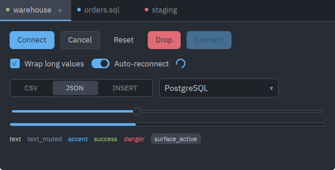 | 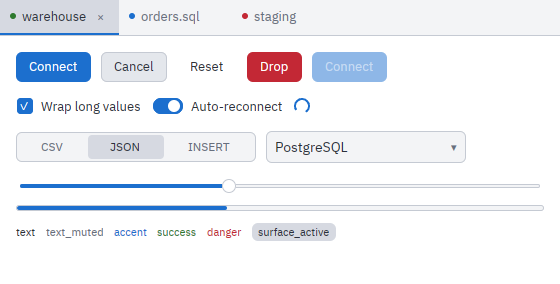 |

| `solarized-dark` | `solarized-light` |
| --- | --- |
| 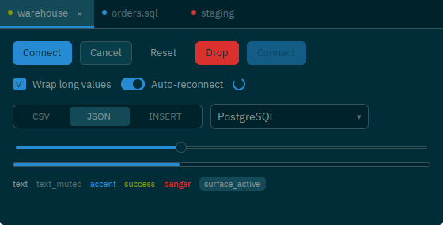 | 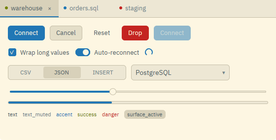 |

| `gruvbox-dark` | `dracula` |
| --- | --- |
| 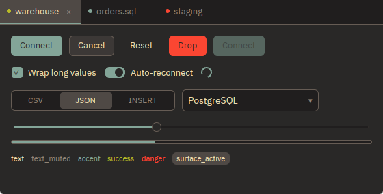 | 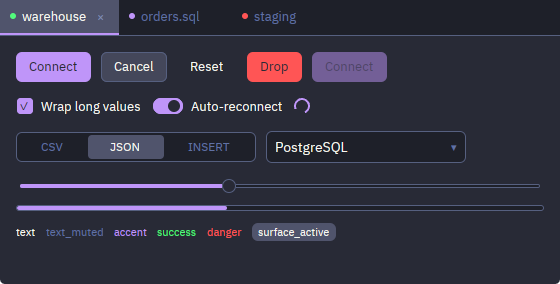 |

### Reading and setting

```rust
let palette = theme(cx);          // clones the global; falls back to Theme::dark()
set_theme(Theme::solarized_light(), cx);
```

`theme(cx)` returns a clone rather than a borrow, which is what lets a `render`
keep using `cx` mutably while styling elements. Call it once at the top of
`render` and use the value throughout.

### `ThemeRegistry`

The registry is where built-in and file-loaded themes are listed and resolved
together. It is a `Global` too, installed empty by `rugpui::init`.

| function | what it does |
|---|---|
| `ThemeRegistry::init(cx)` | Installs an empty registry if none exists. Called by `rugpui::init`, so resolving an id before any file has been read answers the built-ins rather than panicking. |
| `ThemeRegistry::set_custom(themes, cx)` | Replaces the whole custom list at once, so a re-scan cannot leave behind a theme its file no longer defines. |
| `ThemeRegistry::custom(cx)` | The custom themes as `Vec<CustomUiTheme>`. |
| `ThemeRegistry::is_builtin(id)` | Whether `id` names a theme that ships with the crate. Case-insensitive. |
| `ThemeRegistry::all(cx)` | Every selectable theme as `Vec<ThemeEntry>`: built-ins in presentation order, then custom ones sorted by name. A custom theme shadowing a built-in id is left out. |
| `ThemeRegistry::resolve(id, cx)` | The palette `id` names. Case-insensitive; built-ins win over custom; an id nothing answers to falls back to `Theme::dark()` rather than failing — a settings file naming a deleted theme still has to open the app. |

`CustomUiTheme { id, name, theme }` is a loaded file. `ThemeEntry { id, name,
dark, builtin }` is what a picker needs to draw a row and nothing more; the
colours are fetched with `resolve` only for the entries that end up on screen.

### The file format

`ThemeFile` is the on-disk form and `ThemeColors` its colour block. Field names
serialise exactly as they are written in Rust — no renames — so the JSON is
snake_case throughout. A complete, valid file:

```json
{
  "version": 1,
  "name": "Tokyo Night",
  "dark": true,
  "colors": {
    "background": "#1a1b26",
    "surface": "#16161e",
    "surface_hover": "#242637",
    "surface_active": "#2f3549",
    "border": "#3b4261",
    "text": "#c0caf5",
    "text_muted": "#787c99",
    "accent": "#7aa2f7",
    "danger": "#f7768e",
    "success": "#9ece6a",
    "overlay": "#0d0e149e",
    "grid_header": "#242637",
    "grid_row_alt": "#1e1f2b",
    "grid_selection": "#7aa2f747",
    "grid_null": "#787c99",
    "grid_pk": "#e0af68"
  }
}
```

`version` defaults to the version this build writes when absent; `dark` defaults
to `false`; the five `grid_*` keys may all be omitted. Everything else is
required. Reading is deliberately forgiving, the way a hand-editable settings
file is: **keys the format does not know are ignored**, and a colour that will
not parse falls back to `Theme::dark()`'s value for that slot instead of failing
the file. For the five optional grid slots a typo means the same as leaving the
key out — the value is derived — which is the better answer there, since falling
back to a dark header on a light theme would put a near-black band over a white
grid.

`parse_hex(&str) -> Option<Hsla>` accepts `#RRGGBB` and `#RRGGBBAA`, with the
leading `#` optional and the digits case-insensitive. Anything else — a short
`#rgb`, a colour name — answers `None`. `to_hex(Hsla) -> String` writes the
six-digit form when the colour is opaque and the eight-digit form when it is
not, so the ten opaque slots of a file stay readable.

## `EditorTheme`

Twenty-one slots, split three ways: four are the canvas, three are the frame
around it, and fourteen are token classes a lexer hands out.

| group | slots |
|---|---|
| canvas | `background`, `foreground`, `cursor`, `selection` |
| frame | `line_highlight`, `gutter`, `gutter_active` |
| tokens | `keyword`, `string`, `number`, `comment`, `function`, `type`, `operator`, `identifier`, `key`, `variable`, `punctuation`, `bracket_match`, `error`, `warning` |

`foreground` is also the colour of anything the lexer did not classify;
`gutter_active` the line number of the line the caret is on, `line_highlight`
the band behind that line, `bracket_match` the bracket under the caret and its
partner. `error` and `warning` are the squiggles and gutter marks a host's
parser asks for — the editor has no parser of its own.

Two of the token slots arrived after the format was published:

- `key` — the left-hand side of a mapping: a YAML or JSON member name, an `ini`
  `[section]`, a Markdown heading, a `KEY=` in a shell script. In Rust it is
  `EditorTheme::key`; in a file it is `"key"`.
- `variable` — a named reference to something defined elsewhere: `$HOME`,
  `${TARGET}`, a YAML anchor or alias, a Markdown link's text.

A file that carries neither is a file whose author never had them to choose, so
rather than dropping a built-in colour into the middle of theirs, the nearest
thing they *did* choose stands in: `key` takes the file's own `type`, and
`variable` takes its `function`.

Nothing else here is derived. Every slot of a syntax palette is a choice about
which token deserves which colour, and an operator is not a shade of a keyword.
What replaces derivation is forgiveness of a different shape: an unparseable
slot falls back to the built-in theme **of the same darkness**, so a typo in a
light theme cannot drop a near-black keyword onto a near-white page.

### The six built-ins

`EditorTheme::one_dark()`, `one_light()`, `solarized_dark()`,
`solarized_light()`, `gruvbox_dark()`, `dracula()` — under the ids `one-dark`,
`one-light`, `solarized-dark`, `solarized-light`, `gruvbox-dark`, `dracula`.
`EditorTheme::default()` is `one_dark()`.

Those are exactly the six ids of the built-in *chrome* themes, name for name and
in the same order, which is what a "keep the editor in step with the chrome"
setting is built on: it resolves the chrome theme's id in the editor table and
always finds the syntax palette drawn by whoever drew the window around it. That
the two tables agree is a property of the built-ins, not of the design — a
custom theme can exist on one side and not the other, and the two settings stay
independently selectable.

One short listing in each, with a range selected so the selection colour is in
the picture beside the current-line band and the caret:

| `one-dark` | `one-light` |
| --- | --- |
|  | 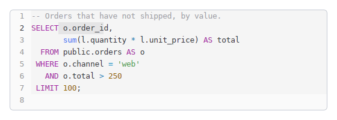 |

| `solarized-dark` | `solarized-light` |
| --- | --- |
| 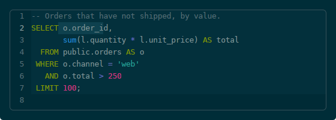 |  |

| `gruvbox-dark` | `dracula` |
| --- | --- |
| 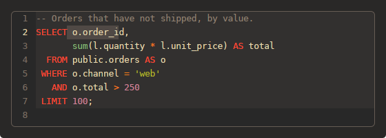 | 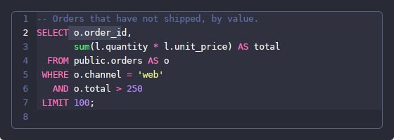 |

### Reading, setting, resolving

```rust
let editor_palette = editor_theme(cx);
set_editor_theme(EditorTheme::dracula(), cx);
```

`EditorThemeRegistry` mirrors `ThemeRegistry` exactly: `init`, `set_custom`,
`custom`, `is_builtin`, `all` (returning `Vec<EditorThemeEntry>`) and `resolve`
(falling back to `EditorTheme::one_dark()`). `CustomEditorTheme { id, name,
theme }` is a loaded file.

### The file format

`EditorThemeFile` / `EditorThemeColors`. The Rust field is `r#type`, which serde
writes as `"type"`; `bracket_match` is the other name worth checking when a
palette is copied from elsewhere. A complete file:

```json
{
  "version": 1,
  "name": "Tokyo Night",
  "dark": true,
  "colors": {
    "background": "#1a1b26",
    "foreground": "#a9b1d6",
    "cursor": "#c0caf5",
    "selection": "#33467c",
    "line_highlight": "#1f2335",
    "gutter": "#3b4261",
    "gutter_active": "#737aa2",
    "keyword": "#bb9af7",
    "string": "#9ece6a",
    "number": "#ff9e64",
    "comment": "#565f89",
    "function": "#7aa2f7",
    "type": "#2ac3de",
    "operator": "#89ddff",
    "identifier": "#c0caf5",
    "key": "#73daca",
    "variable": "#7aa2f7",
    "punctuation": "#a9b1d6",
    "bracket_match": "#f7768e",
    "error": "#f7768e",
    "warning": "#e0af68"
  }
}
```

Nineteen of the twenty-one are required — only `key` and `variable` may be
omitted. There is nothing to derive a missing token class *from*, and a file
missing one is more likely a truncated copy than a deliberate omission, so
`theme_store` logs it and skips the file rather than applying it half-way.
Unknown keys are ignored, as in the chrome format.

## `theme_store`

Where the files live is the host's decision — a widget library has no
configuration directory of its own, and an application that keeps its settings
somewhere unusual, or a test that keeps them in a temporary directory, must not
have to fight one. Every entry point that touches the disk therefore takes a
`ThemeDirs` first.

```rust
let dirs = rugpui::ThemeDirs {
    ui_themes: config_dir.join("themes"),
    // `None` for an application with no code editor and so no second palette.
    editor_themes: Some(config_dir.join("editor-themes")),
};
rugpui::theme_store::reload(&dirs, cx);
```

Neither directory has to exist. `ThemeDirs::default()` is the "no directory yet"
answer: an **empty** `ui_themes` path means what `None` means for
`editor_themes`, so a host whose configuration directory could not be resolved
can still build something to hand the widgets and reload with a real path later,
rather than inventing one or refusing to start. Saving or deleting through an
unnamed directory fails loudly instead of landing in the process's current
directory.

| function | what it does |
|---|---|
| `reload(&dirs, cx)` | Reads both directories and installs what they hold into the two registries. Call once at start-up, after `rugpui::init` and before the configured ids are resolved, and again after any change you make to the files. Both registries are swapped whole. |
| `load_ui_themes(&dirs)` | `Vec<CustomUiTheme>`. Never fails. |
| `load_editor_themes(&dirs)` | `Vec<CustomEditorTheme>`. Never fails; answers nothing when no editor directory was named. |
| `save_ui_theme(&dirs, id, &file)` | Writes `<ui_themes>/<id>.json` atomically; returns the path. |
| `save_editor_theme(&dirs, id, &file)` | The same for the editor directory. |
| `delete_ui_theme(&dirs, id)` | Removes the file. A theme that is not there is not an error. |
| `delete_editor_theme(&dirs, id)` | The same for the editor directory. |
| `slug(value)` | Turns a file stem or a typed name into an id: lowercase `a`-`z`, `0`-`9` and `-`, runs of separators collapsed, ends trimmed. A name that leaves nothing behind answers `None`. |
| `unique_id(names, prefix, taken)` | The first id derived from `names` that nothing in `taken` answers to, suffixing `-2`, `-3`, … as needed; when no candidate slugs at all, `prefix-1`, `prefix-2`, … `taken` is compared case-insensitively. |
| `read_file::<T>(path)` | Parses one theme file from anywhere on disk — what an import uses. |
| `write_file(path, &value)` | Writes pretty JSON to any path, atomically — what an export uses. |
| `FILE_EXTENSION` | `"json"`. |
| `GENERATED_THEME_ID` | `"theme"` — the `prefix` for a chrome theme whose name yields no slug. |
| `GENERATED_EDITOR_THEME_ID` | `"editor-theme"` — the same for an editor theme. |

Things worth knowing about the loader:

- **The file stem is the id.** `<editor themes>/tokyo-night.json` is the editor
  theme `tokyo-night`. The stem is passed through `slug`, so case and stray
  punctuation do not make two themes out of one file on two file systems.
- **Ids mean nothing across the two directories.** `dracula` may be a chrome
  theme, an editor theme, both or neither, and the two are picked separately.
- **Parsing is forgiving, loading is not silent.** A file that will not parse,
  one whose name yields no usable id, and one whose id is already taken are each
  logged with `log::warn!` and skipped; one broken file must not keep the others
  — or the application — from loading.
- **A BOM is tolerated.** `serde_json` rejects one outright, and several Windows
  editors add one on save, so every reader here strips a leading UTF-8 BOM
  first.
- **A collision with a built-in id is skipped.** A file named `dracula.json` in
  the chrome directory could never be selected, because `resolve` lets built-ins
  win, so it is logged and dropped rather than loaded into a list it can never
  be reached from. `save_*` refuses such an id for the same reason.
- **The order is by id**, because `read_dir` reports no order of its own and a
  picker that reshuffles itself between runs is worse than an arbitrary but
  stable one.
- **Writes are atomic**: to a `.tmp` sibling, then renamed over the destination,
  so a crash mid-write cannot leave a truncated file and a palette that
  silently disappears from the picker on the next start.

## Window tint and translucency

A window may be drawn translucent or blurred, and that is a third global:

```rust
set_window_tint(0.85, cx);   // 1.0 means fully opaque; rugpui::init sets 1.0
let translucent = window_translucent(cx);   // opacity < 1.0
let fill = window_tint(palette.background, cx);
```

The rule the three exist to enforce: **at most one tinted background fill may
cover any given pixel**, and between them the fills must leave no pixel of the
body uncovered. The window surface starts fully transparent, so one translucent
fill lets the desktop or the blur behind it show through — but a second one on
top does not. gpui's Windows renderer blends the alpha channel additively
(`SrcBlendAlpha = ONE, DestBlendAlpha = ONE`), so two fills of 0.75 and 0.62
saturate the surface alpha at 1.0 and the window goes opaque again.

So a widget that paints a full-bleed background does not tint itself — it asks
whether the window is translucent and *skips* its fill, letting the one tinted
fill the body already carries show through. That is exactly what the grid does:

```rust
.when(!window_translucent(cx), |grid| grid.bg(palette.background))
```

`window_tint(color, cx)` — the function that actually applies the opacity — is
for the shell alone, and only for a fill it has reasoned about;
`rugpui_shell::window_tint` is that call site. A view that would rather be
legible than see-through simply does not ask and paints itself opaque, which is
the choice the code editor made.

## Two helpers

- `shift_lightness(color, delta) -> Hsla` — lightness moved by `delta`, clamped
  to `[0, 1]`. How a widget derives a hover or pressed shade from a base colour
  without the theme storing one slot per state.
- `contrast_ratio(left, right) -> f32` — the WCAG 2.1 ratio, `1.0` to `21.0`,
  symmetric in its arguments so a caller need not know which is the foreground.
  Alpha plays no part: a translucent colour would have to be composited against
  a specific background before its luminance meant anything.

## How a colour reaches a widget

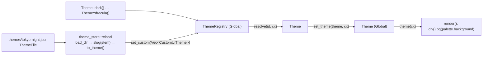

The editor palette takes the identical path through `EditorThemeFile`,
`EditorThemeRegistry`, `set_editor_theme` and `editor_theme(cx)`.

Note where the derivation happens: `ThemeFile::to_theme()`, on the way out of
the store. By the time a `Theme` exists, `icon` and any absent `grid_*` slot are
already settled, so nothing downstream ever has to ask whether a slot was
written down.

## Writing your own theme

1. Write the JSON above into a file. The stem is the id: `tokyo-night.json`
   gives `tokyo-night`. Pick a stem that is not one of the six built-in ids, or
   the loader will log a warning and skip it.
2. Drop it into the `ui_themes` directory your application named through
   `ThemeDirs` (or export a starting point with
   `ThemeFile::from_theme("Tokyo Night", &Theme::dark())` and edit from there —
   that writes all sixteen colours, including the grid slots).
3. Reload:

   ```rust
   rugpui::theme_store::reload(&dirs, cx);
   ```

4. Select it:

   ```rust
   let palette = ThemeRegistry::resolve("tokyo-night", cx);
   set_theme(palette, cx);
   ```

   `resolve` never fails; if the id is wrong you get `Theme::dark()` and a
   window that still opens.

5. Offer the list to the user with `ThemeRegistry::all(cx)`, which gives you
   `id`, `name`, `dark` and `builtin` for every selectable theme, and store the
   `id` — never the name — in your settings.

An editor theme is the same five steps through `editor_themes`,
`EditorThemeFile`, `EditorThemeRegistry::resolve` and `set_editor_theme`.

## Pickers, and editing themes in the app

Two widgets in `rugpui` present these lists:

- [`SchemeSelect`](./widgets/scheme-select.md) — a one-line dropdown over
  entries that carry colours as well as a name, for a settings form with several
  catalogues and no room for preview grids.
- [`EditorThemePicker`](./widgets/editor-theme-picker.md) — a grid of cards, each
  rendering a miniature statement in the palette it is offering, because swatches
  cannot answer "can I still tell a keyword from a column name".

`rugpui-shell` goes further: `ThemeEditor` edits one entry of a catalogue colour
by colour and writes the file back, and the `ThemeCatalog` trait —
with `UiThemeCatalog` and `EditorThemeCatalog` over the two formats here, and
`CatalogFile::Other` for a third of your own — is what wires a catalogue,
its import and export, and its default id into a settings dialog. See
[shell.md](./shell.md).
