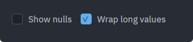

# Checkbox

A labelled on/off box for a setting the user reads as a list of independent
choices. When the choice is "this feature is on or off" and reads better as a
physical toggle, use [`Switch`](./switch.md) — the two have identical APIs and
differ only in how they draw.

Source: [checkbox.rs](../../crates/rugpui/src/checkbox.rs).

## Minimal example

From the gallery, a checkbox bound to a field on the view:

```rust
use rugpui::Checkbox;

Checkbox::new("wrap", "Wrap long values")
    .checked(self.checked)
    .on_toggle({
        let this = this.clone();
        move |value, _window, cx| {
            this.update(cx, |gallery, cx| {
                gallery.checked = value;
                cx.notify();
            });
        }
    })
```

`cx.listener` does not fit here: it produces an `Fn(&E, ..)` and `on_toggle`
wants the `bool` by value. `cx.processor` is the by-value counterpart, and is the
short form when the handler only needs the view:

```rust
Checkbox::new("remember", "Remember password")
    .checked(self.remember)
    .on_toggle(cx.processor(|this, checked, _window, cx| {
        this.remember = checked;
        cx.notify();
    }))
```

A checkbox with no handler still draws — the gallery includes
`Checkbox::new("nulls", "Show nulls")` and
`Checkbox::new("locked-check", "Read only").checked(true)` as static examples —
but clicking it does nothing.



*The two states the box has: `checked(false)`, the default, and
`checked(true)`.*

## Builder options

| method | argument | default | effect |
| --- | --- | --- | --- |
| `Checkbox::new` | `id: impl Into<ElementId>`, `label: impl Into<SharedString>` | — | Creates an unchecked checkbox. `id` must be unique among its siblings. |
| `checked` | `bool` | `false` | Whether the box is ticked. |
| `tab_index` | `isize` | none | Places the checkbox in the window's tab order. |
| `on_toggle` | `impl Fn(bool, &mut Window, &mut App) + 'static` | none | Fired with the value the checkbox is toggling *to*. |

## State the host keeps

The checkbox is stateless: it does not remember whether it was ticked. The host
view owns the `bool`, passes it in through `checked(..)` on every render, and
writes the new one back from `on_toggle`. The gallery's `Gallery` struct is the
model — a plain `checked: bool` field, updated inside `this.update(..)` followed
by `cx.notify()`.

The argument handed to `on_toggle` is the *next* value, not the current one, so
there is never a `!` to remember to write. Forgetting `cx.notify()` is the usual
way a newcomer ends up with a checkbox that appears not to respond: the state
changed but nothing asked for a repaint.

## Keyboard and mouse

- Clicking anywhere on the row — box or label — toggles it. The whole row is one
  clickable element with `cursor_pointer`, not just the 16 px box.
- With `tab_index`, a focused checkbox draws an accent outline and toggles on
  `Space` or `Enter`, which gpui delivers as an ordinary click. Unlike
  [`Button`](./button.md) there is no disabled state to skip, so the tab stop is
  unconditional.

## Theme slots

- `accent` — the fill and border of a ticked box, and the focus outline.
- `background` — the check glyph (U+2713) drawn inside a ticked box.
- `surface` — the fill of an unticked box.
- `border` — the outline of an unticked box.
- `text` — the label.

## Pitfalls

- The focus ring is a transparent 1 px border that is only recoloured on focus,
  so gaining focus costs no layout and the row does not shift.
- `checked(..)` is what draws; the widget never derives it from previous clicks.
  A `on_toggle` that does not write back leaves a box that flickers nowhere.
- The glyph colour on an unticked box is `transparent_black`, so the tick is
  always present in the tree and only becomes visible when checked.
