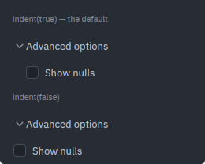
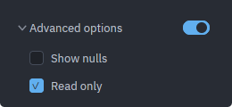

# Collapsible

A titled section that folds its body away: a disclosure arrow, a title, and
children that are either drawn or are not there at all. The block a settings
form keeps for the questions most users never ask — "Advanced options",
"Session overrides" — and the optional half of a dialog, such as a connection
form's "SSH tunnel".

Source: [collapsible.rs](../../crates/rugpui/src/collapsible.rs).

## Minimal example

From the gallery, two sections in a column — one open with two checkboxes and a
[`Switch`](./switch.md) in its header, one closed over a single
[`TextInput`](./text-input.md):

```rust
use rugpui::{Checkbox, Collapsible, Switch};

let this = cx.entity();

Collapsible::new("advanced", "Advanced options")
    .open(self.advanced_open)
    .on_toggle({
        let this = this.clone();
        move |open, _window, cx| {
            this.update(cx, |gallery, cx| {
                gallery.advanced_open = open;
                cx.notify();
            });
        }
    })
    .trailing(Switch::new("advanced-on", "").checked(self.switch_on))
    .child(Checkbox::new("advanced-nulls", "Show nulls"))
    .child(Checkbox::new("advanced-locked", "Read only").checked(true))
```

```rust
Collapsible::new("ssh", "SSH tunnel")
    .open(self.ssh_open)
    .on_toggle({
        let this = this.clone();
        move |open, _window, cx| {
            this.update(cx, |gallery, cx| {
                gallery.ssh_open = open;
                cx.notify();
            });
        }
    })
    .child(self.tunnel_host.clone())
```

`cx.listener` does not fit `on_toggle`: it produces an `Fn(&E, ..)` and the
handler wants the `bool` by value. `cx.processor` is the by-value counterpart
and is the short form when the handler only needs the view:

```rust
Collapsible::new("tunnel", "SSH tunnel")
    .open(self.tunnel_open)
    .on_toggle(cx.processor(|this, open, _window, cx| {
        this.tunnel_open = open;
        cx.notify();
    }))
```

The body is filled through `ParentElement` — `.child(..)` and `.children(..)` —
so anything that goes into a `div` goes into a section.


*`open(false)`, the default: the arrow points right and the children are not in
the tree at all.*


*`open(true)`: the arrow turns down and the body appears, indented under the
title.*

## Builder options

| method | argument | default | effect |
| --- | --- | --- | --- |
| `Collapsible::new` | `id: impl Into<ElementId>`, `title: impl Into<SharedString>` | — | Creates a closed section. `id` must be unique among its siblings. |
| `open` | `bool` | `false` | Whether the body is showing. A closed section does not render its children at all — see below. |
| `on_toggle` | `impl Fn(bool, &mut Window, &mut App) + 'static` | none | Fired with the value the section is folding *to*. |
| `trailing` | `impl IntoElement` | none | An element at the far end of the header, beside the disclosure. Clicking it does not fold the section. |
| `arrow_icons` | `closed: impl Into<SharedString>`, `open: impl Into<SharedString>` | `rugpui::CARET_RIGHT` / `CARET_DOWN` | Host svg paths for the disclosure, painted in `theme.icon` at 14 px. |
| `tab_index` | `isize` | none | Places the header in the window's tab order. A disabled section takes no stop. |
| `indent` | `bool` | `true` | Pads the body left by the arrow box, so its content lines up with the title. |
| `disabled` | `bool` | `false` | Greys the header and stops it answering presses. The body still draws if `open` says so. |

`.child(..)` / `.children(..)` come from `gpui::ParentElement` and fill the body.


*`disabled(true)`: the title and the arrow drop to `text_muted` and the header
stops answering presses.*



*`indent(true)`, the default, above `indent(false)`: without the indent the
body sits flush with the arrow instead of lining up with the title.*

## State the host keeps

One `bool` per section. The widget is stateless: it does not remember whether it
was open, it is passed the current value through `open(..)` on every render, and
it reports the next one through `on_toggle`. The gallery keeps `advanced_open`
and `ssh_open` as plain fields, written inside `this.update(..)` followed by
`cx.notify()`.

The value handed to `on_toggle` is the *next* one, never the one already
showing, so there is no `!` to remember to write — the same contract as
[`Checkbox`](./checkbox.md) and [`Switch`](./switch.md). A handler that does not
write the value back leaves a header that answers presses and never folds.

## Closed means *not rendered*

A closed section drops its children rather than hiding them, and that is the
whole point rather than an optimisation. gpui keeps a focus handle alive for as
long as something in the tree tracks it, so a fold-away block full of text
fields that merely *hid* would go on holding the caret, go on taking the tab
ring's stops, and go on answering keys typed at a section the user can no longer
see.

What this means for what you put inside:

- **Entities survive; their elements do not.** `self.tunnel_host` is an
  `Entity<TextInput>` owned by the host, so its contents are still there when
  the section is opened again. Only the element built from it comes and goes.
- **Focus does not survive.** Closing a section that holds the focused field
  takes the focus with it. If the host cares where focus lands next, it has to
  say so when it writes the `false` back.
- **Nothing inside runs while closed.** A child's `render` is not called, so a
  body that counts renders, starts a timer from one, or reads something
  expensive pays nothing while folded.
- **Tab indices inside are only stops while open.** Numbering them is still
  worth doing — the ring simply skips the ones that were not drawn.

## The trailing slot, and why it does not toggle

Section headers grow a control at the far end: a switch that arms the whole
block, a checkbox, a button, a count of what is inside. That control is a second
target, so it sits *beside* the clickable header rather than inside it:

```
[ ▾ Advanced options .................... ] [ switch ]
  \______ one clickable element, flex_1 ___/   \_ trailing, a sibling
```

A switch nested inside the disclosure would flip the block off and fold the
section in the same gesture — one press doing two things the user asked one of.
As a sibling it takes its own press and the header never sees it.

The trailing element is the host's, so `disabled(true)` on the section does not
touch it: disable it yourself if the whole header is meant to be inert.



*`trailing(Switch::new("advanced-on", "").checked(true))` — the switch sits at
the far end of the header, outside the clickable disclosure.*

## Arrow icons

The default disclosure is a pair of svg chevrons this crate ships itself —
`rugpui::CARET_RIGHT` closed and `rugpui::CARET_DOWN` open — drawn at 14 px
inside a 16 px box, nearly its full width, since a drawn chevron carries its own
margin inside its viewBox. Both are resolved by the application's `AssetSource`
like every other icon path, so chain `rugpui::ICONS` into yours or the arrow
paints as nothing at all; see [getting started](../getting-started.md#with_assets).

A host with icons of its own passes both paths instead:

```rust
Collapsible::new("advanced", "Advanced options")
    .arrow_icons("icons/chevron-right.svg", "icons/chevron-down.svg")
```

They are drawn at the same 14 px and painted in `theme.icon`. These are the same
two icons a [`TreeView`](./tree.md) is given through `with_arrow_icons`: a
form's sections and a tree's branches disclose the same way and should not
disagree about which way the chevron points.


*`arrow_icons(..)` with two paths of the gallery's own: filled triangles in
`theme.icon` where the default carets would be.*

## Keyboard and mouse

- Clicking anywhere on the disclosure — the arrow, the title, or the empty width
  after it up to the trailing control — folds the section. The target is
  `flex_1`, so it is the whole row rather than the 16 px arrow box.
- With `tab_index`, a focused header draws an accent outline and folds on
  `Space` or `Enter`, which gpui delivers as an ordinary click. One `on_click`
  therefore covers pointer and keyboard both.
- A disabled section is not a tab stop and has no `cursor_pointer` or hover
  wash.

## Theme slots

- `icon` — the disclosure arrow, the default caret or a replacement.
- `text` — the title.
- `text_muted` — the title *and* the arrow while `disabled(true)`.
- `surface_hover` — the wash under the disclosure while the pointer is on it.
- `accent` — the focus outline, when the header has a `tab_index`.

Nothing else is painted. The section draws no border, no background and no rule
under the header: it is a heading in a form, not a panel, and a host that wants
a frame puts one around it.

## Pitfalls

- **`open(..)` is what draws.** The widget never derives it from previous
  clicks, so an `on_toggle` that does not write back gives a header that does
  nothing.
- **Closing takes focus with it.** See above — this is intended, but it does
  mean a field the user was typing in stops being focused the instant the
  section folds.
- **Ids inside a closed section are still ids.** Two sections holding a child
  with the same element id collide as soon as both are open, even though neither
  collided while one was folded.
- **The trailing element is not disabled with the section.** `disabled(true)`
  greys the header alone.
- **`indent(false)` for a body that draws its own frame.** The default pads the
  body left by the arrow box so its content lines up with the title; a panel or
  a table inside would read as a second step in.
- **No animation.** The body appears and disappears between frames. Anything
  that slides would have to keep a height between renders, and the widget keeps
  nothing.
