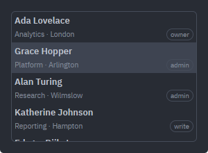
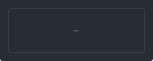

# ListView

A virtualised flat list whose rows the host draws itself. The widget owns the *shape* — how tall a row is, which one is selected, where the viewport sits — and the host owns the items, handed over through a `ListSource` keyed by an id the host invents. What is *inside* a row is never the list's business: a contact card, a saved query and a connection with a status dot are all the same widget, because the only thing the list draws inside a row is the row the host handed back.

Source: [list.rs](../../crates/rugpui/src/list.rs). Re-exported as `rugpui::{ListView, ListSource, ListRowInfo, ListEvent}`; `list::init` is called for you by `rugpui::init`.

## Why a source rather than a column of elements

gpui's `uniform_list` lays out only the rows the viewport can reach, and it can do that only if the rows are addressable by index and all the same height. So the list asks for rows one index at a time instead of taking a built column: ten items and ten thousand cost the same to draw, and the host never builds an element nobody will see.

That is also why the height is a property of the *list* and not of a row. `row_height(px(44.))` is how a two-line card is asked for — a taller row is a taller list, not one row that grew.

## Writing a `ListSource`

Three required items. The gallery's `Contacts` is a complete one — everything is already in memory, so the list never has to ask for anything:

```rust
use gpui::{AnyElement, App, FontWeight, IntoElement, ParentElement, Styled, Window, div, px};
use rugpui::{ListRowInfo, ListSource, theme};

/// One row: its id, the name on the first line, the note on the second, and
/// the word in the pill at the end of that line.
type Contact = (&'static str, &'static str, &'static str, &'static str);

const CONTACTS: &[Contact] = &[
    ("ada", "Ada Lovelace", "Analytics · London", "owner"),
    ("grace", "Grace Hopper", "Platform · Arlington", "admin"),
    ("alan", "Alan Turing", "Research · Wilmslow", "admin"),
    // …
];

pub struct Contacts;

impl Contacts {
    fn contact(id: &str) -> Option<&'static Contact> {
        CONTACTS.iter().find(|(contact, _, _, _)| *contact == id)
    }
}

impl ListSource for Contacts {
    type Id = &'static str;

    fn len(&self) -> usize {
        CONTACTS.len()
    }

    fn id(&self, index: usize) -> Self::Id {
        CONTACTS[index].0
    }

    fn render_item(
        &self,
        id: &Self::Id,
        _info: ListRowInfo,
        _window: &mut Window,
        cx: &mut App,
    ) -> AnyElement {
        let palette = theme(cx);
        let Some((_, name, note, badge)) = Self::contact(id) else {
            return div().into_any_element();
        };
        div()
            .flex()
            .flex_col()
            .justify_center()
            .size_full()
            .gap(px(1.))
            .child(div().truncate().font_weight(FontWeight::SEMIBOLD).child(*name))
            .child(
                div()
                    .flex()
                    .flex_row()
                    .items_center()
                    .justify_between()
                    .gap(px(6.))
                    .text_size(px(10.5))
                    .text_color(palette.text_muted)
                    .child(div().truncate().child(*note))
                    // Outlined rather than filled: the row's background changes
                    // under it when it is selected, and a pill painted in
                    // `surface_active` would disappear into it.
                    .child(
                        div()
                            .flex_none()
                            .px(px(5.))
                            .rounded_full()
                            .border_1()
                            .border_color(palette.border)
                            .text_size(px(9.5))
                            .child(*badge),
                    ),
            )
            .into_any_element()
    }
}
```

| trait item | required | notes |
| --- | --- | --- |
| `type Id: Clone + Eq + Hash + 'static` | yes | how the host names an item |
| `fn len(&self) -> usize` | yes | asked once per rebuild; it may count, it may not fetch |
| `fn id(&self, index: usize) -> Id` | yes | asked per visible row, and per row of a scan for the selection — a lookup, not a computation |
| `fn render_item(&self, id, info: ListRowInfo, window, cx) -> AnyElement` | yes | draws the whole inside of a row |
| `fn render_empty(&self, window, cx) -> AnyElement` | no | defaults to nothing at all |
| `fn is_empty(&self) -> bool` | no | defaults to `len() == 0`; the list itself asks `len` |

`render_item` is handed a `ListRowInfo { index, selected }`. `index` is not an item identity — a host that reorders its items moves it — but it *is* an element identity, and the list keys its own row container by it, so a host that wants a draggable row can key alongside rather than invent a second numbering.

The row it fills is the full width inside the list's padding, laid out with `flex_1 min_w_0`: a card that justifies its second line against the row's width has the width to justify against, and an over-long line is clipped instead of pushing the row wider than the list.

### Id stability

The selection is remembered and reported by `Id` rather than by a row number, which is what lets a host filter, sort or refetch its items without the highlight landing on a different one. Ids must therefore be **stable across such a change**: a key or a qualified name, never a position.

Unlike a tree's, though, an id the source has stopped holding is not a selection that is merely off screen — a flat list has no closed branch a row could be hiding inside. So the list drops it and emits `SelectionChanged(None)`. That is the one behavioural difference between the two widgets' memories.

## Creating and subscribing

`ListView` is an entity, created once and rendered as a child element:

```rust
use rugpui::{ListEvent, ListView};

let contacts = cx.new(|cx| {
    let mut list = ListView::new(Contacts, cx).row_height(px(44.));
    list.set_selected(Some("grace"), cx);
    list
});

// The host's half of a list: what activating a row *means* is the only thing
// the widget cannot know.
cx.subscribe(&contacts, |_view, _list, event: &ListEvent<&str>, _cx| {
    if let ListEvent::Activated(id) = event {
        eprintln!("contact activated: {id}");
    }
})
.detach();
```



*Seven items at `row_height(px(44.))` in a box that holds four and a half: the row cut off at the bottom is what says the list scrolls, and every pixel inside a row — the two lines, the weights, the outlined pill — is the source's own `render_item`.*

### Events

| event | when |
| --- | --- |
| `Activated(Id)` | `Enter`, `Space`, or a double click on a row |
| `SelectionChanged(Option<Id>)` | the selection moved, or was dropped because the source stopped holding it |
| `ContextMenu { id, position }` | a row was right-clicked; the list has already focused itself and moved the selection onto `id` |

Every double click arrives as `Activated`, which a tree's does not: a flat row is the thing itself, so there is no branch for the gesture to open instead.

`ContextMenu` carries a window-space position for the host's own [`ContextMenu`](./menu.md) to hang from; the list draws no menu itself, because the rows have no strings in them and neither can their menu. The selection is moved first on purpose — the menu's commands act on the selection, so "delete" must name what the user just aimed at.

## The empty state

`render_empty` defaults to nothing, because the obvious default would be a sentence and this layer has no strings: "No items" in English inside a Korean application would be worse than an empty box. The host overrides it with a wording of its own — or a glyph, or an illustration and a button — and is handed the whole of the list's area rather than a row, because what goes there is usually centred.



*A source whose `len()` is zero, with a `render_empty` that centres one muted glyph.*

## Methods

| method | argument | effect |
| --- | --- | --- |
| `ListView::new` | `S`, `cx` | a list over `source`, nothing selected |
| `.row_height` | `Pixels` | draws every row that tall instead of the default 24 px |
| `.tab_index` | `isize` | joins the window's tab ring |
| `.source()` | — | the source, to read |
| `.source_mut(cx)` | — | the source, to change; marks dirty and notifies for you |
| `.refresh(cx)` | — | reread the source, for changes that did not go through `source_mut` |
| `.selected()` | — | `Option<&Id>` |
| `.set_selected(Some(id), cx)` | — | move the selection and scroll its row into view |
| `.selected_index()` | — | where the selection sits, as of the last rebuild |
| `.scroll_to(index, cx)` | — | bring a row into view, leaving the selection alone |

`row_height` and `tab_index` take `self` by value, so they are chained inside the `cx.new` closure; everything below them is a `&mut self` method callable for the life of the entity.

`set_selected` with an id the source does not hold clears the selection rather than remembering it — again, the opposite of a tree. `scroll_to` ignores an index past the end rather than clamping it: that index names a row that is not there, and scrolling to the last one instead would be an answer to a different question.

Finding an id in the source is a linear scan, so the list does it once per rebuild rather than once per draw and keeps the answer beside the selection; `selected_index()` is that cached answer.

## Keyboard and mouse

`list::init` binds the `rugpui_list` actions to the `ListView` key context, so the arrows keep meaning what they meant everywhere else in the app:

| key | action | effect |
| --- | --- | --- |
| `up` | `SelectPrev` | selection to the row above |
| `down` | `SelectNext` | selection to the row below |
| `enter` | `Activate` | emit `Activated` for the selection |
| `space` | `Activate` | the same |
| `home` | `SelectFirst` | selection to the first row |
| `end` | `SelectLast` | selection to the last row |

Neither arrow walks off the end of the list, and with nothing selected `up` lands on the last row and `down` on the first.

Mouse: a click selects (and focuses); a double click selects and activates; a right press focuses, selects and emits `ContextMenu`.

The list carries a full overlay [`Scrollbar`](./scrollbar.md), wired the complete way — `moved`/`hide_later` from render, `hold` on drag, `release` on mouse-up and mouse-up-out, `hover_enter`/`hover_leave` from `on_hover`. Its id is keyed by `cx.entity_id()`, so two lists in one window never answer each other's drags. See the scrollbar page for that code.

## Theme slots

| slot | where |
| --- | --- |
| `text` | row text (set on the list's root) |
| `surface_active` | background of the selected row |
| `surface_hover` | background of a hovered row |

That is the whole of it: everything *inside* a row is the source's, so the weights, the muted second line and the badge are the host's choice.

Layout constants worth knowing when you draw a row: rows are 24 px tall until `row_height` says otherwise, and there is 4 px of padding at each end — no indent column and no arrow column, which is exactly what a `TreeView` has and this does not.

## Its relationship to the tree

[`TreeView`](./tree.md) with the hierarchy taken out. The two share the flattened-list drawing, the id-keyed selection, the row-drawing hook, the events and the overlay scrollbar, and a `ListSource` is a `TreeSource` minus `children` and `has_children`. What a list does not have: `ChildState` and the round trip it exists for, expand and collapse, the `Left`/`Right` keys, the indent, the disclosure arrow and the placeholder row. If your rows nest or arrive a level at a time, you want the tree; if they are a flat run of things the host already has, the list is the widget that does not make you say `ChildState::Leaf` seven times.

## Pitfalls

- **`len` and `id` must not fetch.** They are asked during a draw. A list over data that is still arriving is a list whose source answers `len() == 0` until it lands.
- **Reuse ids across a refetch** or the selection is dropped — and, unlike a tree's, it is dropped rather than kept.
- **`source_mut` refreshes; a source that only *reads* host data does not.** If your items live somewhere else entirely, call `refresh(cx)` yourself after they change.
- **One height for the whole list.** A row that needs to be taller than its neighbours is not something `uniform_list` can draw; give every row the tallest shape, or use a different widget.
- **`render_empty` draws nothing by default**, so a list that has not loaded yet looks like a list with nothing in it. Say which, in the host's own words.
- **`selected_index()` is as of the last rebuild.** After changing the source, the answer arrives on the next draw.
