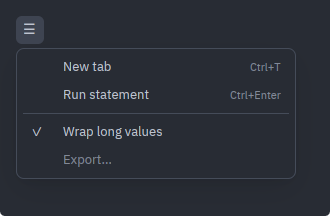
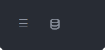
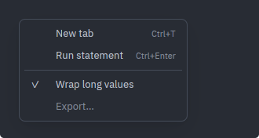

# Menus

Two ways to show the same list of commands: `MenuButton`, a compact toolbar trigger whose dropdown hangs beneath it, and `ContextMenu`, the same panel with no trigger at all, opened wherever the caller says. Reach for them because gpui only builds a native menu bar on macOS — on Windows and Linux the shell has to draw its own.

Source: [menu.rs](../../crates/rugpui/src/menu.rs). Re-exported as `rugpui::{MenuButton, ContextMenu, MenuEntry, Anchor}`.

## The state the host keeps

Both are stateless `RenderOnce` elements. The parent view owns the open flag — and, for a context menu, the pointer position that goes with it — passes it in on every render, and clears it from `on_open_change` / `on_dismiss`. That is the one thing a newcomer gets wrong: a `MenuButton` will never open by itself.

```rust
use rugpui::{MenuButton, MenuEntry};

MenuButton::new("app-menu")
    .tooltip("Everything this window can do")
    .open(self.menu_open)
    .entries(vec![
        MenuEntry::new("New tab").shortcut("Ctrl+T"),
        MenuEntry::new("Run statement").shortcut("Ctrl+Enter"),
        MenuEntry::separator(),
        MenuEntry::new("Wrap long values").checked(self.checked),
        MenuEntry::new("Export…").disabled(true),
    ])
    .on_open_change({
        let this = cx.entity();
        move |open, _window, cx| {
            this.update(cx, |gallery, cx| {
                gallery.menu_open = open;
                cx.notify();
            });
        }
    })
```

## MenuEntry

A row is either a command — a label, an optional shortcut hint and a callback — or a rule.

| method | argument | default | effect |
| --- | --- | --- | --- |
| `MenuEntry::new` | `impl Into<SharedString>` | — | a command row with no hint and no callback |
| `MenuEntry::separator` | — | — | a hairline rule between two groups |
| `.shortcut` | `impl Into<SharedString>` | none | right-aligned muted hint |
| `.on_activate` | `Fn(&mut Window, &mut App)` | none | run on click; the menu closes itself afterwards |
| `.disabled` | `bool` | `false` | drawn muted, no hover, no cursor, **no click handler at all** |
| `.checked` | `bool` | `false` | a `✓` in a column before the label |
| `.label()` | — | — | the row's text (empty for a separator) |
| `.is_separator()` | — | — | whether the row is a rule |

The shortcut is decoration only. The key binding itself is registered by the application (`cx.bind_keys`), and the menu row dispatches the same handler that binding does — the menu is a second way in, never a second implementation. This module registers no `KeyBinding` of its own.

`checked` decides a *column*, not a row: a menu with any checked row lays that column out on every row, so the labels stay in a line; a menu with nothing checked never gets the column at all.

A disabled row is inert by having no handler rather than by having one that thinks better of it — which also means clicking it leaves the menu open, since the panel occludes the backdrop a press would otherwise dismiss from. Showing a greyed-out command says "the surface has this, and this is not the moment"; dropping it says nothing.



*The five rows the gallery draws: two commands with `.shortcut(..)`, a `MenuEntry::separator()`, a `.checked(true)` row and a `.disabled(true)` one. The check column is laid out on every row because one row asked for it.*

## MenuButton

| method | argument | default | effect |
| --- | --- | --- | --- |
| `MenuButton::new` | `impl Into<ElementId>` | — | a closed 28 px trigger showing `☰` |
| `.glyph` | `impl Into<SharedString>` | `☰` | replaces the character on the trigger |
| `.icon` | asset path | none | draws a 16 px SVG instead of the glyph |
| `.tooltip` | `impl Into<SharedString>` | none | hover label |
| `.open` | `bool` | `false` | whether the dropdown is showing |
| `.entries` | `Vec<MenuEntry>` | empty | the rows, in display order |
| `.on_open_change` | `Fn(bool, …)` | none | the open state the menu would like to be in |

`on_open_change` fires with `true` when the trigger is clicked while closed, and with `false` when the trigger is clicked again, when a row is activated, or when the pointer goes down anywhere outside the panel.

The dropdown is a **fixed 280 px** wide, deliberately: the same trigger opens the same menu every time, and a width that followed the entries would make the panel breathe under a button that never moves. It hangs 32 px below the trigger's top-left corner.



*Two closed triggers: the default `☰` glyph, and one given `.icon(..)` instead.*

## ContextMenu

Rendered by the view that owns the pointer position — typically from an `on_mouse_down(MouseButton::Right, …)` handler that stored the event's window-space position. The element is absolutely positioned and zero-sized, so it can be dropped in anywhere the view already renders.

```rust
use gpui::{MouseButton, MouseDownEvent, Pixels, Point};
use rugpui::{ContextMenu, MenuEntry};

// in the view: `context: Option<Point<Pixels>>`
div()
    .on_mouse_down(MouseButton::Right, cx.listener(|view, event: &MouseDownEvent, _w, cx| {
        cx.stop_propagation();
        view.context = Some(event.position);
        cx.notify();
    }))
    .children(self.context.map(|position| {
        ContextMenu::new("row-context")
            .position(position)
            .entries(vec![
                MenuEntry::new("Copy"),
                MenuEntry::new("Close others").disabled(only_tab),
            ])
            .on_dismiss({
                // `on_dismiss` takes no event, so `cx.listener` does not fit:
                // capture a handle to the view and update it directly.
                let this = cx.entity();
                move |_window, cx| {
                    this.update(cx, |view, cx| {
                        view.context = None;
                        cx.notify();
                    });
                }
            })
    }))
```

| method | argument | default | effect |
| --- | --- | --- | --- |
| `ContextMenu::new` | `impl Into<ElementId>` | — | empty menu at the window's top-left |
| `.position` | `Point<Pixels>` | `(0, 0)` | window-space point the anchor corner sits at |
| `.anchor` | `Anchor` | `Anchor::TopLeft` | which corner is pinned, and so which way the panel grows |
| `.width` | `Pixels` | content-sized | a fixed width instead of measuring |
| `.entries` | `Vec<MenuEntry>` | empty | the rows |
| `.on_dismiss` | `Fn(&mut Window, &mut App)` | none | called after a row runs, or on a press outside |

### Positioning

`.position(p)` puts the panel's *anchor corner* at `p` in window coordinates, and the panel is snapped back inside the window with a 6 px margin if it would hang off an edge. `Anchor` is gpui's own enum, re-exported here so a caller need not reach past this crate for the name.

- `Anchor::TopLeft` (the default) is what a right-click wants: the list hangs down and to the right of the pointer, away from it.
- `Anchor::BottomLeft` is for a trigger along the bottom of the window — a status bar's encoding picker — so the list stands *on* the trigger and opens upward, instead of being snapped back over the thing it was opened from.

Unlike a `MenuButton`, a context menu is **content-sized**: as wide as its widest row, between 180 px and 360 px, with longer labels truncated by ellipsis. The commands a right-click offers depend on what was under the pointer, so two surfaces of the same window can want very differently sized menus. `.width(px)` opts out, for a menu the same trigger reopens over rows that come and go.



*The same entries as a `ContextMenu` at `position(point(px(24.), px(24.)))`: no trigger, and the panel sized to its widest row rather than to a fixed 280 px.*

## How the panel is drawn

Both draw two `deferred` layers over the window, so a menu opened inside a scrolling form is never clipped by it:

1. A full-window **backdrop** (priority 1) that occludes and dismisses on *any* mouse button, so a right-click outside is not swallowed without effect.
2. The **panel** (priority 2), which occludes the backdrop so presses on a row never reach it.

The panel scrolls vertically once it is taller than the window minus the margins, with the wheel locked to that one axis; the rows stay `flex_none` so they scroll past rather than being squeezed.

## Theme slots

| slot | where |
| --- | --- |
| `background` | panel fill (opaque on purpose — a translucent window allows one tinted fill per pixel) |
| `border` | panel outline and the separator rule |
| `text` | a command row's label, and the open/hovered trigger |
| `text_muted` | a disabled row's label, and the shortcut hint |
| `surface_hover` | a hovered row, and the hovered trigger |
| `surface_active` | the trigger while its menu is open |
| `icon` | resting colour of the trigger's icon or glyph |

## Pitfalls

- **Nothing opens itself.** Both are stateless; store the flag and pass it back.
- **`on_dismiss` fires for the outside press *and* after a row runs.** Clear your stored position in one place and let the row handlers do their own work.
- **A disabled row does not dismiss the menu.** That is by design; the user must click elsewhere.
- **The context menu's element takes no layout space**, but it must still be a child of something that renders — attach it beside the content it belongs to, not in a detached branch.
- **Shortcut hints are strings you write.** They are never derived from the bindings, so a hint that has drifted from its key binding will lie; the [`TextInput`](./text-input.md) menu shows the pattern for keeping them honest by building both from the same `cfg`.
