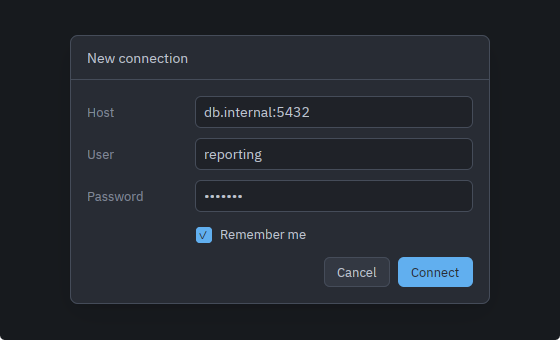
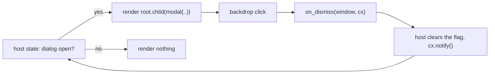

# modal and form_row

A centred dialog panel over a translucent backdrop, plus the labelled row its
body is usually built out of. Reach for `modal` when a decision has to be made
before anything else can happen — a connection to configure, a change to
confirm. Both are free functions rather than types: they take everything they
need in one call and have no builder.

Source: [modal.rs](../../crates/rugpui/src/modal.rs).

## Signatures

```rust
pub fn modal<E: IntoElement>(
    id: impl Into<ElementId>,
    title: impl Into<SharedString>,
    width: Pixels,
    body: E,
    on_dismiss: impl Fn(&mut Window, &mut App) + 'static,
) -> impl IntoElement

pub fn form_row<E: IntoElement>(
    label: impl Into<SharedString>,
    control: E,
) -> impl IntoElement
```

| parameter | effect |
| --- | --- |
| `id` | Element id of the backdrop; the panel takes `(id, "panel")`. Unique among siblings. |
| `title` | Text of the 44 px header band. |
| `width` | Fixed panel width. The height is the content's, capped by the window. |
| `body` | Anything that is an element; converted with `into_any_element()`. |
| `on_dismiss` | Called when the **backdrop** is clicked. Clicks on the panel itself are swallowed. |

`form_row` puts a fixed 96 px label column beside a control that takes the rest
of the row, so a stack of them lines up without the caller measuring anything.

## Minimal example

The shell's about dialog is the worked example. It builds a `body`, a `title`
and an `on_dismiss` closure, then hangs the modal off a full-size absolutely
positioned root:

```rust
use rugpui::{Button, ButtonVariant, modal};

let this = cx.entity();
let on_dismiss = {
    let this = this.clone();
    move |_window: &mut Window, cx: &mut App| {
        this.update(cx, |dialog, cx| dialog.dismiss(cx));
    }
};

let body = div()
    .flex()
    .flex_col()
    .gap(px(14.))
    .child(heading)
    .child(
        div().flex().flex_row().justify_end().child(
            Button::new("about-close", "Close")
                .variant(ButtonVariant::Primary)
                .on_click({
                    let this = this.clone();
                    move |_, _window, cx| {
                        this.update(cx, |dialog, cx| dialog.dismiss(cx));
                    }
                }),
        ),
    );

div()
    .id("about-dialog")
    .absolute()
    .inset_0()
    .size_full()
    .track_focus(&self.focus_handle)
    .on_key_down(cx.listener(Self::on_key_down))
    .child(modal("about-modal", title, px(420.), body, on_dismiss))
```

With `form_row` in the body:

```rust
use rugpui::form_row;

div()
    .flex()
    .flex_col()
    .gap(px(12.))
    .child(form_row("Name", self.name_input.clone()))
    .child(form_row("Host", self.host_input.clone()))
```



*`modal("connect", "New connection", px(420.), body, on_dismiss)` with three
`form_row(..)` fields, a checkbox and the two buttons that end it. The backdrop
covers the whole window; the card is centred and 420 px wide.*

## Where it must be rendered

The returned element positions itself absolutely (`inset_0`, `size_full`), so it
must be rendered inside a `relative()` — or itself absolutely positioned —
ancestor that spans the window, typically the root element of the view. It
should be the **last** child of that ancestor so that it paints on top of
everything else.

This is the mistake that costs the most time: an absolutely positioned child is
laid out against its nearest positioned parent, so a modal dropped into some
inner panel will fill that panel rather than the window and the backdrop will
stop at the panel's edge.

## State the host keeps

Whether the dialog is open, and everything inside it.

`modal` has no `open` flag: a closed dialog is one that is not in the tree at
all. The host keeps a `bool` (or an `Option<Entity<..>>` for a dialog that owns
inputs), renders the modal only while it is set, and clears it from
`on_dismiss`. The shell's dialogs go one step further and are whole entities
with their own focus handle, which is what lets them field `Escape`.



## Keyboard and mouse

- Clicking the backdrop calls `on_dismiss`. Clicking the panel does not: the
  panel is marked `occlude()`, so presses that land on it never reach the
  backdrop's click handler.
- **There is no `Escape` handling in the widget.** A dialog that should close on
  `Escape` tracks focus itself and wires its own `on_key_down`, the way the
  shell's about and update dialogs do.
- Nothing here traps focus either. `occlude()` stops mouse events, not `Tab`.

## Sizing

The width is whatever was passed. The height is the content's, capped at the
window's viewport height less 64 px of margin — top and bottom combined — with a
floor of 160 px so that a window shorter than the margin does not cap the panel
at zero and hide it entirely.

The body carries `min_h_0`, which is what lets it shrink once the panel hits that
cap: a flex item's default minimum size is its content, which would otherwise
push the panel past the cap instead of handing the overflow to a scroll area
inside. A `body` that can grow past the cap should therefore put its own scroll
area inside it — the modal will not add one.

## Theme slots

`modal`:

- `overlay` — the translucent backdrop. This slot carries its own alpha.
- `background` — the panel's fill, one level up from the surrounding chrome.
- `border` — the panel's outline and the hairline under the header band.
- `text` — the panel's text colour, inherited by the body.

`form_row`:

- `text_muted` — the label column, so the control beside it is what reads.

## Pitfalls

- Render it last, inside a full-window positioned ancestor. See above.
- `on_dismiss` fires on backdrop clicks only. Every other way out — a Close
  button, `Escape`, a successful submit — is the host's to wire, usually to the
  same method.
- The panel's id is derived as `(id, "panel")`, so passing a duplicate `id`
  collides twice over.
- `form_row`'s label column is a fixed 96 px. A longer label will overflow it
  rather than widening the row; shorten the label or lay the row out by hand.
