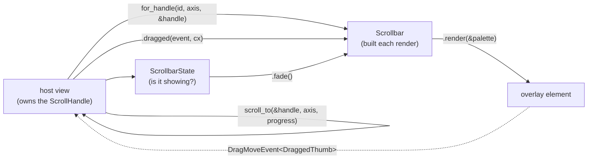
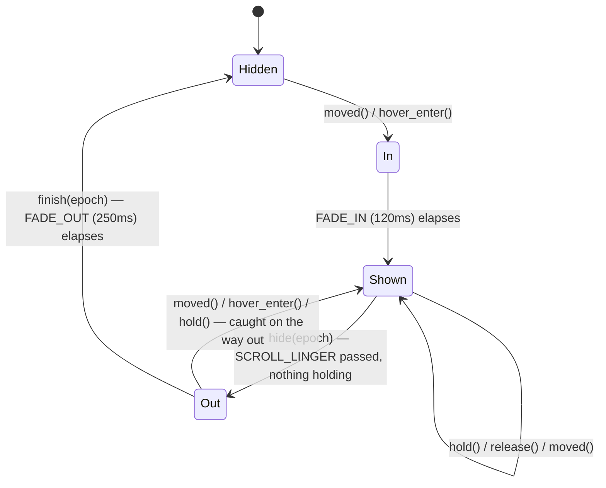

# Scrollbar

An overlay scroll indicator: a thumb with no track behind it, drawn *over* the content rather than beside it, shown while a surface is being scrolled or while the pointer rests on the edge it rides, and taken down again once neither is true. It is the behaviour macOS gives every scrollable view, and nothing here reserves layout space, so turning it on costs a surface no width.

Source: [scrollbar.rs](../../crates/rugpui/src/scrollbar.rs). Re-exported as `rugpui::{Scrollbar, ScrollbarAxis, ScrollbarState, DraggedThumb, hide_later, hide_now, scroll_to, scrolled}`; `Fade`, `Thumb`, `hide_after`, the pure `thumb`/`dragged_to` and the timing constants (`INSET`, `SCROLL_LINGER`, `FADE_IN`, `FADE_OUT`) are reached through the module path, `rugpui::scrollbar::…`.

## Four pieces, kept apart on purpose



- `thumb` and `dragged_to` are the geometry, and pure: offset to thumb, and pointer back to offset. Every awkward case is decided there, where it can be tested without a window.
- `ScrollbarState` is the "is it showing?" flip-flop. It carries no timer of its own; the owning view arms one with `hide_later`, or starts the fade this instant with `hide_now`, because only the view can notify itself when either lands.
- `Scrollbar` describes one bar, and both draws it *and* reads drags of it — so the two can never disagree about the geometry.
- `DraggedThumb` is what a drag of one carries.

## The simplest case: an always-on bar

The gallery's list is the canonical minimal example. The bar is rebuilt from scratch on every render out of the `ScrollHandle` the list is tracked by, and the drag is handled by the owner with the same id:

```rust
use gpui::{DragMoveEvent, ScrollHandle};
use rugpui::{DraggedThumb, Scrollbar, ScrollbarAxis, scroll_to, theme};

const LIST_BAR: &str = "list-bar";

fn list(&self, cx: &mut Context<Self>) -> Div {
    let palette = theme(cx);
    let bar = Scrollbar::for_handle(LIST_BAR, ScrollbarAxis::Vertical, &self.list);

    div()
        // The bar is placed against THIS box, not against the scrolling one:
        // a scroll container's own children are what scroll away underneath.
        .relative()
        .h(px(150.))
        .on_drag_move(cx.listener(
            |gallery, event: &DragMoveEvent<DraggedThumb>, _window, cx| {
                let bar = Scrollbar::for_handle(LIST_BAR, ScrollbarAxis::Vertical, &gallery.list);
                if let Some(progress) = bar.dragged(event, cx) {
                    scroll_to(&gallery.list, ScrollbarAxis::Vertical, progress);
                    cx.notify();
                }
            },
        ))
        .child(
            div()
                .id("list")
                .track_scroll(&self.list)
                .size_full()
                .overflow_y_scroll()
                .children(rows),
        )
        .children(bar.render(&palette))
}
```

Three things to copy exactly:

1. **The bar goes on a wrapper.** `render` returns an absolutely positioned element placed against its parent's padding box, so the parent has to be the box the thumb measures — a wrapper around the scroll container, not the container itself.
2. **`.children(…)`, not `.child(…)`.** `render` returns `Option<AnyElement>`: `None` when there is nothing to scroll, which is when a bar has nothing to say.
3. **The drag is answered by the owner, once, on its own root.** gpui hands a `DragMoveEvent` to *every* element listening for that drag type, and the `bounds` on the event are the listener's rather than the dragged element's — so the thumb carries its own track (in window coordinates, as of the frame the drag began) inside `DraggedThumb`, along with where in the thumb the press landed. `Scrollbar::dragged` returns `None` when the drag belongs to a different bar, which is what the id is for. Views therefore listen once and need no wiring around each individual bar.

That example leaves `fade` at its default `Fade::Shown`, so the bar is simply always there.

## API

### Building and drawing

| method | argument | default | effect |
| --- | --- | --- | --- |
| `Scrollbar::new` | id, `ScrollbarAxis`, `track: Bounds<Pixels>`, `visible`, `scrollable`, `scrolled` | — | a bar over a surface measured in whatever unit suits it |
| `Scrollbar::for_handle` | id, `ScrollbarAxis`, `&ScrollHandle` | — | the same, measured off a gpui scroll container |
| `.inset` | `f32` | `2.0` | pushes the thumb further in from the edge it rides |
| `.fade` | `Fade` | `Fade::Shown` | whether it is drawn at all, and how solidly |
| `.on_hover` | `Fn(&bool, …)` | none | `true` when the pointer reaches the edge, `false` when it leaves |
| `.thumb()` | — | — | `Option<Thumb { start, length }>` as it stands |
| `.render` | `&Theme` | — | `Option<AnyElement>`; `None` when there is nothing to scroll |
| `.dragged` | `&DragMoveEvent<DraggedThumb>`, `&App` | — | `Option<f32>` progress, `None` when the drag is another bar's |

`ScrollbarAxis` is `Horizontal` (along the bottom edge) or `Vertical` (down the right-hand edge).

The three numbers `new` takes are all in the *same* unit, whatever it is — pixels for a gpui container, lines for a terminal — because only their ratios matter: `visible / (visible + scrollable)` sets the length and `scrolled / scrollable` sets the position. `scrollable` is how much lies *beyond* the visible part, which is exactly what `ScrollHandle::max_offset` reports. The thumb never gets shorter than 24 px, so a long scrollback still leaves something to aim at.

### Free functions over a `ScrollHandle`

| function | effect |
| --- | --- |
| `scrolled(&handle, axis) -> f32` | how far the handle is scrolled, counting up from the start (gpui's own offset runs negative) |
| `scroll_to(&amp;handle, axis, progress) -> bool` | scrolls to a fraction of the range, reporting whether it moved |
| `hide_later(epoch, cx, pick)` | arms the timer that takes a bar down once scrolling stops (waits `SCROLL_LINGER`) |
| `hide_now(view, epoch, cx, pick)` | starts the fade this instant, for a departure that announces itself |
| `hide_after(delay, epoch, cx, pick)` | the general form the two above are written in terms of |

`pick` finds the state *inside the view when the timer fires*, rather than borrowing it now, because by then the surface it belongs to may be gone.

### `ScrollbarState`

| method | returns | when to call |
| --- | --- | --- |
| `ScrollbarState::new()` | — | a bar that is not showing |
| `.moved(scrolled)` | `Option<u64>` epoch | once per render; arm `hide_later` with the epoch |
| `.hold()` | — | on every drag move; pins the bar at full strength and arms nothing |
| `.release()` | `Option<u64>` epoch | on mouse-up (and mouse-up-*out*); arm `hide_later` |
| `.hover_enter()` | `bool` changed | from `on_hover(true)`; `notify` if it returns true |
| `.hover_leave()` | `Option<u64>` epoch | from `on_hover(false)`; pass to `hide_now` |
| `.fade()` | `Fade` | to build the bar |
| `.showing()` | `bool` | whether it is on screen at all |
| `.hide(epoch)` / `.finish(epoch)` | `bool` changed | called for you by the `hide_*` helpers |

Movement is noticed by comparing offsets between renders rather than by hooking every route that scrolls — a wheel, a keyboard, "scroll the active tab into view", a window resize. Anything that moves a surface repaints it, so the comparison catches all of them and nothing has to remember to announce itself. The first look never counts as movement, so a surface does not flash a bar the moment it appears.

Two things move nothing and must still keep the bar up: a pointer holding the thumb (`hold`) and a pointer resting on the edge (`hover_enter`). Those are also the only reasons a bar waits at all — scrolling has to be waited out because its end is never announced; a pointer leaving is announced the moment it happens, so that bar starts going at once.

## The fade lifecycle



A bar caught on its way out comes straight back at **full strength** rather than fading in again from nothing: it never left, and restarting the fade would dip it to invisible on the way back up.

The `epoch` is what keeps an old timer from taking down a new showing. Every event that puts the bar up bumps it, and both `hide` and `finish` refuse to act on an epoch that has been superseded — so a bar is never taken down by a timer belonging to an older burst of scrolling. `hide` deliberately leaves the epoch alone so the same one carries on to `finish`: the fade and the expiry that started it are one expiry, and anything that interrupts the first interrupts the second.

`SCROLL_LINGER` (500 ms) is not a "keep it up for a while" delay; it is the width of the gap between two wheel ticks, which is the only thing that tells a stopped scroll from a paused one.

## The full lifecycle, as the tree wires it

[`TreeView`](./tree.md) is the reference implementation of the complete pattern — keep a `ScrollbarState` beside the handle, notice movement from inside the render that draws it, and answer the drag on the view's root:

```rust
// in render:
if let Some(epoch) = self.bar.moved(scrolled(&self.base_handle(), ScrollbarAxis::Vertical)) {
    hide_later(epoch, cx, |view: &mut Self| Some(&mut view.bar));
}

div()
    .relative()
    .on_drag_move::<DraggedThumb>(cx.listener(|view, event: &DragMoveEvent<DraggedThumb>, _w, cx| {
        let Some(progress) = view.scrollbar().dragged(event, cx) else { return };
        view.bar.hold();
        scroll_to(&view.base_handle(), ScrollbarAxis::Vertical, progress);
        cx.notify();
    }))
    // Both halves: a thumb dragged off the end of its track lets go with the
    // pointer outside the window, which only the second sees.
    .on_mouse_up(MouseButton::Left, cx.listener(|view, _: &MouseUpEvent, _w, cx| view.release_thumb(cx)))
    .on_mouse_up_out(MouseButton::Left, cx.listener(|view, _: &MouseUpEvent, _w, cx| view.release_thumb(cx)))
    .child(list)
    .children(
        self.scrollbar()   // Scrollbar::for_handle(..).fade(self.bar.fade())
            .on_hover(cx.listener(|view, hovered: &bool, _w, cx| view.hover_scrollbar(*hovered, cx)))
            .render(&theme),
    )
```

with the two small halves the callbacks need:

```rust
fn release_thumb(&mut self, cx: &mut Context<Self>) {
    if let Some(epoch) = self.bar.release() {
        hide_later(epoch, cx, |view: &mut Self| Some(&mut view.bar));
        cx.notify();
    }
}

fn hover_scrollbar(&mut self, hovered: bool, cx: &mut Context<Self>) {
    if hovered {
        if self.bar.hover_enter() { cx.notify(); }
        return;
    }
    let Some(epoch) = self.bar.hover_leave() else { return };
    hide_now(self, epoch, cx, |view: &mut Self| Some(&mut view.bar));
}
```

The [`TabBar`](./tab-bar.md) and [`Select`](./select.md) take a finished `Scrollbar` through `.scrollbar(bar)` for the same reason: a bar comes and goes with the scrolling, which is state a widget rebuilt on every render cannot keep, so the owner keeps it.

## Hit testing, and why a hidden bar steals nothing

`render` builds four boxes:

- the **strip**, running the whole length of the track and 10 px across, which draws nothing and answers nothing;
- the **grab area**, transparent, the same thickness but only as long as the thumb — and it *occludes*, so a press on the thumb belongs to the bar and does not also reach the row underneath;
- the **drawn thumb**, 4 px, inside it — splitting the two is what lets the bar be as slim as it should look and still be worth aiming at, and only the grab area is widened, so the bare track keeps letting presses through;
- the **sensor**, filling the strip, carrying `on_hover`, painted *last* on purpose. gpui's hit test walks from the front and stops at the first box that occludes, so a sensor behind the grab area would drop out of the hit list the moment the pointer reached the thumb — and the bar would read that as the pointer having left.

A `Fade::Hidden` bar is the strip and its sensor alone: nothing drawn, nothing to press. That is the guarantee — a bar that has gone shows nothing and steals no press; it only listens. A *fading* one is still there to be caught, because it can still be seen, and catching it brings it back.

## Theme slots

Exactly one: the thumb is filled with `text_muted`. The fill is opaque on purpose — a translucent window composes one tint fill per pixel and no more, and a bar over a surface would be a second one. The fades are the only exception, and they are over in a quarter of a second.

## Keeping a wheel on its axis

gpui's scroll listener folds a wheel's delta on the axis a container does *not* scroll onto the one it does, unless told otherwise — so a sideways wheel over a vertical-only list drags it up and down. `restrict_scroll_to_axis()` opts a container out, and every vertical-only surface in this crate calls it next to the bar it draws. `TabBar`'s horizontal strip deliberately leaves it off, so a vertical wheel still drives its sideways scroll. A `UniformList` cannot call the method (it is on gpui's stateful interactive half), so the tree sets the same flag directly: `list.interactivity().base_style.restrict_scroll_to_axis = Some(true)`.

## Pitfalls

- **Do not put the bar inside the scroll container.** Its children are what scroll away; the bar must be a sibling under a `relative()` wrapper of the container's size.
- **Rebuild the bar in the drag handler too.** The geometry is read off the handle each time, so a bar cached from render would be a frame stale — and the handler needs one with the *same id* to recognise the drag.
- **Listen for `on_mouse_up_out` as well as `on_mouse_up`.** A thumb dragged off the end of its track lets go with the pointer outside the window.
- **`for_handle` trails a resize by one frame.** The handle reports bounds as of the last layout pass; the bar corrects itself on the next, which is the frame the resize is drawn in.
- **`hide_later` must be armed from inside the render that noticed the movement**, with the epoch `moved()` returned — arming with a stale epoch does nothing, which is the point.
- **`ElementId` uniqueness matters across the whole view.** Two trees in one window would answer each other's drags; `TreeView` keys its bar id by `cx.entity_id()` for exactly that reason.
