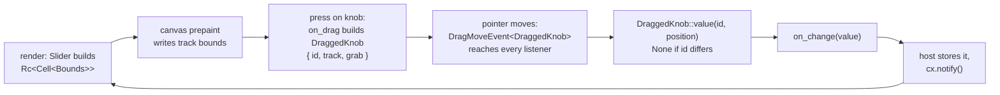

# Slider

A horizontal slider over a fraction from `0.0` to `1.0`. One knob riding one
track, and a number to say where it sits. Nothing in the widget knows what that
number means — a volume, a font size, a timeout in seconds are all the same
slider — so turning the fraction into whatever the host stores, and back again,
is the host's business. That is what keeps the slider from having to hear about
units, formatting or locales.

Source: [slider.rs](../../crates/rugpui/src/slider.rs).

## Minimal example

From the gallery, next to a [`ProgressBar`](./progress.md) showing the same
value:

```rust
use rugpui::{ProgressBar, Slider};

Slider::new("amount")
    .value(self.amount)
    .step(0.05)
    .on_change({
        let this = this.clone();
        move |value, _window, cx| {
            this.update(cx, |gallery, cx| {
                gallery.amount = value;
                cx.notify();
            });
        }
    })
```

With a tab stop, written the way the type's own docs put it:

```rust
let this = cx.entity();
Slider::new("volume")
    .value(self.volume)
    .step(0.1)
    .tab_index(3)
    .on_change(move |value, _window, cx| {
        this.update(cx, |view, cx| {
            view.volume = value;
            cx.notify();
        });
    })
```

`on_change` takes its `f32` by value, so `cx.listener` — which produces an
`Fn(&E, ..)` — does not fit; `cx.processor` is the by-value counterpart.

## Builder options

| method | argument | default | effect |
| --- | --- | --- | --- |
| `Slider::new` | `id: impl Into<ElementId>` | — | Creates a slider at the start of its range. See below for why `id` is unusual. |
| `value` | `f32` | `0.0` | Where the knob sits. Clamped to `0.0..=1.0` for drawing; `NaN` draws as `0.0`. The host's own value is left alone. |
| `step` | `f32` | `0.05` | How far one arrow key moves the slider, and which grid keyboard values snap to. A step that is not positive and finite disables stepping rather than freezing the keys. |
| `tab_index` | `isize` | none | Places the slider in the window's tab order and enables the arrow / `Home` / `End` keys. |
| `on_change` | `impl Fn(f32, &mut Window, &mut App) + 'static` | none | Fired with the value the slider is moving to, by all three ways of moving it, and never with the value already showing. |

Three more items in the module are part of the public API:

| item | signature | purpose |
| --- | --- | --- |
| `Slider::dragged` | `fn dragged(&self, event: &DragMoveEvent<DraggedKnob>, cx: &App) -> Option<f32>` | The value `event` has dragged *this* slider to, or `None` when the drag belongs to another slider. |
| `DraggedKnob::value` | `fn value(&self, id: &ElementId, position: Point<Pixels>) -> Option<f32>` | The same answer, straight off the drag payload. |
| `stepped` | `fn stepped(value: f32, step: f32, up: bool) -> f32` | The value one step away, snapped to the step's grid. Exposed so a host can reproduce the keyboard behaviour elsewhere — a `+`/`-` button pair, say. |

## `id` has to be unique in the *window*

Every other widget in the kit asks for an id unique among its siblings. The
slider asks for more: unique among every slider that can be dragged at the same
time, which in practice means the whole window. The id is what tells one
slider's drag from another's — gpui hands a `DragMoveEvent<DraggedKnob>` to
*every* element listening for that payload type, hovered or not, and each slider
answers only for drags whose payload carries its own id.

## State the host keeps

Just the `f32` — the gallery keeps `amount: f32`. There is nothing to initialise
and nothing to keep beside it: no drag flag, no phase, no handle. The slider is
rebuilt from `value(..)` on every render and reports the new value through
`on_change`; store it and call `cx.notify()`.

If the host stores something other than a fraction — a font size in points, a
timeout in seconds — convert on the way in and invert on the way out:

```rust
const MIN_PT: f32 = 8.;
const MAX_PT: f32 = 24.;

Slider::new("font-size")
    .value((self.font_pt - MIN_PT) / (MAX_PT - MIN_PT))
    .on_change({
        let this = this.clone();
        move |fraction, _window, cx| {
            this.update(cx, |view, cx| {
                view.font_pt = MIN_PT + fraction * (MAX_PT - MIN_PT);
                cx.notify();
            });
        }
    })
```

The widget will never do that mapping for you, which is exactly why it does not
need to know about units.

## Keyboard and mouse

Three ways to move it, and all three end at `on_change`:

| gesture | effect |
| --- | --- |
| drag the knob | the knob follows the pointer, keeping the grab offset the press landed at; no snapping to the step |
| press the track | the knob's *centre* jumps to where the pointer landed; no snapping |
| `Left` / `Down` | one step towards the start, snapped to the step's grid |
| `Right` / `Up` | one step towards the end, snapped to the step's grid |
| `Home` / `End` | straight to `0.0` / `1.0` |

Keys only work when `tab_index` has been set, and a keystroke carrying any
modifier is ignored. Propagation is stopped for the slider's own keys whether or
not the press moved it: the slider owns those keys while it holds focus.

Snapping is why `step` exists at all. `stepped` moves to multiples of the step
rather than to `value + step`, so a value a drag left at `0.42` becomes `0.45`
rather than `0.47`, and a keyboard-driven slider can reach round numbers. A
value already on the grid — within a tolerance of `1e-4`, because `0.15 / 0.05`
comes out as `2.9999998` rather than `3` — moves a whole step; a value between
grid points moves to the next grid point in that direction, which may be less
than a step away. Both ends are hard stops.

## How a drag finds its way home

The knob cannot read the track off the event, because gpui's `bounds` on a
`DragMoveEvent` belong to the listener rather than to the knob. So the payload
carries its own track, in window coordinates, plus where inside the knob the
press landed:



The track bounds cannot be known while the element is being built, since nothing
has been laid out. A `canvas` the width of the track writes them into a cell the
payload shares, during the prepaint of the very frame the element was built in —
long before any press can arrive. Every render makes a fresh cell, so a payload
stops being updated the moment its frame is replaced, and a drag therefore
measures against the track as it stood when the drag began. That is the same
rule [`Scrollbar`](./scrollbar.md) follows, and the drag maths is literally
shared: `rugpui::scrollbar::dragged_to` measures the knob's travel with the
knob's diameter standing in for the thumb's length.

`Slider::dragged` is there only for a host that wants to read the gesture
itself — to drive something the callback does not cover, or to keep the slider's
drag and a scrollbar's on one `on_drag_move` handler. Using both at once is
harmless: they agree on the value.

## Geometry

Four boxes over one measurement, which is worth knowing when styling around it:

- the outer box is the control, as tall as the knob (14 px) plus 3 px of ring
  padding on every side, and `w_full`;
- a `canvas` fills it, and is what every press and drag is measured against, so
  the geometry the pointer is read with is the box the eye sees;
- the *groove* runs the full width — the 4 px track the value is drawn on;
- the *rail* is inset by half a knob at each end, making it exactly the knob's
  travel, so placing the knob at `relative(value)` against the rail is a
  percentage of the travel and works at any width. The filled part reaches back
  over the rail's leading edge to the groove's, so it starts where the track
  starts and stops under the knob's centre.

## Theme slots

- `surface` — the groove's fill.
- `border` — the groove's outline and the knob's outline.
- `accent` — the filled part of the track, the knob's outline on hover, and the
  focus ring.
- `background` — the knob's fill, so it reads as a hole in the filled track.

## Pitfalls

- **Ids collide across a window, not just across siblings.** Two sliders sharing
  an id will both answer one drag.
- A press on the knob is occluded so it does not also register on the track
  underneath — without that, grabbing the knob would first jump it to where it
  already is.
- The drag preview is deliberately empty (`gpui::Empty`): the knob follows the
  pointer directly, and a ghost trailing it would only be a second thing to
  watch.
- `value(..)` clamps for drawing only. A host that stores an out-of-range number
  will see the slider pinned at an end while its own state stays wrong; clamp on
  the host side too if that matters.
- Dragging and track presses do **not** snap to `step`. Only the keyboard does.
  A host that needs every value on the grid should snap inside `on_change`.
