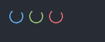
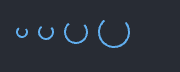

# Spinner

A rotating arc that says work is under way without saying how much is left. Show
one while a view waits on something whose progress it cannot measure — a query
still running, a file still opening. A wait whose end *is* known belongs in a
[`ProgressBar`](./progress.md) instead.

Source: [spinner.rs](../../crates/rugpui/src/spinner.rs).

## Minimal example

From the gallery, at the default size and at 24 px:

```rust
use rugpui::Spinner;
use gpui::px;

row()
    .child(Spinner::new("spinner-small"))
    .child(Spinner::new("spinner-large").size(px(24.)))
```

(`row()` is the gallery's own helper for a wrapping flex row, not part of this
crate.)

Swapping a spinner in for the control it replaces, from the type's own docs:

```rust
if self.running {
    Spinner::new("query-busy").size(px(14.)).into_any_element()
} else {
    Button::new("run", "Run").into_any_element()
}
```

## Builder options

| method | argument | default | effect |
| --- | --- | --- | --- |
| `Spinner::new` | `id: impl Into<ElementId>` | — | Creates a 16 px spinner drawn in the theme's accent. |
| `size` | `Pixels` | `px(16.)` | Width and height of the box the arc is drawn inside. |
| `color` | `Hsla` | the theme's `accent` | Overrides the arc's colour. |



*The default `accent`, then `color(palette.success)` and
`color(palette.danger)`. All three share one phase because all three began
turning on the same frame.*

## State the host keeps

Nothing at all — not even a phase. The animation runs off the element id, so the
parent view neither stores a rotation nor asks for repaints: rendering a spinner
is enough to make it turn, and dropping it from the tree is enough to stop it.

The only state involved is whatever the host uses to decide *whether* to render
one, such as the `running` flag above.

## Sizing, and why the stroke does not scale

The stroke is a constant 2 px. As the box grows the ring gets thinner in
proportion, so a large spinner reads as a thin ring and a small one as a thick
comma. That is deliberate: at the sizes a spinner is actually used at, a hairline
reads as a smudge and anything heavier as a solid ring.

The radius is `(size - 2) / 2` rather than `size / 2`, because a stroke straddles
the path it follows and half of it would otherwise bleed over every edge of the
element. A box narrower than the stroke gets a radius of zero, which the painter
takes as nothing to draw — so `Spinner::new("x").size(px(1.))` renders an empty
box rather than a smear.



*`size(px(12.))`, the default 16 px, `size(px(24.))` and `size(px(32.))`. The
stroke stays 2 px, so the ring thins as the box grows.*

## How it is drawn

The arc is painted rather than loaded from an icon. A widget kit that shipped an
SVG would need the host to have registered an asset source and a path to find it
under, and this crate deliberately knows nothing about the host's assets, so the
geometry is computed in Rust and handed to a gpui `canvas`.

The arc covers three quarters of a circle — a closed ring would look identical in
every frame, and the gap is what makes the rotation legible. It is built from
three elliptical arc segments so that each stays under a half turn, which keeps
the large-arc flag of every `PathBuilder::arc_to` unambiguously `false` wherever
the sweep starts. One full turn takes 800 ms, and the animation's `delta` running
`0..1` over each period *is* the phase in turns, measured clockwise from twelve
o'clock.

## Theme slots

- `accent` — the arc, unless `color(..)` overrides it.

Nothing else. The spinner paints no background and no track, so it sits on
whatever is behind it.

## Pitfalls

- **The id is the animation's key.** Two spinners sharing one id would fight
  over a single rotation, so ids must be unique among siblings.
- `color(..)` is worth setting when the spinner sits on a coloured surface the
  accent disappears into — inside a filled [`Button`](./button.md), say, where
  the label's own colour is the one that reads.
- A spinner left in the tree keeps animating and keeps asking for frames. Drop
  it when the work finishes rather than hiding it behind zero opacity.
