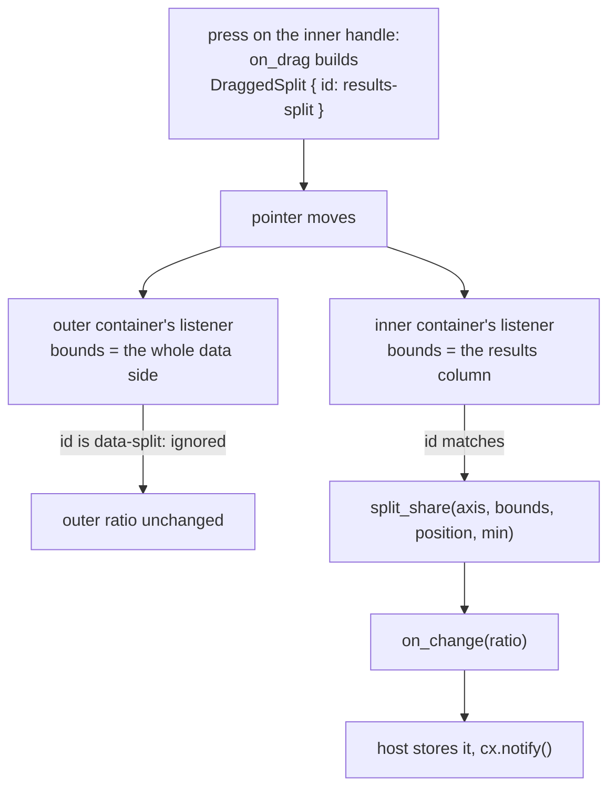

# Splitter

Two panes side by side — or one above the other — with a divider the pointer can
move. One box holding two children and a number between `0.0` and `1.0` to say
how much of the box the first of them gets. Nothing in the widget knows what is
in either half: a tree beside a grid, an editor above a preview, a sidebar beside
everything else are all the same splitter, which is why a split layout does not
have to be rewritten each time the thing being split changes.

Source: [splitter.rs](../../crates/rugpui/src/splitter.rs).

## Minimal example

From the gallery, which divides its data side twice — the tree against the
results beside it, and the grid against the editors below it:

```rust
use gpui::Axis;
use rugpui::Splitter;

let this = cx.entity();

Splitter::new("data-split", Axis::Horizontal)
    .ratio(self.split_x)
    .min_ratio(0.15)
    .first(tree_column)
    .second(results_column)
    .on_change(move |ratio, _window, cx| {
        this.update(cx, |gallery, cx| {
            gallery.split_x = ratio;
            cx.notify();
        });
    })
```

The vertical one is the same call with the axis and the field changed:

```rust
Splitter::new("results-split", Axis::Vertical)
    .ratio(self.split_y)
    .first(grid)
    .second(editors)
    .on_change({
        let this = this.clone();
        move |ratio, _window, cx| {
            this.update(cx, |gallery, cx| {
                gallery.split_y = ratio;
                cx.notify();
            });
        }
    })
```

`on_change` takes its `f32` by value, so `cx.listener` — which produces an
`Fn(&E, ..)` — does not fit; `cx.processor` is the by-value counterpart.

## Builder options

| method | argument | default | effect |
| --- | --- | --- | --- |
| `Splitter::new` | `id: impl Into<ElementId>`, `axis: gpui::Axis` | — | Creates an even split. `Horizontal` puts the halves side by side and moves the divider left and right; `Vertical` stacks them. See below for why `id` is unusual. |
| `ratio` | `f32` | `0.5` | The first child's share of the box. Clamped to `min_ratio..=1-min_ratio` for drawing; `NaN` draws as `0.5`. The host's own value is left alone. |
| `min_ratio` | `f32` | `0.1` | The smallest share either half may be squeezed to. Above `0.5` reads as `0.5` (which pins the divider to the middle); `NaN` disables the minimum. |
| `first` | `impl IntoElement` | empty | The leading half — left of the divider, or above it. |
| `second` | `impl IntoElement` | empty | The trailing half — right of the divider, or below it. |
| `handle_thickness` | `Pixels` | `6 px` | How thick the band that answers a press is. The grab area alone: the line on the seam stays a hairline whatever this is widened to. |
| `bar_thickness` | `Pixels` | `3 px` | How thick the accent bar drawn inside the band is. Clamped to the band's own thickness, so the two can be set in either order; `0 px` gives a splitter that answers a press but never marks itself. |
| `seamless` | — | seam drawn | Drops the line on the seam, leaving the grab band invisible until the pointer finds it. |
| `on_change` | `impl Fn(f32, &mut Window, &mut App) + 'static` | none | Fired with the ratio the divider is moving to, already clamped and finite, and never with the ratio already showing. |

Two more items in the module are part of the public API:

| item | signature | purpose |
| --- | --- | --- |
| `split_share` | `fn split_share(axis: Axis, bounds: Bounds<Pixels>, position: Point<Pixels>, min: f32) -> Option<f32>` | The share of `bounds` a pointer at `position` is asking for, clamped to `min..=1-min`. `None` when the box has no size. |
| `DraggedSplit::id` | `fn id(&self) -> &ElementId` | Which splitter a drag payload belongs to, for a host that listens for the gesture itself. |

## State the host keeps

One `f32` per divider — the gallery keeps `split_x` and `split_y`. There is
nothing to initialise and nothing to keep beside it: no drag flag, no phase, no
handle. The splitter is rebuilt from `ratio(..)` on every render and reports the
new share through `on_change`; store it and call `cx.notify()`.

The value handed to `on_change` is already clamped to the range and is always a
finite number, so it can be stored unexamined. That is deliberate: the two ways
a stored ratio goes wrong — collapsing a half to nothing, and catching a `NaN` —
are both decided inside the widget rather than left to every host to rediscover.

The fade is *not* the host's. A fade is a fact about one pointer and one
divider, and no view has any use for it, so the handle keeps it under gpui's
element state — the same store an `on_click` uses to remember it saw a press —
keyed by the splitter's own id. It comes into being the first time the divider
is drawn and is gone the moment it stops being drawn, which is exactly as long
as a fade should live. Nothing to declare, nothing to initialise, nothing to
reset: the ratio stays the one thing a host stores per divider.

## `id` has to be unique in the *window*

Every other widget in the kit asks for an id unique among its siblings. The
splitter asks for more, and nesting is why. gpui delivers a `DragMoveEvent` to
*every* element listening for that payload type, ancestor or not, so the handle
of an inner split makes each enclosing split's listener fire as well — each with
its own, larger `bounds`:



Without the id check the outer divider would jump every time the inner one was
touched, and it would jump to the wrong place, since the outer listener measures
the pointer against a box several times the size.

## The handle: a band you can hit, a bar you can see

Two different numbers wanted at once. The band that answers a press has to be
wide enough for a pointer to find — 6 px, the same bargain a scrollbar's grab
area makes with its thumb. The mark on the seam has to be thin enough not to
read as a gutter. So they are two elements: an invisible band that takes the
press and the cursor, and a rounded 3 px bar inside it that takes the accent.

The bar is not drawn at all until the pointer first arrives, and after that it
fades rather than snapping:

| | duration | easing |
| --- | --- | --- |
| in | `FADE_IN`, 120 ms | `ease_in_out` |
| out | `FADE_OUT`, 250 ms | `ease_in_out` |

Those are `rugpui::scrollbar`'s own two constants, used here on purpose. The
scrollbar and the splitter handle are the same kind of thing — an overlay that
appears under the pointer and leaves when it goes — and two overlays breathing
at different rates make a window look assembled from parts. Out is twice in for
the reason it is there: nothing is waiting on a bar that is leaving, so it can
afford to go gently, while one arriving is a reaction to something the user has
just done and anything slower reads as lag.

Each phase animates under an element id of its own (`…/bar-fade-in`,
`…/bar-fade-out`). gpui keeps an animation's start time in element state keyed
by that id and drops it once the id stops being drawn, so switching phase
restarts the new one from zero, while staying on one phase leaves the clock
running.

## Dragging

The bar stays fully up for the whole of a drag — from the press until the
release — however far the pointer runs ahead of the divider. It always does run
ahead eventually: once the ratio hits `min_ratio` the band stops moving and the
pointer keeps going, often clean out of the window.

That needs saying because gpui reports *every* element as unhovered while a drag
is in flight, so hover alone would take the bar down the instant the gesture
began. The handle therefore remembers the press, and a press outranks the
pointer: while the divider is held the phase stays `In` whatever hover says, and
because the phase is unchanged the animation keeps its id and its clock across
every re-render the moving ratio causes. The bar does not blink as the divider
travels.

The release is read from where it landed:

- **on the band** — the handle's own `on_mouse_up`, which gpui only runs when
  the band is under the pointer, so the bar demonstrably still has a pointer on
  it and stays up. No fade out and straight back in, which is what a blink is,
  and this is the common ending: a short drag never reaches the minimum, so the
  divider is still under the pointer when the button comes up.
- **anywhere else, inside the container or outside the window** — the
  container's `on_mouse_up` / `on_mouse_up_out`, which fade the bar out. Both are
  no-ops unless a press of this splitter's own band is outstanding, so an
  ordinary click in either pane leaves the bar alone.

Every one of those handlers asks for a repaint even when the phase is unchanged.
The repaint is the point: gpui re-checks each hover listener against the pointer
as it paints, and the frame drawn after a release is what tells the band it is
being hovered again — a fact it had no way to learn during the drag, and without
which the bar could not hear the pointer eventually leave.

## Why the container hears the drag, not the handle

A ratio is a fraction *of a box*, so the only thing worth measuring a pointer
against is the box. The handle is exactly the wrong thing: it slides out from
under the pointer as the drag goes on, while the container stays where it is for
as long as the frame lives. So the handle only starts the gesture — with an empty
drag preview, `gpui::Empty`, because the divider follows the pointer directly and
a ghost trailing it would only be a second thing to watch — and the container,
which gpui hands `bounds` for on every move, turns the pointer into a share.

That also means a drag that has wandered far outside the window still lands
somewhere sensible. The share is recomputed from scratch each move rather than
integrated from deltas, so there is no accumulated drift to undo when the pointer
comes back, and no need for the widget to have seen the press.

## `split_share` for a host laying out its own split

A sidebar whose width is a *setting* rather than a `Splitter` still needs the
same arithmetic, so it is public:

```rust
use rugpui::split_share;

fn drag_sidebar(&mut self, event: &DragMoveEvent<MyDrag>, cx: &mut Context<Self>) {
    let Some(share) =
        split_share(Axis::Horizontal, event.bounds, event.event.position, 0.15)
    else {
        return;
    };
    self.sidebar_width = share * f32::from(event.bounds.size.width);
    cx.notify();
}
```

`rugpui-shell`'s [`PaneTree`](../shell.md#panes) is the other caller worth
knowing about: a `PaneNode::Split` carries an `axis` and a `ratio`, and a
`Splitter` is the natural way to render one.

## Geometry

Two boxes in a flex line, and two more floating over the seam between them:

- the **container** is `size_full`, `min_w_0`, `min_h_0`, and is a `flex_row` for
  `Horizontal` or a `flex_col` for `Vertical`;
- the two **halves** are sized by `flex_basis(relative(share))` alone — a
  percentage each, adding up to the whole — which is what lets the split be drawn
  without knowing how wide or tall the container ended up. Both are `min_w_0`,
  `min_h_0` and `overflow_hidden`;
- the **seam** is a 1 px absolutely positioned line at `relative(ratio)`, the
  same place a border between the two halves would have landed;
- the **handle** is an absolutely positioned band at the same percentage, pulled
  back half its own thickness so the grab area is symmetric about the line the
  eye sees. It `occlude()`s, carries the resize cursor for its axis, and paints
  nothing itself;
- the **bar** is a child of the band and is what the eye actually follows: 3 px
  across against the band's 6, `rounded_full`, centred in the band by whatever
  room is left over, and held 6 px back from both ends of the seam so the
  rounding reads as a capsule rather than running into the container's corners.
  On `Horizontal` it is `w(bar)` by the band's height less the insets; on
  `Vertical`, the transpose.

The divider is out of the flow on purpose. One that took part in the layout would
have to be paid for out of one half's share, and the arithmetic that decides
which one is exactly the arithmetic this widget exists to avoid.

## Theme slots

- `border` — the hairline drawn on the seam. `seamless()` drops it.
- `accent` — the rounded bar inside the grab band, while the pointer is on it or
  holding it.

Nothing else is painted: the halves are whatever the host put in them, and the
band itself is transparent in every state.

## Pitfalls

- **The container must have a size.** It is `size_full`, so the parent has to be
  something with a definite width and height — a flex child that stretches, a box
  with `flex_1` and `min_h_0`. Dropped into a box that sizes itself to its
  content, both halves collapse and the divider has nowhere to go.
- **Children need `min_w_0` / `min_h_0` to shrink.** A flex child refuses to go
  below its content's minimum otherwise, so a grid or an editor inside a half
  quietly pushes the divider off the ratio it was told to sit at. The halves the
  widget draws already carry both; the elements *you* put inside them may need
  them too.
- **Ids collide across a window, not just across siblings** — see above.
- **The `NaN` guard is not decoration.** A ratio divided out of a zero-sized box
  is `NaN`, and a `NaN` stored by the host poisons every length computed from it
  for the rest of the session, including the one that would let the divider be
  dragged back. `split_share` answers `None` for a box with no size, which is
  what the first frame of a splitter looks like before anything has been laid
  out.
- **A `min_ratio` above `0.5` would invert the range** and `f32::clamp` panics on
  a reversed one, so it is read as `0.5` and the divider pins to the middle.
- `ratio(..)` clamps for drawing only. A host that stores an out-of-range number
  will see the divider pinned while its own state stays wrong; clamp on the host
  side too if that matters.
- The two halves meet *on* the divider, with no gap. Padding beside the seam has
  to be paid for from inside the halves, as the gallery does with a `pr` on one
  and a `pl` on the other.
