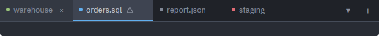
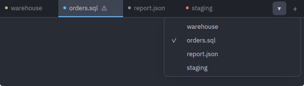

# TabBar

A horizontal strip of tabs with a status dot, an optional mark, close buttons, a dropdown listing every tab and a "+" at the right edge. Reach for it whenever a window holds several interchangeable documents or sessions.

Source: [tab_bar.rs](../../crates/rugpui/src/tab_bar.rs). Re-exported as `rugpui::{TabBar, TabItem, TabMark, TabStatus}`.

## Stateless: the host owns everything

The bar keeps nothing. It is a `RenderOnce` element built from scratch on every frame, so the parent view owns the list of tabs, the active index, and the open flag of the dropdown, and gets them back through the callbacks. This is the gallery's whole tab strip:

```rust
use rugpui::{TabBar, TabItem, TabStatus};

/// An asset path into the host's own `AssetSource`.
const WARNING: &str = "icons/warning.svg";

fn tabs(&self, cx: &mut Context<Self>) -> TabBar {
    let this = cx.entity();
    TabBar::new("tabs")
        .tabs(vec![
            TabItem::new("t1", "warehouse").status(TabStatus::Connected),
            TabItem::new("t2", "orders.sql")
                .status(TabStatus::Connecting)
                .mark(WARNING, "One statement did not parse"),
            TabItem::new("t3", "report.json").status(TabStatus::Disconnected),
            TabItem::new("t4", "staging").status(TabStatus::Error),
        ])
        .active(self.tab)
        .tooltips("All tabs", "New tab", "Close")
        .on_select(move |index, _window, cx| {
            this.update(cx, |gallery, cx| {
                gallery.tab = index;
                cx.notify();
            });
        })
        .on_close(|_index, _window, _cx| {})
        .on_new(|_window, _cx| {})
}
```

Every callback is keyed by the tab's **index in display order**, not by its `ElementId`, so a host that reorders or filters its tabs must map the index back through the same vector it passed in.

## TabItem

| method | argument | effect |
| --- | --- | --- |
| `TabItem::new` | `impl Into<ElementId>`, `impl Into<SharedString>` | id (unique in the bar) and title |
| `.status` | `TabStatus` | a coloured dot before the title |
| `.dot` | `Hsla` | a dot in a colour of your own; wins over `.status` |
| `.mark` | icon path, tooltip | an icon *after* the title, with a required hover label |

`TabStatus` has four variants and each takes a theme slot: `Connecting` → `accent`, `Connected` → `success`, `Disconnected` → `text_muted`, `Error` → `danger`. `.dot(color)` exists for strips whose dot means something those four cannot say — which connection profile a pane's tab belongs to, say.

`TabMark` is the struct behind `.mark(icon, tooltip)`; the two arguments always travel together on purpose, because a symbol nobody can name is a symbol nobody can act on. The mark goes after the title while the dot goes before it: the dot reports a state every tab has, the mark reports something only some tabs are doing, and a second symbol before the title would push a whole strip's titles out of line for the sake of the few that carry one. A tab may wear both.

## TabBar options

| method | argument | default | effect |
| --- | --- | --- | --- |
| `TabBar::new` | `impl Into<ElementId>` | — | empty strip, 36 px tall |
| `.tabs` | `Vec<TabItem>` | empty | the tabs, in display order |
| `.active` | `usize` | `0` | which index is highlighted |
| `.tooltips` | menu, new, close | none | hover labels for the three buttons; unset means no tooltip |
| `.menu_icon` | asset path | `▾` glyph | face of the dropdown button |
| `.new_icon` | asset path | `+` glyph | face of the new-tab button |
| `.scroll_handle` | `&ScrollHandle` | none | tracks the strip's horizontal scroll |
| `.scrollbar` | `Scrollbar` | none | overlay bar drawn over the tabs |
| `.menu_open` | `bool` | `false` | whether the dropdown is showing |
| `.on_select` | `Fn(usize, …)` | none | a tab, or a dropdown row, was clicked |
| `.on_close` | `Fn(usize, …)` | none | **setting it is what makes the close buttons appear** |
| `.on_new` | `Fn(…)` | none | **setting it is what makes the "+" appear** |
| `.on_context_menu` | `Fn(usize, Point<Pixels>, …)` | none | a tab was right-clicked, with the pointer position |
| `.on_menu_open_change` | `Fn(bool, …)` | none | **setting it is what makes the dropdown appear** (and it is still left out while the bar has no tabs) |

Three of the buttons are opt-in by handler rather than by a flag: a bar whose host has no way to close a tab does not draw a close button that would do nothing.



*One tab per `TabStatus` — `Connected`, `Connecting`, `Disconnected`, `Error` — with `.mark(..)` on the second and `active(1)`. The close button, the `▾` and the `+` are all there because `on_close`, `on_menu_open_change` and `on_new` were set.*

## Overflow, scrolling and the overlay bar

The tab list is an `overflow_x_scroll` row; the dropdown and the "+" stay pinned to the right edge and never scroll away. Once the tabs overflow:

- The dropdown lists every tab as a [`MenuEntry`](./menu.md), with `.checked(true)` on the active one and `on_activate` wired to the same `on_select` a click runs. That is the route to a tab that is scrolled out of sight.



*`menu_open(true)`: every tab as a row, with the active one checked.*

- Scrolling the active tab back into view is the *host's* job, through the handle it passed to `.scroll_handle(…)` — `ScrollHandle::scroll_to_item(index)`, indexed in display order.
- A wheel over a tab scrolls the strip. Tabs occlude, which would otherwise cut the scrolling row out of the hit test; the bar answers the wheel itself with exactly the arithmetic gpui would have used, and a vertical wheel folds onto the horizontal axis so a plain mouse can drive it.
- `.scrollbar(bar)` draws a [`Scrollbar`](./scrollbar.md) over the tabs (and only over them — it stops short of the dropdown and "+"). Build it from the same handle, and handle the drag yourself; see the scrollbar page for the full pattern.

There is no drag-to-reorder: the bar never mutates the vector it is given.

## Mouse behaviour

- Left click on a tab → `on_select(index)`.
- Left click on the close button → `on_close(index)`; the press is swallowed so the tab is not also selected. The button is invisible until the tab is hovered (`group_hover`).
- Right press anywhere on a tab → `on_context_menu(index, position)`, on the *press* rather than the release. It deliberately does **not** also select the tab: the commands a tab menu offers differ for the active tab and any other, so the selection must survive the click that opens the menu. Render your own [`ContextMenu`](./menu.md) at `position`.
- The tab, the "+" and the dropdown trigger all occlude, so a click on them is not read as "drag the window" when the strip doubles as the title bar.

## Theme slots

| slot | where |
| --- | --- |
| `surface` | the strip's background |
| `border` | the hairline under the strip |
| `surface_active` | background of the active tab |
| `surface_hover` | hover background of an inactive tab, the close button and the "+" |
| `accent` | 2 px underline of the active tab, and the `Connecting` dot |
| `text` | title of the active tab, and hover colour of the icon buttons |
| `text_muted` | titles of inactive tabs, and the `Disconnected` dot |
| `icon` | resting colour of the close "×", the mark, the "+" and the dropdown face |
| `success` / `danger` | the `Connected` / `Error` dots |

## Pitfalls

- **Indices, not ids.** `TabItem::new` takes an id for gpui's element state; the callbacks report positions. Keep the vector you passed in around to map back.
- **A missing handler is a missing button.** No `on_close` means no close buttons at all; likewise `on_new` and `on_menu_open_change`. This is deliberate, but it looks like a bug the first time.
- **`menu_open` is yours.** The dropdown will not open on its own — store the flag from `on_menu_open_change` and pass it back through `.menu_open(…)`, exactly as the gallery does for its `MenuButton`.
- **Icons are asset paths.** `.menu_icon`, `.new_icon` and `TabItem::mark` take paths into the host's `AssetSource`; this crate ships no icons and falls back to glyphs when they are absent.
- **The strip is a fixed 36 px** and always `w_full`; put it in a column, not in a flex row that will squeeze it.
