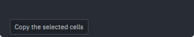
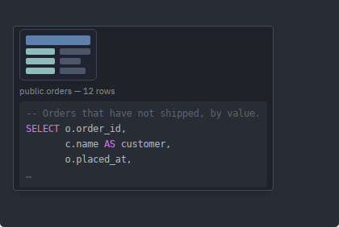
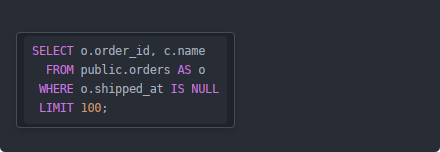

# Tooltips

A box that appears when the pointer rests on a control. Usually one line —
`tooltip_label`, to name an icon-only button or spell out an abbreviation — but
the module also has the parts builder for the case that turns out to want a
thumbnail and a caption as well (`Tooltip`), and the escape hatch for content
this crate has never heard of (`tooltip_with`). Prose longer than a few words is
documentation and belongs in a guide rather than under the cursor, however it is
built.

Source: [tooltip.rs](../../crates/rugpui/src/tooltip.rs).

| item | what it is |
| --- | --- |
| `tooltip_label(label)` | One line of text. The hot path, and the default answer. |
| `Tooltip` | A builder over a short column of parts: lines, notes, an image, a host element. |
| `tooltip_with(build)` | The escape hatch: the host builds the whole inside as one element. |
| `tooltip_frame(&theme)` | The box the other three draw in, for a host that wants only the box. |

## Why this is a function and not a widget

gpui asks for tooltips as a *builder*: `.tooltip(f)` stores `f` and calls it to
make a fresh view each time the pointer settles. The view has to be an `AnyView`,
so a tooltip cannot be a plain element the way the rest of this crate's widgets
are — it needs an entity behind it. `tooltip_label` hides that. It takes the text
once and hands back exactly the closure `.tooltip` wants:

```rust
pub fn tooltip_label(
    label: impl Into<SharedString>,
) -> impl Fn(&mut Window, &mut App) -> AnyView + 'static
```

## Minimal example

From the gallery, hung on an ordinary `div`:

```rust
use rugpui::tooltip_label;

div()
    .id("tooltip-target")
    .px(px(8.))
    .py(px(4.))
    .rounded_md()
    .border_1()
    .border_color(palette.border)
    .text_color(palette.text_muted)
    .tooltip(tooltip_label("Rests here to show a tooltip"))
    .child("Hover me")
```

Or on an icon:

```rust
div().id("save").tooltip(tooltip_label("Save")).child(icon)
```

`.tooltip(..)` is gpui's own method on a stateful element, so the element needs
an `.id(..)` — a tooltip on an id-less `div` will not compile.



*What `tooltip_label(..)` draws: one line in the standard frame. The pictures on
this page render the box straight into the window rather than hovering it, since
a screenshot cannot hold a pointer still.*

## Options

`tooltip_label` has none — a single argument and no builder:

| item | argument | effect |
| --- | --- | --- |
| `tooltip_label` | `label: impl Into<SharedString>` | Returns the `.tooltip(..)` callback showing `label`. |
| `tooltip_with` | `build: Fn(&mut Window, &mut App) -> AnyElement + 'static` | Returns the callback showing whatever `build` makes, in the standard box. |
| `tooltip_frame` | `theme: &Theme` | Returns the `Div` that box *is*, with nothing in it. |

The text is captured once and cloned per hover, so the caller can hand over a
localised string without keeping it alive itself. `Tooltip`'s own options are
[below](#composite-tooltips).

## Custom content

Two functions, and they are the same function twice: `tooltip_frame` is the box,
and `tooltip_with` is the box with a host's element in it.

```rust
pub fn tooltip_frame(theme: &Theme) -> Div

pub fn tooltip_with<F>(build: F) -> impl Fn(&mut Window, &mut App) -> AnyView + 'static
where
    F: Fn(&mut Window, &mut App) -> AnyElement + 'static,
```

`tooltip_frame` carries the margin, the padding, the corner, the surface, the
border, the shadow, the 11 px type and the text colour — everything that makes a
tooltip look like a tooltip, and nothing about what is inside it. The type style
is set on the frame rather than on its children, so a plain string handed to
`.child(..)` is already styled correctly. What it deliberately does *not* carry
is `whitespace_nowrap`: that belongs to a one-line label, and a frame that forced
it on every child would stop a host from ever wrapping anything. `tooltip_label`
adds it back on itself.

Use `tooltip_frame` directly only when the content is unusual enough that the
column `Tooltip` builds is in the way. Otherwise `tooltip_with`:

```rust
use rugpui::{theme, tooltip_with};

div()
    .id("row-3")
    .tooltip(tooltip_with(|_window, cx| {
        let palette = theme(cx);
        div()
            .flex()
            .flex_col()
            .child("public.orders")
            .child(div().text_color(palette.text_muted).child("12 rows"))
            .into_any_element()
    }))
    .child(row)
```

`build` is called once per hover — gpui asks for a fresh view every time the
pointer settles — and is handed the same `Window` and `App` the tooltip is being
made in, so it can read a global or ask the theme for a colour. It must not
*keep* anything, since it will be called again for the next hover; everything it
needs is cloned into it rather than borrowed.

## Composite tooltips

`Tooltip` is the step between the two. A rich tooltip is nearly always a short
column — a title, a muted caption, sometimes a thumbnail or a snippet of code —
and this builds that column so a host does not hand-style its rows and two
hosts' tooltips do not drift apart.

```rust
use rugpui::Tooltip;

div()
    .id("tooltip-rich")
    .tooltip(
        Tooltip::new()
            .image(PREVIEW, px(96.))
            .text("public.orders")
            .note("12 rows")
            .build(),
    )
    .child("Hover for a preview")
```

Parts are drawn top to bottom in the order they were added, so the calls *are*
the layout. There is no separate "title" part: the first `.text(..)` is the title
because it is first.

| method | argument | effect |
| --- | --- | --- |
| `Tooltip::new` | — | An empty tooltip. |
| `text` | `impl Into<SharedString>` | A line in `text`. Never wrapped; call it again for a second line. |
| `note` | `impl Into<SharedString>` | A line in `text_muted` — a caption, a row count, a hint. Also never wrapped. |
| `image` | `impl Into<ImageSource>`, `Pixels` | A picture at that width; the height follows the aspect ratio. |
| `element` | `Fn(&mut Window, &mut App) -> AnyElement + 'static` | Anything else, built on every hover. |
| `max_width` | `Pixels` | Caps the column. Off by default. |
| `build` | — | Consumes the builder into the `.tooltip(..)` callback. |

`max_width` bounds what can be *measured* — an image, a snippet, a host element
— and not the text lines, which never wrap; a `text` longer than the cap still
draws at full width. Set it when a part could be arbitrarily wide and the tooltip
should not follow it across the screen.



*`Tooltip::new().image(PREVIEW, px(96.)).note(..).element(..)`: the parts are
drawn top to bottom in the order they were added.*

### Image sources, and why `img` rather than `svg`

`image` takes anything gpui's `img` takes. A `&'static str` or a `SharedString`
that does not parse as a URL becomes an *embedded* resource, resolved through the
application's `AssetSource` — the same path a widget's icon takes, and the reason
the gallery registers `icons/preview.svg` in its `ICONS` table. One that does
parse as a URL is fetched over HTTP; a `PathBuf` reads from disk; a decoded
`Image` skips loading altogether.

Note that this is `img`, not `svg`. The `svg` element throws a file's colours
away and keeps only its coverage, so an icon drawn with it takes the element's
`text_color` — which is exactly right for a monochrome glyph and exactly wrong
for a thumbnail. `img` rasterises the same file with the colours written in it.
The gallery's `preview.svg` is drawn in three fills for that reason; its
`folder.svg` is not.

## Code in a tooltip

Highlighted, read-only code under the pointer is `rugpui-editor`'s
`tooltip_code`, and code *beside* an image and a caption is a `Tooltip` with a
`CodeSnippet` handed in through `.element(..)`. Both are covered in
[Snippets and code tooltips](../editor.md#snippets-and-code-tooltips).



*`tooltip_code(sql, highlighter, Some(mono))`: nothing but code, in the editor's
own palette rather than the chrome theme's.*

## State the host keeps

None. There is no open flag, no timer and no anchor to store — gpui owns the
hover timing and the tooltip's lifetime entirely. This is the one widget in the
kit where "the host keeps nothing" is literally true, since even the id belongs
to the element the tooltip is attached to.

That holds for all three entry points. `Tooltip` is `Clone` and cheap to clone —
a `Vec` of parts, each of them a shared handle — and `build` consumes one into
the closure gpui stores, which then rebuilds the column on every hover; a host
that shows the same tooltip on several elements clones the builder rather than
writing it twice. But the builder is a *description*, not state: nothing about
the tooltip's lifetime lives in it either.

## Positioning

Nothing here positions anything. gpui lays the view out at the pointer and, when
the box would cross a window edge, flips it to the other side of the cursor on
that axis. Adding an `anchored` or a `deferred` around it would fight machinery
that has already done the work.

The one adjustment the widget makes is a 16 px top **margin**. gpui puts the
tooltip one pixel from the mouse position, which is the *tip* of the arrow
cursor and therefore underneath the rest of the glyph; the margin clears it so
the first word is not read through the pointer. It is a margin rather than an
offset passed to gpui precisely because a margin is part of the measured size,
so the edge-flipping above still sees the box the user actually sees.

## Theme slots

The styling is the [menu](./menu.md) panel's, one step quieter — a tooltip is
read and dismissed rather than clicked, so it takes `surface` instead of the
menu's page background and a softer shadow, which keeps it from reading as
something that can be pressed.

- `surface` — the box's background.
- `border` — its outline.
- `text` — the label, at 11 px.

## Pitfalls

- The label never wraps (`whitespace_nowrap`), and neither do `Tooltip`'s `text`
  and `note` lines. A long string produces a very wide box rather than two lines;
  keep tooltips to a few words, and use several lines where several are wanted.
- `tooltip_frame` is not `whitespace_nowrap` — a host building its own content
  through it or through `tooltip_with` gets wrapping unless it says otherwise.
- Several widgets in this crate take tooltip text directly rather than needing
  this helper — [`TabBar::tooltips`](./tab-bar.md) and
  [`MenuButton::tooltip`](./menu.md) among them. Use those where they exist;
  `tooltip_label` is for the host's own elements.
- The closure builds a new entity on every hover. That is gpui's design, not an
  inefficiency to work around by hoisting the view out — and it is why a
  `tooltip_with` or `Tooltip::element` closure must clone what it needs rather
  than borrow it.
- An `image` that the application's `AssetSource` does not answer for draws as
  nothing at all, silently. If a thumbnail is missing, check the path is
  registered before looking anywhere else.
