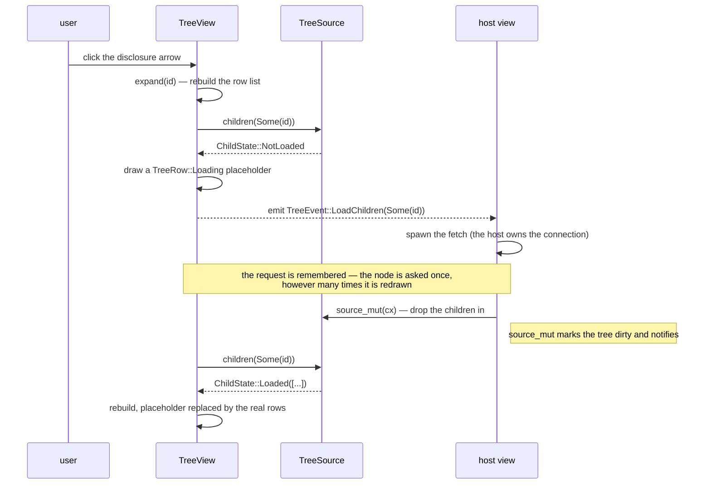

# TreeView

A virtualised tree whose branches arrive one round trip at a time. The widget owns the *shape* — which nodes are open, which one is selected, where the list is scrolled — and the host owns the nodes themselves, handed over through a `TreeSource` keyed by an id the host invents. That split is what keeps a database explorer, a file listing and an object browser the same widget.

Source: [tree.rs](../../crates/rugpui/src/tree.rs). Re-exported as `rugpui::{TreeView, TreeSource, ChildState, TreeRow, TreeRowInfo, TreeEvent}`; `tree::init` is called for you by `rugpui::init`.

## Why a flattened list

The tree is drawn as a flat list of the rows currently visible, rebuilt whenever the shape changes, and never as nested elements. gpui's `uniform_list` only lays out the rows the viewport can see, and it can only do that if rows are addressable by index — so an open schema with five thousand tables costs the same to draw as an empty one. The children of a collapsed node are not in the list at all, which is also what makes "how many rows are there" and "what is below this one" answerable without walking anything: arrow keys move by one index, and the subtree of a row is the run of rows after it that are deeper than it is.

## Writing a `TreeSource`

Two required methods. The gallery's `Catalog` is a complete one — everything is already in memory, so no node is ever `NotLoaded` and the tree never has to ask for a fetch:

```rust
use gpui::{AnyElement, App, IntoElement, ParentElement, Styled, Window, div, px, svg};
use rugpui::{ChildState, TreeRowInfo, TreeSource, theme};

/// One node: its id, the label drawn for it, and the ids of its children.
type Node = (&'static str, &'static str, &'static [&'static str]);

const ROOTS: &[&str] = &["warehouse", "reporting"];

// Ids are paths because a tree's ids have to be stable across a reload.
const NODES: &[Node] = &[
    ("warehouse", "warehouse", &["warehouse/public"]),
    ("warehouse/public", "public", &["warehouse/public/orders"]),
    ("warehouse/public/orders", "orders", &[]),
    ("reporting", "reporting", &["reporting/daily"]),
    ("reporting/daily", "daily", &[]),
];

pub struct Catalog;

impl Catalog {
    fn node(id: &str) -> Option<&'static Node> {
        NODES.iter().find(|(node, _, _)| *node == id)
    }
}

impl TreeSource for Catalog {
    type Id = &'static str;

    fn children(&self, parent: Option<&Self::Id>) -> ChildState<Self::Id> {
        match parent {
            None => ChildState::Loaded(ROOTS.to_vec()),
            Some(id) => match Self::node(id) {
                Some((_, _, [])) | None => ChildState::Leaf,
                Some((_, _, children)) => ChildState::Loaded(children.to_vec()),
            },
        }
    }

    fn render_row(
        &self,
        id: &Self::Id,
        info: TreeRowInfo,
        _window: &mut Window,
        cx: &mut App,
    ) -> AnyElement {
        let palette = theme(cx);
        let label = Self::node(id).map_or(*id, |(_, label, _)| *label);
        let icon = if info.has_children { FOLDER } else { FILE };
        div()
            .flex()
            .flex_row()
            .items_center()
            .gap(px(6.))
            .child(
                svg().size(px(14.)).flex_none().path(icon)
                    .text_color(if info.selected { palette.text } else { palette.icon }),
            )
            .child(label)
            .into_any_element()
    }
}
```

| trait item | required | notes |
| --- | --- | --- |
| `type Id: Clone + Eq + Hash + 'static` | yes | how the host names a node |
| `fn children(&self, parent: Option<&Id>) -> ChildState<Id>` | yes | `None` means the outermost level; **must not block** |
| `fn render_row(&self, id, info: TreeRowInfo, window, cx) -> AnyElement` | yes | draws the inside of a row |
| `fn has_children(&self, id: &Id) -> bool` | no | defaults to `!matches!(children(Some(id)), ChildState::Leaf)` |
| `fn render_loading(&self, window, cx) -> AnyElement` | no | defaults to a muted `…` |

`children` is called during a rebuild for the root and for every **open** node, so a closed subtree costs nothing. `has_children` is asked of every visible row including closed ones — so a source whose `children` is expensive (one that allocates a large vector, say) should answer it from something cheaper.

`render_row` fills a row the tree has already laid out as a centred flex row, with the indent, the disclosure arrow and the background drawn. It is handed a `TreeRowInfo { index, depth, expanded, selected, has_children }`, so a label can follow the row's state without keeping a copy of it. `index` is not a node identity — it moves whenever something above is opened — but it *is* an element identity, and the tree keys its own row container by it, so a host that wants a draggable row can key alongside rather than invent a second numbering.

`render_loading` defaults to an ellipsis glyph rather than a word, because this layer has no translations and "Loading…" in English under a Korean tree would be worse than no text at all.

### Id stability

Everything the widget remembers — the open set, the selection — is keyed by `Id`, which is what lets the host throw its nodes away and fetch them again without the tree closing up. Ids must therefore be **stable across a reload**: a path or a qualified name, never a row number. The open set deliberately holds ids the source may no longer know about, so a node that comes back after a reload comes back open.

## Lazy loading

Every node a database explorer opens is a server round trip, so "I do not have these children yet" is the ordinary state, not an error one. The tree reacts to it rather than asking the host to pretend.



`ChildState` has four variants:

| variant | the tree does |
| --- | --- |
| `Loaded(Vec<Id>)` | draws them, in the order given; an empty vector is a node that turned out to have nothing under it |
| `Loading` | draws a placeholder row and asks for nothing (the host says a fetch is already in flight) |
| `NotLoaded` | draws a placeholder row **and** emits `TreeEvent::LoadChildren` |
| `Leaf` | no disclosure arrow; the node cannot be opened |

Nothing here ever blocks, and nothing here spawns a task either: the host owns the connection, so the host owns the fetch. A request is remembered until the source answers with anything other than `NotLoaded`, so a node is asked for once however many times it is redrawn — and a node whose children the host later drops back to `NotLoaded` is asked again. Requests are collected during the walk and emitted afterwards, so a host that answers one synchronously is never reading a half-built list.

## Creating and subscribing

`TreeView` is an entity, created once and rendered as a child element:

```rust
use rugpui::{TreeEvent, TreeView};

let tree = cx.new(|cx| {
    let mut tree = TreeView::new(Catalog, cx);
    tree.expand(&"warehouse", cx);
    tree.expand(&"warehouse/public", cx);
    tree.set_selected(Some("warehouse/public/orders"), cx);
    tree
});

cx.subscribe(&tree, |view, tree, event, cx| match event {
    TreeEvent::LoadChildren(parent) => view.fetch(parent.clone(), cx),
    TreeEvent::Activated(id) => view.open(id, cx),
    TreeEvent::SelectionChanged(_) => {}
    TreeEvent::ContextMenu { id, position } => view.open_menu(id, *position, cx),
})
.detach();
```

The first draw asks the source for its outermost level and emits `LoadChildren(None)` if it has not been fetched — so a host that subscribes right after building the tree still catches the request for the root.

### Events

| event | when |
| --- | --- |
| `LoadChildren(Option<Id>)` | children are wanted and nobody has fetched them; `None` is the root |
| `Activated(Id)` | `Enter`, `Space`, or a double click **on a leaf** |
| `SelectionChanged(Option<Id>)` | the selection moved |
| `ContextMenu { id, position }` | a row was right-clicked; the tree has already focused itself and moved the selection onto `id` |

The keys activate whatever is selected, branch or leaf, because the keyboard already has `Left` and `Right` for opening and closing. The pointer does not: a double click on a node *with* children opens or closes it and never arrives as `Activated`, so a host that shows leaves gets exactly the rows it can show.

`ContextMenu` carries a window-space position for the host's own [`ContextMenu`](./menu.md) to hang from; the tree draws no menu itself, because the rows have no strings in them and neither can their menu. The selection is moved first on purpose — the menu's commands act on the selection, so "drop table" must name what the user just aimed at.

## Methods

| method | argument | effect |
| --- | --- | --- |
| `TreeView::new` | `S`, `cx` | a tree over `source`, nothing open, nothing selected |
| `.with_arrow_icons` | closed path, open path | draws host assets as the disclosure marks instead of the `▸`/`▾` glyphs |
| `.tab_index` | `isize` | joins the window's tab ring |
| `.source()` | — | the source, to read |
| `.source_mut(cx)` | — | the source, to change; marks dirty and notifies for you |
| `.refresh(cx)` | — | reread the source, for changes that did not go through `source_mut` |
| `.rows()` | — | `&[TreeRow<Id>]` — everything on screen, outermost first |
| `.is_expanded(&id)` | — | whether the node is open |
| `.expand(&id, cx)` | — | open it, asking the host for children if they are missing |
| `.collapse(&id, cx)` | — | close it |
| `.toggle(&id, cx)` | — | one or the other |
| `.selected()` | — | `Option<&Id>`, whether or not a row carries it |
| `.set_selected(Some(id), cx)` | — | move the selection and scroll the row into view |
| `.selected_index()` | — | where the selection sits in `rows()`, or `None` |

`with_arrow_icons` and `tab_index` take `self` by value, so they are chained inside the `cx.new` closure; everything below them is a `&mut self` method callable for the life of the entity.

`expand` on a node **no row carries** still opens it, and it stays open until it is closed again — that is how a host restores a whole path at once: open the server, the catalogue and the schema in one go, and each level is already open by the time the one above it arrives. `expand` on a visible leaf does nothing. `collapse` brings a selection that was inside the subtree up to the node that swallowed it, so the highlight stays where the user can see it. `set_selected` with an id no row carries is remembered rather than refused, for the same reason.

`TreeRow<Id>` is `Node { id, depth, has_children }` or `Loading { depth }`, with `.id() -> Option<&Id>` and `.depth() -> usize`. A `Loading` row is not selectable and is skipped by the arrow keys: there is nothing there to act on yet.

## Keyboard and mouse

`tree::init` binds the `rugpui_tree` actions to the `TreeView` key context, so the arrows keep meaning what they meant everywhere else in the app:

| key | action | effect |
| --- | --- | --- |
| `up` | `SelectPrev` | selection to the row above |
| `down` | `SelectNext` | selection to the row below |
| `right` | `Expand` | open the selected node, or step into it when already open |
| `left` | `Collapse` | close it, or step out to its parent when already closed |
| `enter` | `Activate` | emit `Activated` for the selection |
| `space` | `Activate` | the same |
| `home` | `SelectFirst` | selection to the first row |
| `end` | `SelectLast` | selection to the last row |

Mouse: a click selects (and focuses); a double click opens a node with children and activates one without; a click on the arrow toggles **without** disturbing the selection, because the left press is swallowed there — aiming at the arrow is aiming at the arrow. A right press anywhere on the row, the arrow included, focuses, selects and emits `ContextMenu`.

The list carries a full overlay [`Scrollbar`](./scrollbar.md), wired the complete way — `moved`/`hide_later` from render, `hold` on drag, `release` on mouse-up and mouse-up-out, `hover_enter`/`hover_leave` from `on_hover`. Its id is keyed by `cx.entity_id()`, so two trees in one window never answer each other's drags. See the scrollbar page for that code.

## Theme slots

| slot | where |
| --- | --- |
| `text` | row text (set on the tree's root) |
| `surface_active` | background of the selected row |
| `surface_hover` | background of a hovered row |
| `text_muted` | the disclosure arrow, glyph or icon, and the default loading `…` |

Everything *inside* a row is the source's, so the icon tint, badges and secondary text are the host's choice — the gallery uses `theme.icon` for a resting row and `theme.text` for the selected one.

Layout constants worth knowing when you draw a row: rows are 24 px tall, each level indents 14 px, and the arrow column is a fixed 16 px reserved on leaf rows too, so labels line up down a level instead of stepping sideways.

## Pitfalls

- **`children` must not block.** Return `NotLoaded` and wait to be asked; the tree redraws when the host notifies.
- **Answer `LoadChildren` exactly once per node.** The tree already deduplicates, but a host that spawns on every render instead of on the event will hammer the connection.
- **Reuse ids across a reload** or the tree will close up and lose the selection.
- **`source_mut` refreshes; a source that only *reads* host data does not.** If your nodes live somewhere else entirely, call `refresh(cx)` yourself after they change.
- **A double click on a branch never reaches `Activated`.** Do not wait for it there.
- **`selected()` can name a node no row carries** — inside something closed, or reloaded away. Use `selected_index()` when you need a row.
- **`with_arrow_icons` takes asset paths**, not elements: this crate owns no icons, and the glyph fallback is what keeps a host without an icon set from drawing a column of blanks.
- **The tree follows a source only 64 levels deep.** That cap is only reachable by a source that answers `children` with an ancestor of the node it was asked about; it keeps such a bug a wrong drawing rather than a blown stack.
